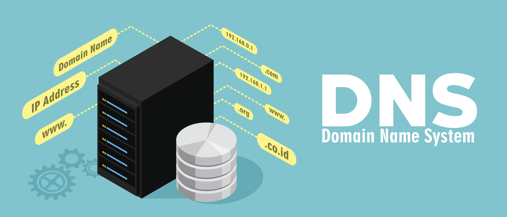

{ .img2 .marginbottom40}

**Resultados de aprendizaje y criterios de evaluacion que se evaluarán en esta unidad.**  

| **Resultados de aprendizaje de la unidad didáctica:**|
||
| **RA. 1:** Instala servicios de configuración dinámica, describiendo sus características y aplicaciones.|

|**Criterios de evaluación de la unidad didáctica:**|
||
|**a)** Se ha reconocido el funcionamiento de los mecanismos automatizados de configuración de los parámetros de red.|
|**b)** Se han identificado las ventajas que proporcionan.|
|**c)** Se han ilustrado los procedimientos y pautas que intervienen en una solicitud de configuración de los parámetros de red.|
|**d)** Se ha instalado un servicio de configuración dinámica de los parámetros de red.|
|**e)** Se ha preparado el servicio para asignar la configuración básica a los sistemas de una red local.|
|**f)** Se han realizado asignaciones dinámicas y estáticas.|
|**g)** Se han integrado en el servicio opciones adicionales de configuración.|
|**h)** Se ha verificando la correcta asignación de los parámetros.|

## 1 - Introducción

**Internet es una red pública y global** de ordenadores que están interconectados mediante el protocolo de Internet (Internet Protocol) y que se comunican mediante la conmutación de paquetes.  

La denominación TCP/IP hace referencia a sus **dos protocolos más importantes:

- **Protocolo de Internet (IP)**.
Conjunto de reglas que asigna direcciones únicas a los dispositivos y permite enviar (enrutar) paquetes de datos a través de las redes y llegar al destino correcto.
- **Protocolo de Control de Transmisión (TCP)**.
 Es un estándar de comunicación de la capa de transporte que garantiza el envío seguro, ordenado y sin errores de paquetes de datos entre dispositivos conectados a una red.

## 2 - Protocolo de Internet (IP)

### 2.1 Introducción

La versión más utilizada actualmente del protocolo IP es **IPv4**, definida en el RFC 791 de 1981. Permite **un total teórico de 2³² direcciones**, aunque algunas están reservadas para usos especiales. Esto limita el número de direcciones IP disponibles, lo que ha provocado que se agoten en muchas regiones del mundo.

Hoy en día ya dispone de un sucesor, **IPv6**, cuyo uso se está extendiendo progresivamente. Ofrece un espacio de direcciones mucho más amplio de 2¹²⁸ direcciones y otras mejoras, como la simplificación del encabezado y la eliminación de la necesidad de traducción de direcciones de red (NAT).

Todas las versiones del protocolo IP permiten el envío de paquetes entre equipos sin establecer **ningún tipo de conexión** (*connectionless*). Esto significa que el equipo de origen envía datos al destinatario sin esperar ninguna confirmación de que la información se haya recibido correctamente.

Aunque para **enviar datos entre dos hosts basta con el protocolo IP**, este no ofrece ninguna garantía de que se envíen correctamente ni de que lleguen a su destino. Tampoco garantiza que los datos lleguen intactos, ya que el control de errores solo se realiza sobre las cabeceras y no sobre la carga útil (los datos transmitidos). Por ello, las aplicaciones que requieren fiabilidad recurren al **protocolo TCP** en la capa de transporte.

### 2.1. Configuración de un nodo IP

En primer lugar, es necesario **configurar los protocolos TCP/IP locales**, incluidos por defecto en el núcleo de cualquier sistema operativo moderno. Para configurar un equipo se requiere la siguiente información:

- La dirección IP (ya sea IPv4 o IPv6).
- La máscara de subred, que sirve para identificar la red o subred a la que pertenece.

Si la comunicación se realiza con equipos de otras subredes o con Internet, se necesitará además:

- La dirección IP de la puerta de enlace predeterminada (*default gateway*), que corresponde al router a través del cual se redirige el tráfico hacia otras redes.
- Las direcciones IP de los servidores DNS.

!!! tip "Características principales del protocolo IP"
    - **Enrutamiento:** seleccionar la ruta más adecuada para el envío de paquetes.
    - **Servicio de entrega *Best-Effort* (mejor esfuerzo):**
    - **No orientado a conexión:** cada paquete puede follow una ruta distinta, por lo que pueden llegar desordenados.
    - **No fiable:** los paquetes se pueden perder, dañar o sufrir retardos.
    - **Direccionamiento lógico:** proporciona un esquema de direccionamiento lógico mediante direcciones IP.

#### 2.1.1 Estructura de una dirección IP (IPv4)

{ .img1 .marginbottom40}

Una dirección IPv4 es un número de 32 bits que identifica a cada uno de los dispositivos conectados a una red IP, así como a la propia red.

Se divide en dos partes:

- Una parte identifica la red (*Network ID*).
- La parte restante identifica al dispositivo (*Host ID*).

Para separar el identificador de red del identificador de dispositivo se aplica la máscara de red. Al realizar la operación lógica AND entre la dirección IP y la máscara de red, se obtiene la dirección de red.

!!! exercise "Identificación de direcciones IP"
    1. Tenéis un serie de direcciones IP, identificar cuales son IPv4 y cuales IPv6.
    1. Identificar las IPv6 que estan en formato reducido y escribirlas en formato no reducido.

    **Direcciones IP**

    - 192.168.1.1
    - 2001:db8::8a2e:370:7334
    - 8.8.8.8
    - 127.0.0.1
    - ff02::1
    - 2001:4860:4860::8888
    - 142.250.184.206
    - 2607:f8b0:4004:809::200e

#### 2.1.2 Clases de direcciones IPv4

Históricamente, las direcciones se dividían en tres clases principales según los octetos destinados a la red:

- **Clase A:** el primer octeto identifica la red.
- **Clase B:** los dos primeros octetos identifican la red.
- **Clase C:** los tres primeros octetos identifican la red.

Además, existen dos clases especiales:

- **Clase D:** reservada para multidifusión (*multicast*).
- **Clase E:** reservada para investigación y uso futuro.

**Tabla resumen de las clases de direcciones IPv4**  

| Clase | Rango campo de red (bits de red) | Rango campo de direcciones (bits de hosts) | Máscara por defecto | Dirección de difusión (broadcast) |
||||||
| A | 1 - 126 (8) | 0.0.0 - 255.255.255 (24) | 255.0.0.0 | x.255.255.255 |
| B | 128.0 - 191.255 (16) | 0.0 - 255.255 (16) | x.x.255.255 | x.255.255.255 |
| C | 192.0.0 - 223.255.255 (24) | 0 - 255 (8) | 255.255.255.0 | x.x.x.255 |
| D | 224.0.0 - 239.255.255 | No aplica |
| E | 240.0.0.0 – 247.255.255.255 | No aplica |

!!! exercise "Identificación de direcciones IP"
    Con la ayuda de la tabla anterior responder a las siguientes preguntas.  
    1. Calcular el rango de direcciones IP de cada clase.  
    2. Calcular la cantidad de redes disponibles para cada clase.  
    3. Calcular la cantidad de IP's (hosts) disponibles para cada clase.  

#### 2.1.3 Direcciones reservadas y especiales

1. **Dirección de red:** identifica a la red en su conjunto, no a un host concreto. Se obtiene cuando todos los bits del identificador de host son 0 (ej.: 10.0.0.0/8).
1. **Dirección de difusión (broadcast):** permite enviar un paquete a todos los hosts de una red simultáneamente. Se obtiene cuando todos los bits del identificador de host son 1 (ej.: 10.255.255.255).
1. **Dirección no especificada:** representa la ausencia de una dirección IP asignada. Es 0.0.0.0, usada por un host que todavía no tiene una dirección IP (por ejemplo, durante el proceso de solicitud DHCP).
1. **Ruta por defecto:** entrada genérica en una tabla de enrutamiento que representa "cualquier red posible". Se escribe como 0.0.0.0/0 **no es la dirección de un host** y es la ruta que utiliza un router cuando no encuentra una coincidencia más específica para un paquete.
1. **Dirección de bucle de retorno (loopback):** permite a un equipo comunicarse consigo mismo con fines de prueba. La red 127.0.0.0/8 está reservada para ello; los paquetes no salen a la red física (127.0.0.1 hace referencia al localhost).
1. **Direcciones de enlace local (Link-Local / APIPA):** se autoasignan cuando un dispositivo no puede contactar con un servidor DHCP. El rango 169.254.0.0/16 se usa con este propósito y no es enrutable en Internet.
1. **Direcciones privadas:** rangos reservados para uso interno en redes locales, no enrutables en Internet:

!!! exercise "Redes y direcciones IP"
    Con la ayuda de las definiciones anteriores, responder a las siguientes preguntas.  
    1. Proponer una IP de una red de clase C.
    2. Calcular la dirección de red.  
    3. Calcular la dirección de broadcast.
    4. ¿Cuántos hosts admite esa red?
    5. ¿Qué ocurre si, desde cualquier IP de la red, envío un paquete a la dirección de broadcast?
    6. ¿Pueden, teorícamente, ser enrutados hacia internet los paquetes emitidos por la IP de tipo 127.0.0.80?

#### 2.1.4 Direccionamiento sin clase (CIDR)

Con el rápido crecimiento de Internet, el direccionamiento basado en clases quedó obsoleto. En 1993 se introdujo CIDR (*Classless Inter-Domain Routing*), un sistema que elimina la rigidez de las clases y optimiza la forma en que se interpretan y enrutan las direcciones IP.

En lugar de clases, se utiliza **una notación con prefijo** para indicar el número de bits a 1 en la máscara de red. Las antiguas clases A, B y C equivalen a máscaras /8, /16 y /24, respectivamente. Por ejemplo, la notación 192.168.0.0/16 indica que los primeros 16 bits corresponden a la red.

Para utilizar CIDR, los routers deben ser capaces de procesar direcciones IP independientemente de las clases convencionales.

**Ejemplos**  

- 10.0.0.0/8: permite direcciones desde 10.0.0.1 hasta 10.255.255.254.  
- 192.168.0.0/16: permite direcciones desde 192.168.0.1 hasta 192.168.1.253.

!!! exercise "Redes CIDR"
    1. Calcular la máscara de la red 10.0.0.0/8.
    2. Calcular la máscara de la red 192.168.0.0/16.
    3. Calcular la máscara de la red 172.16.0.0/12.
    4. Calcular el rango de direcciones de la red: 172.16.0.0/12.
    4. Calcular la IP de broadcast de la red 172.16.0.0/12.
    5. ¿Cuantos hosts quedarían en las redes anteriores si la red tiene acceso a internet?
    6. ¿Como se llama la IP reservada para salir de la red?

#### 2.1.5 Métodos de transmisión

En una red IP, un paquete puede enviarse siguiendo distintos métodos de transmisión según cuántos destinatarios deban recibirlo. La elección del método influye directamente en el uso del ancho de banda y en el diseño de aplicaciones como streaming, videoconferencias o descubrimiento de dispositivos.

- **Unidifusión (Unicast):**  
La información se envía desde un único origen a un único destinatario. Es el método más común y el que se usa en la inmensa mayoría del tráfico de Internet (navegación web, correo electrónico, transferencias de archivos, etc.).
- **Multidifusión (Multicast):**  
La información se envía desde un origen a un grupo específico de dispositivos suscritos.  
**Utiliza direcciones reservadas de la Clase D** (rango 224.0.0.0 – 239.255.255.255). Los dispositivos se suscriben o abandonan un grupo multicast mediante **el protocolo IGMP** (Internet Group Management Protocol), y **los routers usan protocolos como PIM** (Protocol Independent Multicast) para reenviar el tráfico únicamente hacia las ramas de red donde existen receptores interesados.  
- **Difusión (Broadcast):**  
La información se envía a todos los dispositivos de la subred. Como se explicó en un apartado anterior, esto se logra utilizando la dirección de broadcast de la red (ej.: 10.255.255.255). A nivel de enlace, la trama Ethernet usa la MAC de destino FF:FF:FF:FF:FF:FF, lo que obliga al switch a reenviarla (flood) por todos sus puertos.
Ejemplos de uso: solicitudes DHCP (el cliente no conoce aún la IP del servidor), resolución de direcciones con ARP (para averiguar qué MAC corresponde a una IP).
Desventaja: genera tráfico innecesario en dispositivos que no están interesados en el paquete, y en redes grandes puede provocar problemas de rendimiento (broadcast storms).

#### 2.1.6 Subnetting

- El subnetting es un proceso fundamental en la administración de redes que permite dividir una red grande en varias subredes más pequeñas.
- Este proceso optimiza el uso de direcciones IP, mejora la seguridad y facilita la gestión de redes complejas.

El subnetting es la práctica de **dividir una red IP grande en subredes más pequeñas** y eficientes.  

Sus metas principales son mejorar el rendimiento, aumentar la seguridad y organizar mejor los dispositivos.

Se logra "prestando" bits de la parte de host para aumentar el número de subredes disponibles.  

**Conceptos Clave del Subnetting**  

- **Máscara de subred:**
Indica qué parte de la dirección IP identifica a la red y qué parte identifica a los equipos o hosts.
- **Notación CIDR:**  
Usa un sufijo (como /24) para mostrar de forma rápida cuántos bits forman la red.
- **IP de red y de broadcast:**  
Las direcciones primera y última de cada subred se reservan para identificar la red y para enviar mensajes generales, por lo que no se pueden dar a los equipos.

**Ventajas de dividir una red:**  

- **Menos tráfico:** al haber menos equipos por sección, los datos viajan más rápido y sin choques de información.
- **Más seguridad:** permite separar departamentos (como administración o ventas) y limitar el acceso entre ellos.- **Ahorro de IP:** ayuda a aprovechar mejor los recursos de direcciones disponibles.

[**Calculadora IP**](https://www.aprendaredes.com/cgi-bin/ipcalc/ipcalc_cgi1)

## 3 - Protocolo TCP

El protocolo TCP (Transmission Control Protocol o Protocolo de Control de Transmisión) es uno de los pilares fundamentales de las redes informáticas e internet. Junto con IP, forma la base de la suite de protocolos TCP/IP sobre la que funciona la comunicación en internet.

TCP es el mecanismo que controla las transmisiones de datos y se asegura de que los paquetes enviados entre dispositivos lleguen completos, en orden y sin cambios. A diferencia de otros protocolos de transporte como UDP, TCP prioriza la fiabilidad sobre la velocidad.

### 3.1 Modelo cliente-servidor en TCP

En este modelo la comunicación se establece entre un cliente y un servidor. El cliente es quien inicia la comunicación solicitando un servicio o recurso, mientras que el servidor es quien responde a esas solicitudes proporcionando los datos o servicios requeridos.

Este modelo es el más habitual en internet: por ejemplo, cuando un navegador (cliente) solicita una página web a un servidor web.

### 3.2 Modelo P2P en TCP

En este modelo, todos los nodos de la red actúan como iguales, es decir, cada nodo puede funcionar tanto como cliente como servidor. Esto permite que los nodos compartan recursos directamente entre sí sin necesidad de un servidor centralizado.

Este modelo se utiliza, por ejemplo, en redes de intercambio de archivos, donde cada usuario puede tanto descargar como distribuir fragmentos del mismo archivo.

### 3.3 Segmentación y reensamblaje de datos

Entre otros mecanismos, TCP se encarga de **dividir** las transmisiones en pequeños fragmentos llamados segmentos (comúnmente denominados también paquetes, aunque técnicamente el segmento es la unidad de TCP y el paquete la de IP), para que puedan ser transferidos de manera eficiente por la red.

Cada segmento incluye un número de secuencia que permite identificar su posición dentro del flujo original de datos. Gracias a esta numeración, TCP puede reensamblar los segmentos en el orden correcto en el destino, incluso si llegan desordenados por la red.

### 3.4 Establecimiento de la conexión (three-way handshake)

El three-way handshake es un proceso que actúa como saludo inicial entre el cliente y el servidor. Consiste en el intercambio de tres mensajes que permiten a ambas partes confirmar que están preparadas para realizar una transmisión fiable.

- **SYN:** el cliente envía un mensaje de sincronización al servidor para comprobar que está disponible y solicitar el inicio de la conexión.
- **SYN-ACK:** el servidor responde confirmando que está listo para recibir datos y que ha recibido la solicitud del cliente.
- **ACK:** el cliente confirma la recepción de la respuesta del servidor, y a partir de este momento ambos pueden comenzar a intercambiar datos.

### 3.5 Control de flujo y gestión de errores en TCP

Una vez iniciada la comunicación, TCP se encarga de controlar el flujo de datos entre cliente y servidor mediante mecanismos como:

- **Control de flujo:** regula la cantidad de datos que se envían para evitar saturar al receptor, utilizando un sistema de ventana deslizante (sliding window).
- **Detección de errores:** cada segmento incluye una suma de verificación (checksum) que permite comprobar si los datos han llegado dañados.
- **Retransmisión:** si un segmento se pierde o llega dañado, TCP solicita su reenvío automáticamente, garantizando la integridad de la transmisión.
- **Acuses de recibo (ACK):** el receptor confirma la recepción de cada segmento, lo que permite al emisor saber qué datos han llegado correctamente.

### 3.6 Finalización de la conexión TCP

Cuando la transferencia de datos ha finalizado, el protocolo todavía debe cerrar la conexión de forma ordenada. En este proceso, tanto cliente como servidor intercambian mensajes de FIN (finalización) y ACK (confirmación), en un proceso que suele denominarse four-way handshake, ya que cada extremo debe cerrar su propio flujo de datos de manera independiente. Esto garantiza que ambas partes hayan terminado de enviar y recibir información antes de cerrar la comunicación por completo.

### 3.7 Principales características del protocolo TCP

1. **Confiabilidad en la transmisión de datos**
TCP garantiza que los datos lleguen sin errores y en el orden correcto, resolviendo los posibles fallos que puedan surgir por el camino. Si un paquete se pierde y no llega al destino, TCP se encarga de reenviarlo automáticamente.
1. **Orientación a conexión**
TCP gestiona todo el proceso de conexión entre los integrantes de la transmisión. Es decir, antes de transferir datos, TCP establece una conexión formal (mediante el three-way handshake) que se mantiene activa durante todo el intercambio.
1. **Control de congestión en la red**
Las redes pueden llegar a congestionarse. En esos casos, TCP es capaz de ajustar la velocidad de transmisión según las condiciones de la red, evitando fallos debidos a saturaciones y adaptándose dinámicamente mediante algoritmos como el slow start o el congestion avoidance.
1. **Garantía de entrega de datos en el orden correcto**
Otro aspecto que asegura el protocolo es que los datos lleguen en el orden en que fueron enviados. Gracias a ello, es posible recomponerlos correctamente una vez llegan al cliente, incluso si los segmentos han tomado rutas distintas por la red.
1. **Compatibilidad con otros protocolos de la capa de transporte**
TCP es un protocolo robusto y flexible, capaz de servir de base a muchos otros protocolos más specializados. TCP se encarga del transporte de las comunicaciones de protocolos tan conocidos como HTTP, FTP, SMTP, SSH y muchos otros.
1. **Casos de uso del protocolo TCP**

    - **Protocolo de mensajes de control de Internet (ICMP)**
    El rol de ICMP es enviar mensajes de error e información operativa cada vez que ocurre un problema.
    - **Protocolo de gestión de grupos de Internet (IGMP)**  
    IGMP permite la multidifusión, es decir, enviar los mismos datos a múltiples dispositivos al mismo tiempo.
    - **Protocolo de resolución de direcciones (ARP)**
    Como protocolo de comunicación, ARP ayuda a conectar la dirección de la capa de Internet a la dirección de la capa de enlace.
    - **Protocolo de transferencia de archivos (FTP)**
    FTP permite transferir archivos de un cliente a un servidor. Por ejemplo, este protocolo es lo que nos permite acceder a los datos almacenados en la nube, lee más sobre «lo que es un iPaaS» para obtener más información.
    - **Protocolo de transferencia de hipertexto (HTTP/HTTPS)**  
    Comúnmente conocido como el ancestro de HTTPS, sólo que con menos seguridad de datos, HTTP es lo que hace posible la interacción entre el cliente y el servidor web. A menudo se le considera como la base para la comunicación de datos.
    - **Protocolo simple de transferencia de correo (SMTP, IMAP y POP3)**
    Los SMTP permiten que los ordenadores y los servidores intercambien datos para que los usuarios puedan enviar y recibir correo electrónico.  
    Los IMAP permiten que los usuarios accedan a sus correos electrónicos desde múltiples dispositivos, manteniendo los mensajes sincronizados en todos ellos. Por otro lado, los POP3 permiten que los usuarios descarguen sus correos electrónicos desde el servidor a su dispositivo local, eliminando los mensajes del servidor después de la descarga.  
    Los POP3 son más simples y ligeros, pero no permiten la sincronización entre dispositivos, mientras que los IMAP ofrecen una experiencia más completa y flexible para la gestión del correo electrónico.
    - **Aplicaciones de streaming que requieren fiabilidad en la entrega**
    Los servicios de streaming, como la transmisión de video o audio en tiempo real, requieren que los datos lleguen de manera confiable y en el orden correcto. TCP garantiza que los paquetes de datos se entreguen sin errores, lo que es crucial para mantener la calidad del contenido transmitido.
    - **Conexiones seguras en redes empresariales (SSH, VPN)**  
    SSH (Secure Shell) y las VPN (Virtual Private Network) utilizan TCP para establecer conexiones seguras y cifradas entre dispositivos. Esto es esencial para proteger la información sensible durante la transmisión a través de redes públicas o no confiables.
    - **Acceso remoto y administración de sistemas**  
    TCP es fundamental para el acceso remoto a sistemas y la administración de servidores. Herramientas como RDP (Remote Desktop Protocol) y VNC (Virtual Network Computing) dependen de TCP para garantizar que los comandos y datos enviados desde el cliente lleguen correctamente al servidor, permitiendo una gestión eficiente y segura de los recursos informáticos.

### 3.7.6 Puertos en TCP

Los puertos son números que identifican de manera única a cada servicio o aplicación que se ejecuta en un equipo. TCP utiliza estos puertos, junto con la dirección IP, para dirigir los datos al proceso correcto dentro del sistema operativo (esta combinación de IP y puerto se conoce como socket).

Los puertos se dividen en tres rangos principales:

- **Puertos bien conocidos (Well-known ports):** del 0 al 1023. Son utilizados por servicios y aplicaciones estándar, como HTTP (puerto 80), HTTPS (puerto 443), FTP (puertos 20 y 21) y SMTP (puerto 25).
- **Puertos registrados (Registered ports):** del 1024 al 49151. Son asignados a aplicaciones y servicios específicos por la IANA (Internet Assigned Numbers Authority).
- **Puertos dinámicos o privados (Dynamic or Private ports):** del 49152 al 65535. Son utilizados por aplicaciones y servicios temporales o personalizados, y no están asignados oficialmente; suelen emplearse como puertos de origen en conexiones salientes de los clientes.

<!-- https://www.manageengine.com/latam/oputils/direcciones-ip-fundamentos.html -->
<!-- https://itadmins.es/networking-ii-dispositivos-de-red-y-tipos-de-trafico/ -->

<!-- 

http://www.newdevices.com/tutoriales/ipv4/2.html

https://www.paessler.com/es/it-explained/ip-address

https://usuaris.tinet.cat/fbd/comunicaciones/tcpip/a.htm

https://www.sapalomera.cat/moodlecf/RS/1/course/module10/#10.2.1.3

https://www.sapalomera.cat/moodlecf/RS/1/course/module9/#9.0.1.1

https://www.sapalomera.cat/moodlecf/RS/1/course/module8/#8.1.1.2

https://www.sapalomera.cat/moodlecf/RS/1/course/module8/#8.0.1.1

https://itadmins.es/networking-ii-dispositivos-de-red-y-tipos-de-trafico/

http://127.0.0.1:5500/docs/SMX/SMX_2/SX/sxe/UD01/1_arquitectura_de_xarxa_tcpip.html

https://aules.edu.gva.es/docent/pluginfile.php/5719248/mod_resource/content/1/XL_UT03_Interconnexio%CC%81%20d%E2%80%99equips%20en%20xarxes%20locals%20i%20muntatge%20de%20connectors-IP.pdf

https://www.redeszone.net/tutoriales/internet/protocolos-basicos-redes/#286115-protocolos-basicos-en-redes 

-->
