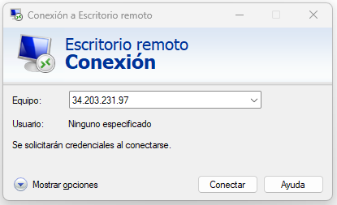{ .img2 .marginbottom40}

**Resultados de aprendizaje y criterios de evaluacion que se evaluarán en esta unidad.**  

| **Resultados de aprendizaje de la unidad didáctica:**|
||
|**RA6. Gestiona métodos de acceso remoto describiendo sus características e instalando los servicios correspondientes**|

|**Criterios de evaluación de la unidad didáctica:**|
||
|**a)** Se han descrito métodos de acceso y administración remota de sistemas.|
|**b)** Se ha instalado un servicio de acceso remoto en línea de comandos.|
|**c)** Se ha instalado un servicio de acceso remoto en modo gráfico.|
|**d)** Se ha comprobado el funcionamiento de ambos métodos.|
|**e)** Se han identificado las principales ventajas y deficiencias de cada uno.|
|*f) Se han realizado pruebas de acceso remoto entre sistemas de distinta naturaleza.*|
|*g) Se han realizado pruebas de administración remota entre sistemas de distinta naturaleza.*|

## 1 - Introducción

**El acceso y administración remota** de servicios en red es **la capacidad de conectar, controlar y configurar ordenadores, servidores y dispositivos de red desde un lugar distinto** sin estar cerca de ellos de forma física. Esto ayuda a solucionar problemas y actualizar sistemas de manera rápida a través de internet o redes locales.

## 2 - Conceptos y definición

### 2.1 Tipos de recursos accesibles

**Los recursos** a los que se accede de forma remota abarca todo tipo de servicios:

- **Infraestructura de Red:**  
Gestión y configuración de servidores, enrutadores y conmutadores por parte de administradores de TI.
- **Escritorios:**  
Acceso completo al sistema operativo de una máquina física o virtual para trabajar de forma íntegra.
- **Archivos y Datos:**  
Permite recuperar, cargar y administrar documentos almacenados en servidores o dispositivos remotos sin necesidad de enviarlos por correo electrónico.
- **Aplicaciones:**  
Ejecución de software específico (virtual o físico) alojado en un servidor central, lo cual es útil cuando el programa requiere mucha potencia de cálculo o licencias específicas.

### 2.2 Tipos de accesos

Los tipos de acceso remoto se pueden clasificar según el nivel de control y la finalidad del acceso:

- **Acceso vs. Control remoto:**  
Mientras que el **acceso remoto** significa conectarse a un sistema o red, el **control remoto** es un tipo específico de acceso donde el usuario toma el control total del dispositivo objetivo.
- **Administración remota:** Se define específicamente como la gestión de servidores y servicios desde un equipo de escritorio remoto, configurando ajustes e instalando actualizaciones sin acceso físico a la sala de servidores.
- **Componentes del acceso:** Para que este concepto se materialice, se requiere una combinación de **software** (que implementa protocolos), **hardware** (dispositivos físicos o virtuales) y una **red** de comunicación.

### 2.3 Software de administración remota

El control de sistemas externos se materializa mediante software (y protocolos) que rigen la interacción entre el dispositivo del usuario y el sistema objetivo.

En este caso se hará una distinción entre **acceso remoto en línea de comandos** y **acceso remoto en modo gráfico**:

1. **Acceso remoto en línea de comandos:**  
    - **SSH (Secure Shell)** es un protocolo de red que permite a los usuarios conectarse de manera segura a un sistema remoto mediante una interfaz de línea de comandos.  
    - **Telnet** es otro protocolo que permite la comunicación remota, pero carece de cifrado, lo que lo hace menos seguro que SSH.

1. **Acceso remoto en modo gráfico:**
    - **RDP (Remote Desktop Protocol)** es un protocolo desarrollado por Microsoft que permite a los usuarios conectarse a otro ordenador a través de una interfaz gráfica, proporcionando acceso completo al escritorio del sistema remoto.
    - **Remmina** es un cliente de escritorio remoto que soporta múltiples protocolos, incluyendo RDP, VNC y SSH, facilitando la conexión a diferentes sistemas desde una única aplicación.
    - **VNC (Virtual Network Computing)** permite controlar un ordenador remoto a través de una interfaz gráfica, transmitiendo la pantalla del sistema remoto al local y permitiendo la interacción con el mismo.

## 3 - **Riesgos e inconvenientes asociados al control externo**  

### 3.1 Riesgos de seguridad y malware

El acceso remoto a los recursos de red expone a las organizaciones a interceptación de datos, robo de credenciales, ataques de fuerza bruta en protocolos como RDP, infección por malware (troyano de acceso remoto, RAT) a través de redes domésticas no seguras y movimientos laterales de atacantes si una sesión queda abierta o mal configurada.

### 3.2 Latencia en la comunicación

La latencia puede afectar el rendimiento y la experiencia del usuario al acceder a recursos remotos, lo que subraya la importancia de implementar soluciones de red optimizadas.
En el caso de la administración remota de servidores, la latencia y estabilidad de la red (internet) puede ser crítica, especialmente en entornos donde se requiere una respuesta rápida para la resolución de problemas.

### 3.3 Complejidad en la gestión y mantenimiento

La gestión y el mantenimiento de sistemas remotos pueden ser más complejos que los sistemas locales, requiriendo conocimientos especializados y herramientas adicionales para su administración eficaz.

## 4 - Buenas prácticas y medidas de seguridad

- **Autenticación multifactor (MFA)**  
Implementarla siempre que sea posible.

- **No exponer el puerto de administración (RDP) a internet**  
Los atacantes escanean el puerto RDP (UDP 3389) constantemente. Una práctica recomendada es utilizar una VPN para acceder a la red interna de manera segura.

- **USar firewalls y listas de control de acceso (ACL)**
Implementar firewalls y listas de control de acceso (ACL) para restringir el acceso a los recursos remotos.

- **Configurar políticas de acceso y permisos**
Configurar políticas de acceso y permisos adecuadas para limitar el acceso a los recursos remotos.
Configurar políticas de bloqueo de cuentas después de varios intentos fallidos de inicio de sesión para prevenir ataques de fuerza bruta.
Establecer tiempos de sesión y desconexión automática para minimizar el riesgo de acceso no autorizado.

- **Políticas de seguridad claras**
Asegúrarse de que todo el mundo entiende las políticas de seguridad y de que se aplican correctamente.
Un ejemplo sería la política de no compartir credenciales de acceso remoto con otros usuarios.

- **Política de contraseñas seguras**
Asegúrarse de que todo el mundo utiliza contraseñas seguras y que se cambian regularmente.

- **Mantener los dispositivos actualizados**
Es fundamental mantener los dispositivos y sistemas operativos actualizados con las últimas correcciones de seguridad.

## 5 - Tarea RA6-CEa - Métodos de acceso y administración remota

### 5.1 Preguntas tipo test

!!! warning "Trabajo a realizar"
    - Para esta evaluación, deberéis responder a preguntas tipo test.
    - Podéis descargar el archivo de texto desde la correspondiente tarea de aules (RA6CEa Nombre Apellidos).
    - Subrayar la respuesta que consideráis correcta.

### 5.2 Entrega de la tarea

!!! warning "Condiciones de entrega de la tarea"
    - Guardar el documento con RA6-CEa-NombreApellidos en formato **odt**, **formato nativo** de LibreOffice writer.
    - **No se aceptará ningun formato que no sea odt**.  
    - A partir de momento de apertura de la tarea, dispondréis de **20 minutos** para subir vuestros trabajos. Pasado ese tiempo la tarea se cerrará y ya no será posible subir vuestras respuestas.

## 6 Tarea RA6-CEbcd-1 - Instalación y conexión remota a Windows Server 2025 en AWS

### 6.1 Instalación de Windows Server 2025 en AWS

AWS (Amazon Web Services) es una plataforma de servicios en la nube que permite a los usuarios crear y gestionar servidores virtuales, conocidos como instancias EC2 (Elastic Compute Cloud). Para instalar Windows Server 2025 en AWS, se deben seguir los siguientes pasos:

#### 6.1.1 Primer acceso a AWS

- Revisad vuestros correos electrónicos, ya que habréis recibido un correo de AWS con un enlace para crear vuestra cuenta.
- Para la creación de la cuenta, debéis seguir los pasos indicados en el siguiente [enlace](https://javieregeablasco.github.io/Apuntes/DAW/DAW_2/AWS/UT.%203-AWS%20Academy/#2-learner-lab)
- Una vez creada la cuenta accederemos al laboratorio de AWS (learner lab).

#### 6.1.2 Acceder al curso

- Para acceder al curso, debéis seguir los pasos indicados en el siguiente [enlace](https://javieregeablasco.github.io/Apuntes/DAW/DAW_2/AWS/UT.%203-AWS%20Academy/#23-acceso-al-curso)

#### 6.1.3 Acceder al laboratorio

- Para acceder al laboratorio, debéis seguir los pasos indicados en el siguiente [enlace](https://javieregeablasco.github.io/Apuntes/DAW/DAW_2/AWS/UT.%203-AWS%20Academy/#24-acceder-al-laboratorio)

#### 6.1.4 Lanzar el laboratorio

- Para lanzar el laboratorio, debéis seguir los pasos indicados en el siguiente [enlace](https://javieregeablasco.github.io/Apuntes/DAW/DAW_2/AWS/UT.%203-AWS%20Academy/#25-lanzar-el-laboratorio)

#### 6.1.5 Acceder al panel del laboratorio

- Para acceder al panel del laboratorio, debéis seguir los pasos indicados en el siguiente [enlace](https://javieregeablasco.github.io/Apuntes/DAW/DAW_2/AWS/UT.%203-AWS%20Academy/#26-panel-de-aws)

#### 6.1.6 Creación de una instancia EC2

Una instancia EC2 es un servidor virtual que se ejecuta en la infraestructura de AWS.

Para crear una instancia EC2 con Windows Server 2025, se deben seguir los siguientes pasos:

- Ir al panel de control de AWS y seleccionar el servicio EC2.
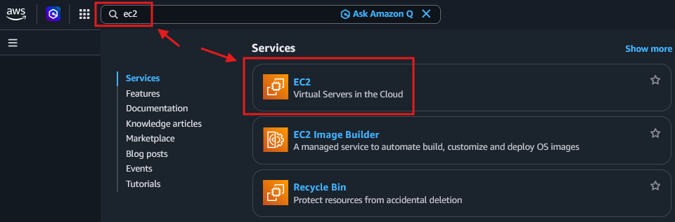{ .margintop10 .marginbottom10}
- Una vez en el menú de EC2, seleccionar "Lanzar instancia".
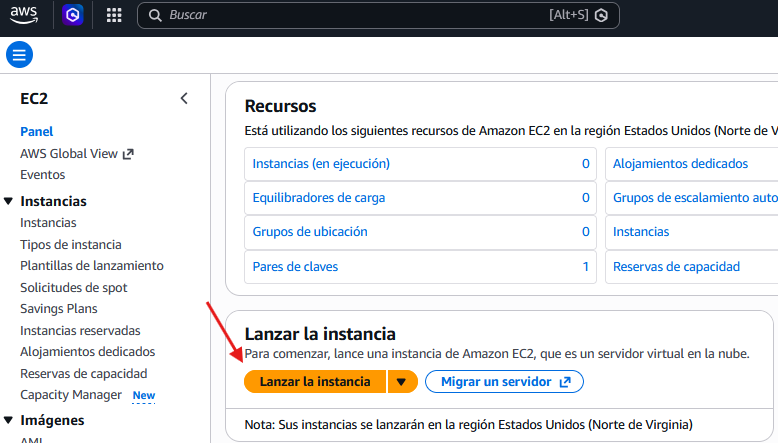{ .margintop10 .marginbottom10 .marco}
- Seleccionar la imagen de Windows Server 2025.
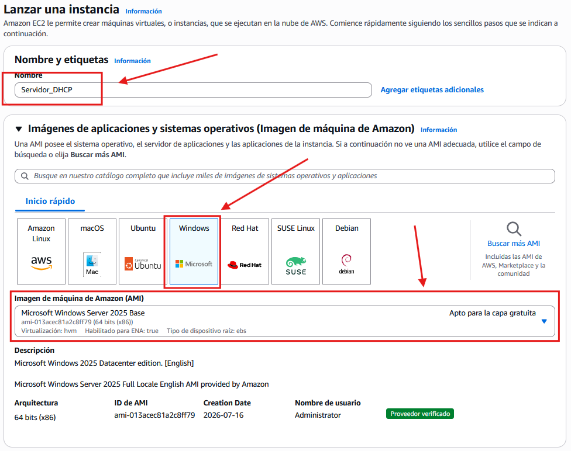{ .margintop10 .marginbottom10 .marco}
- Configurar las opciones de la instancia (tipo, par de claves).
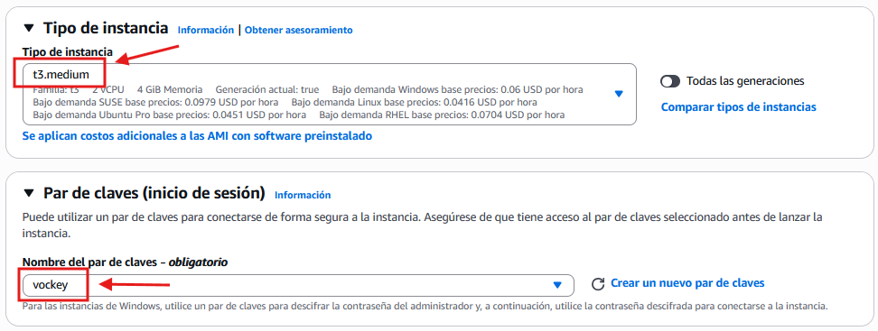{ .margintop10 .marginbottom10 .marco}
- Configurar las opciones de red.
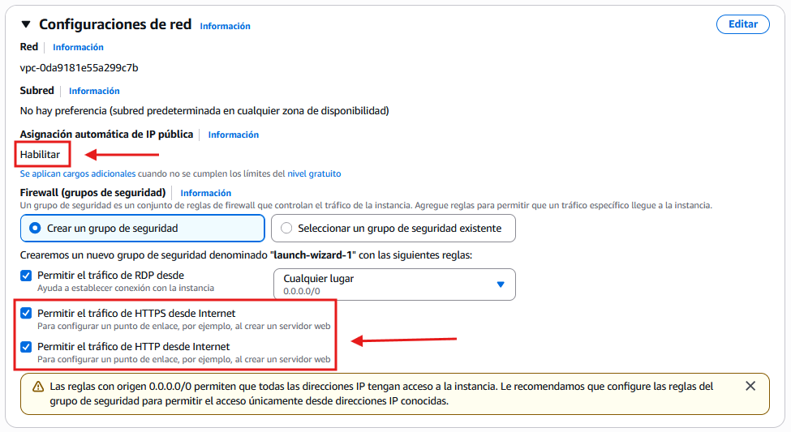{ .margintop10 .marginbottom10 .marco}
- Configurar el almacenamiento.
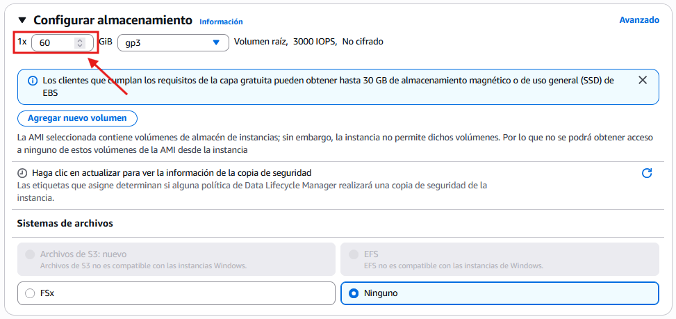{ .margintop10 .marginbottom10 .marco}
- Buscamos el botón de lanzar y lo pulsamos.
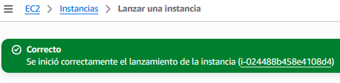{ .margintop10 .marginbottom10 .marco}
- Volvemos a la página de EC2 y supervisamos el estado de creación de nuestra instancia.
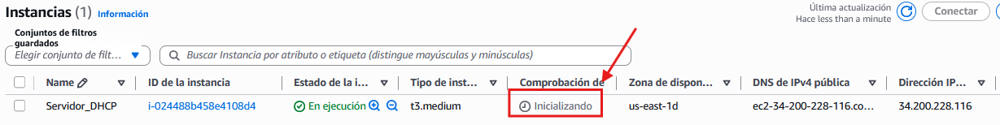{ .margintop10 .marginbottom10 .marco}

### 6.2 Conexión remota a la instancia de Windows Server 2025 desde windows 10-11

En este caso usaremos el protocolo RDP (Remote Desktop Protocol) para conectarnos a la instancia de Windows Server 2025. ese protocolo permite a los usuarios conectarse a otro ordenador a través de una interfaz gráfica, proporcionando acceso completo al escritorio del sistema remoto.

AWS facilita la conexión remota a través de RDP proporcionando un archivo de conexión que contiene la dirección IP pública de la instancia y las credenciales necesarias para acceder.

- Seleccionamos la instancia a la que queremos acceder y accedemos al servicio de conexión remota en AWS.
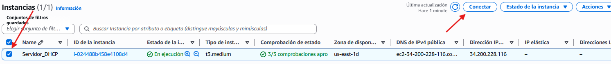{ .margintop10 .marginbottom10 .marco}
- Seleccionamos RDP. Descargamos el archivo de conexión. De momento no lo abrimos ya que aún no tenemos las credenciales.
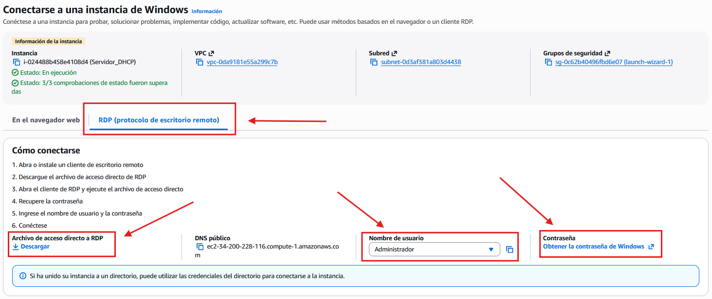{ .margintop10 .marginbottom10 .marco}
- Volvemos al learner lab pinchamos en AWS details y descargamos el archivo de la clave privada **labuser.pem** y lo guardamos en nuestro equipo.
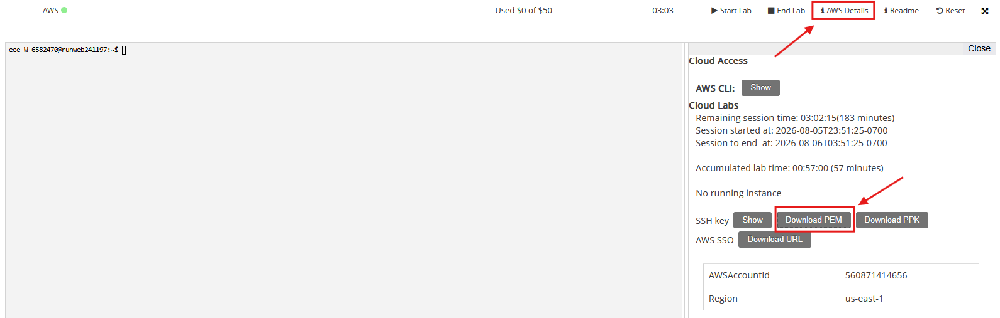{ .margintop10 .marginbottom10 .marco}
- Volvemos a la página de EC2 y seleccionamos la instancia a la que queremos acceder. Pinchamos en **Conectar** y luego en **Obtener contraseña**. Subimos el archivo **labuser.pem** y obtenemos la contraseña de acceso.
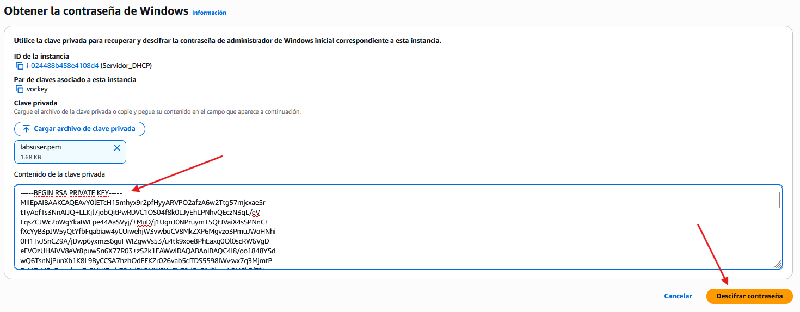{ .margintop10 .marginbottom10 .marco}
Contraseña de acceso: **[Contraseña generada por AWS]**
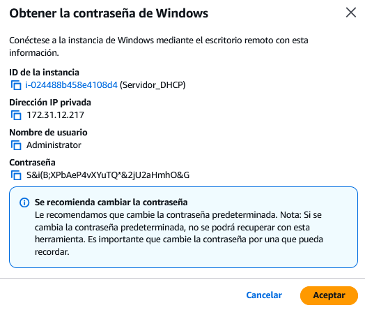{ .margintop10 .marginbottom10 .marco}
- Abrimos el archivo de conexión RDP que hemos descargado anteriormente y pegamos la contraseña generada por AWS.  
Acceso al escritorio remoto de Windows Server 2025.
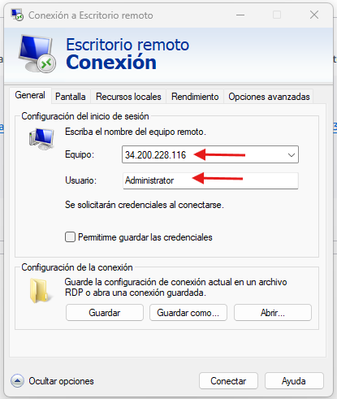{ .margintop10 .marginbottom10 }  
Pegamos la contraseña generada por AWS.
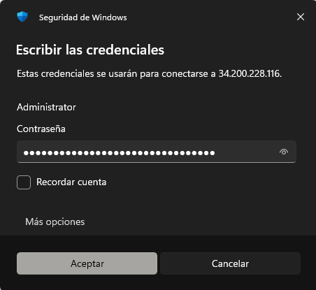{ .margintop10 .marginbottom10 }
- Aceptamos los riesgos de seguridad y nos conectamos al escritorio remoto de Windows Server 2025.  
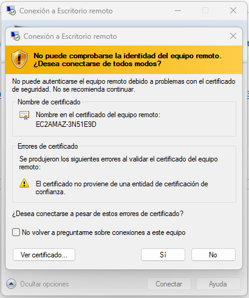{ .margintop10 .marginbottom10 }
- Una vez conectdos, podemos trabajar con el escritorio remoto de Windows Server 2025 como si estuviéramos físicamente frente a él.
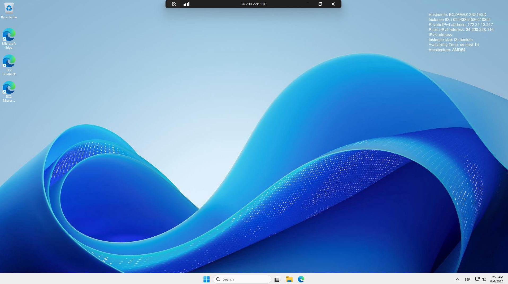{ .margintop10 .marginbottom10}

### 6.3 Configuraciones preliminares de Windows Server 2025

!!! warning "Optional"
Una vez conectados al escritorio remoto de Windows Server 2025, es recomendable realizar algunas configuraciones preliminares para asegurar el correcto funcionamiento del servidor y la seguridad del mismo.

- Cambiar el nombre del equipo.
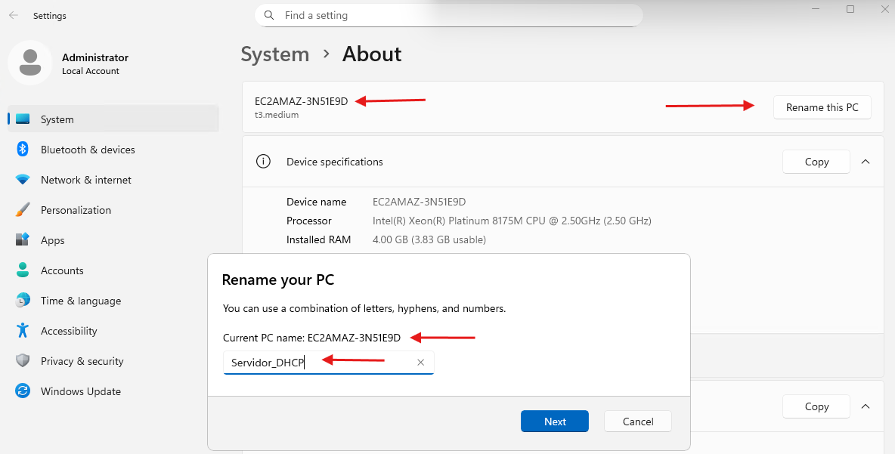{ .margintop10 .marginbottom10 }
Si cambiamos el nombre del equipo, debemos reiniciar el servidor para que los cambios tengan efecto.
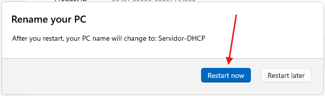{ .margintop10 .marginbottom10 }
- Edición y versión del sistema operativo.
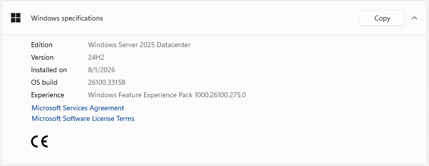{ .margintop10 .marginbottom10 }
- Configurar el widget.
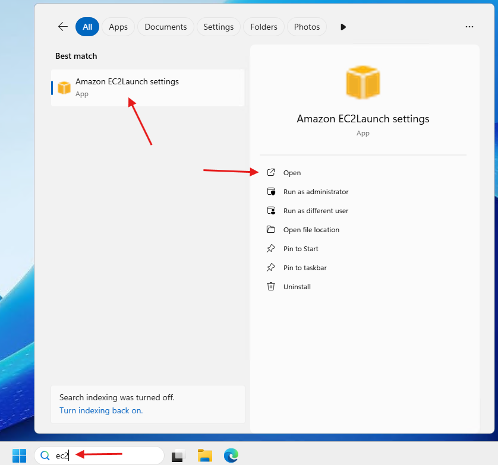{ .margintop10 .marginbottom10 }
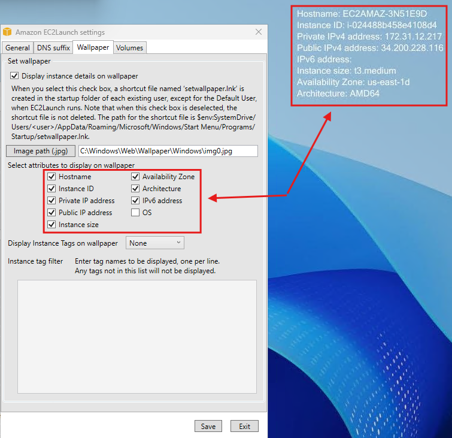{ .margintop10 .marginbottom10 }

### 6.4 Desconexión de la instancia a Windows Server 2025

Podemos hacerlo de varias formas:

- Cerrar la ventana de conexión remota.
- Cerrar sesión desde el menú de inicio de Windows Server 2025.
- Ejecutar la aplicación **Run** y escribir el comando **logoff** para cerrar la sesión de forma inmediata.
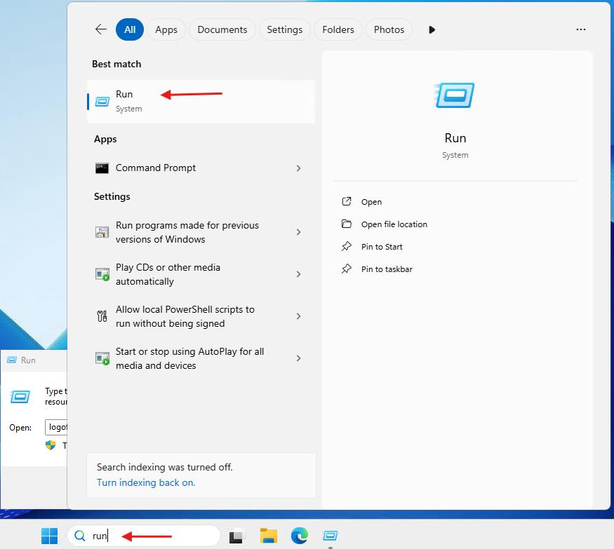{ .margintop10 .marginbottom10 }
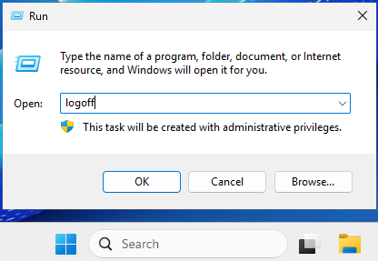{ .margintop10 .marginbottom10 }

## 7 Tarea RA6-CEbcd-2 - Instalación y conexión remota a Ubuntu Server 22.04 en AWS

### 6.5 Conexión remota a la instancia de Windows Server 2025 desde Linux
<!-- doc SSH -->
<!-- https://marcosruiz.github.io/posts/servicio-ssh/ -->
<!-- https://docs.google.com/presentation/d/1eJTYUdgqbQTfzIJDM4FhhvqMX3ICfIG85OaFwnReU3A/edit?slide=id.g1142a802_1_0#slide=id.g1142a802_1_0 -->
<!-- https://acastan.gitbook.io/servicios -->