{ .img2 .marginbottom40}

**Resultados de aprendizaje y criterios de evaluacion que se evaluarán en esta unidad.**  

| **Resultados de aprendizaje de la unidad didáctica:**|
||
|**RA6. Gestiona métodos de acceso remoto describiendo sus características e instalando los servicios correspondientes**|

|**Criterios de evaluación de la unidad didáctica:**|
||
|**a)** Se han descrito métodos de acceso y administración remota de sistemas.|
|**b)** Se ha instalado un servicio de acceso remoto en línea de comandos.|
|**c)** Se ha instalado un servicio de acceso remoto en modo gráfico.|
|**d)** Se ha comprobado el funcionamiento de ambos métodos.|
|*e) Se han identificado las principales ventajas y deficiencias de cada uno.*|
|**f)** Se han realizado pruebas de acceso remoto entre sistemas de distinta naturaleza.|
|*g) Se han realizado pruebas de administración remota entre sistemas de distinta naturaleza.*|

## 1 - Introducción

**El acceso y administración remota** de servicios en red es **la capacidad de conectar, controlar y configurar ordenadores, servidores y dispositivos de red desde un lugar distinto** sin estar cerca de ellos de forma física. Esto ayuda a solucionar problemas y actualizar sistemas de manera rápida a través de internet o redes locales.

## 2 - Conceptos y definición

### 2.1 Tipos de recursos accesibles

**Los recursos** a los que se accede de forma remota abarca todo tipo de servicios:

- **Infraestructura de Red:**  
Gestión y configuración de servidores, enrutadores y conmutadores por parte de administradores de TI.
- **Escritorios:**  
Acceso completo al sistema operativo de una máquina física o virtual para trabajar de forma íntegra.
- **Archivos y Datos:**  
Permite recuperar, cargar y administrar documentos almacenados en servidores o dispositivos remotos sin necesidad de enviarlos por correo electrónico.
- **Aplicaciones:**  
Ejecución de software específico (virtual o físico) alojado en un servidor central, lo cual es útil cuando el programa requiere mucha potencia de cálculo o licencias específicas.

### 2.2 Tipos de accesos

Los tipos de acceso remoto se pueden clasificar según el nivel de control y la finalidad del acceso:

- **Acceso vs. Control remoto:**  
Mientras que el **acceso remoto** significa conectarse a un sistema o red, el **control remoto** es un tipo específico de acceso donde el usuario toma el control total del dispositivo objetivo.
- **Administración remota:** Se define específicamente como la gestión de servidores y servicios desde un equipo de escritorio remoto, configurando ajustes e instalando actualizaciones sin acceso físico a la sala de servidores.
- **Componentes del acceso:** Para que este concepto se materialice, se requiere una combinación de **software** (que implementa protocolos), **hardware** (dispositivos físicos o virtuales) y una **red** de comunicación.

### 2.3 Software de administración remota

El control de sistemas externos se materializa mediante software (y protocolos) que rigen la interacción entre el dispositivo del usuario y el sistema objetivo.

En este caso se hará una distinción entre **acceso remoto en línea de comandos** y **acceso remoto en modo gráfico**:

1. **Acceso remoto en línea de comandos:**  
    - **SSH (Secure Shell)** es un protocolo de red que permite a los usuarios conectarse de manera segura a un sistema remoto mediante una interfaz de línea de comandos.  
    - **Telnet** es otro protocolo que permite la comunicación remota, pero carece de cifrado, lo que lo hace menos seguro que SSH.

1. **Acceso remoto en modo gráfico:**
    - **RDP (Remote Desktop Protocol)** es un protocolo desarrollado por Microsoft que permite a los usuarios conectarse a otro ordenador a través de una interfaz gráfica, proporcionando acceso completo al escritorio del sistema remoto.
    - **Remmina** es un cliente de escritorio remoto que soporta múltiples protocolos, incluyendo RDP, VNC y SSH, facilitando la conexión a diferentes sistemas desde una única aplicación.
    - **VNC (Virtual Network Computing)** permite controlar un ordenador remoto a través de una interfaz gráfica, transmitiendo la pantalla del sistema remoto al local y permitiendo la interacción con el mismo.

## 3 - **Riesgos e inconvenientes asociados al control externo**  

### 3.1 Riesgos de seguridad y malware

El acceso remoto a los recursos de red expone a las organizaciones a interceptación de datos, robo de credenciales, ataques de fuerza bruta en protocolos como RDP, infección por malware (troyano de acceso remoto, RAT) a través de redes domésticas no seguras y movimientos laterales de atacantes si una sesión queda abierta o mal configurada.

### 3.2 Latencia en la comunicación

La latencia puede afectar el rendimiento y la experiencia del usuario al acceder a recursos remotos, lo que subraya la importancia de implementar soluciones de red optimizadas.
En el caso de la administración remota de servidores, la latencia y estabilidad de la red (internet) puede ser crítica, especialmente en entornos donde se requiere una respuesta rápida para la resolución de problemas.

### 3.3 Complejidad en la gestión y mantenimiento

La gestión y el mantenimiento de sistemas remotos pueden ser más complejos que los sistemas locales, requiriendo conocimientos especializados y herramientas adicionales para su administración eficaz.

## 4 - Buenas prácticas y medidas de seguridad

- **Autenticación multifactor (MFA)**  
Implementarla siempre que sea posible.

- **No exponer el puerto de administración (RDP) a internet**  
Los atacantes escanean el puerto RDP (UDP 3389) constantemente. Una práctica recomendada es utilizar una VPN para acceder a la red interna de manera segura.

- **USar firewalls y listas de control de acceso (ACL)**
Implementar firewalls y listas de control de acceso (ACL) para restringir el acceso a los recursos remotos.

- **Configurar políticas de acceso y permisos**
Configurar políticas de acceso y permisos adecuadas para limitar el acceso a los recursos remotos.
Configurar políticas de bloqueo de cuentas después de varios intentos fallidos de inicio de sesión para prevenir ataques de fuerza bruta.
Establecer tiempos de sesión y desconexión automática para minimizar el riesgo de acceso no autorizado.

- **Políticas de seguridad claras**
Asegúrarse de que todo el mundo entiende las políticas de seguridad y de que se aplican correctamente.
Un ejemplo sería la política de no compartir credenciales de acceso remoto con otros usuarios.

- **Política de contraseñas seguras**
Asegúrarse de que todo el mundo utiliza contraseñas seguras y que se cambian regularmente.

- **Mantener los dispositivos actualizados**
Es fundamental mantener los dispositivos y sistemas operativos actualizados con las últimas correcciones de seguridad.

## 5 - Tarea RA6-CEa - Métodos de acceso y administración remota

### 5.1 Preguntas tipo test

!!! warning "Trabajo a realizar"
    - Para esta evaluación, deberéis responder a preguntas tipo test.
    - Podéis descargar el archivo de texto desde la correspondiente tarea de aules (RA6CEa Nombre Apellidos).
    - Subrayar la respuesta que consideráis correcta.

### 5.2 Entrega de la tarea

!!! warning "Condiciones de entrega de la tarea"
    - Guardar el documento con RA6-CEa-NombreApellidos en formato **odt**, **formato nativo** de LibreOffice writer.
    - **No se aceptará ningun formato que no sea odt**.  
    - A partir de momento de apertura de la tarea, dispondréis de **20 minutos** para subir vuestros trabajos. Pasado ese tiempo la tarea se cerrará y ya no será posible subir vuestras respuestas.

## 6 Tarea RA6-CEbcd-1 - Instalación y conexión remota a Windows Server 2025 en AWS

### 6.1 Instalación de Windows Server 2025 en AWS

AWS (Amazon Web Services) es una plataforma de servicios en la nube que permite a los usuarios crear y gestionar servidores virtuales, conocidos como instancias EC2 (Elastic Compute Cloud). Para instalar Windows Server 2025 en AWS, se deben seguir los siguientes pasos:

#### 6.1.1 Primer acceso a AWS

- Revisad vuestros correos electrónicos, ya que habréis recibido un correo de AWS con un enlace para crear vuestra cuenta.
- Para la creación de la cuenta, debéis seguir los pasos indicados en el siguiente [enlace](https://javieregeablasco.github.io/Apuntes/DAW/DAW_2/AWS/UT.%203-AWS%20Academy/#2-learner-lab)
- Una vez creada la cuenta accederemos al laboratorio de AWS (learner lab).

#### 6.1.2 Acceder al curso

- Para acceder al curso, debéis seguir los pasos indicados en el siguiente [enlace](https://javieregeablasco.github.io/Apuntes/DAW/DAW_2/AWS/UT.%203-AWS%20Academy/#23-acceso-al-curso)

#### 6.1.3 Acceder al laboratorio

- Para acceder al laboratorio, debéis seguir los pasos indicados en el siguiente [enlace](https://javieregeablasco.github.io/Apuntes/DAW/DAW_2/AWS/UT.%203-AWS%20Academy/#24-acceder-al-laboratorio)

#### 6.1.4 Lanzar el laboratorio

- Para lanzar el laboratorio, debéis seguir los pasos indicados en el siguiente [enlace](https://javieregeablasco.github.io/Apuntes/DAW/DAW_2/AWS/UT.%203-AWS%20Academy/#25-lanzar-el-laboratorio)

#### 6.1.5 Acceder al panel del laboratorio

- Para acceder al panel del laboratorio, debéis seguir los pasos indicados en el siguiente [enlace](https://javieregeablasco.github.io/Apuntes/DAW/DAW_2/AWS/UT.%203-AWS%20Academy/#26-panel-de-aws)

#### 6.1.6 Creación de una instancia EC2

Una instancia EC2 es un servidor virtual que se ejecuta en la infraestructura de AWS.

Para crear una instancia EC2 con Windows Server 2025, se deben seguir los siguientes pasos:

- Ir al panel de control de AWS y seleccionar el servicio EC2.
{ .margintop10 .marginbottom10}
- Una vez en el menú de EC2, seleccionar "Lanzar instancia".
{ .margintop10 .marginbottom10 .marco}
- Seleccionar la imagen de Windows Server 2025.
{ .margintop10 .marginbottom10 .marco}
- Configurar las opciones de la instancia (tipo, par de claves).
{ .margintop10 .marginbottom10 .marco}
- Configurar las opciones de red.
{ .margintop10 .marginbottom10 .marco}
- Configurar el almacenamiento.
{ .margintop10 .marginbottom10 .marco}
- Buscamos el botón de lanzar y lo pulsamos.
{ .margintop10 .marginbottom10 .marco}
- Volvemos a la página de EC2 y supervisamos el estado de creación de nuestra instancia.
{ .margintop10 .marginbottom10 .marco}

### 6.2 Conexión remota a la instancia de Windows Server 2025 desde windows 10-11

En este caso usaremos el protocolo RDP (Remote Desktop Protocol) para conectarnos a la instancia de Windows Server 2025. ese protocolo permite a los usuarios conectarse a otro ordenador a través de una interfaz gráfica, proporcionando acceso completo al escritorio del sistema remoto.

AWS facilita la conexión remota a través de RDP proporcionando un archivo de conexión que contiene la dirección IP pública de la instancia y las credenciales necesarias para acceder.

- Seleccionamos la instancia a la que queremos acceder y accedemos al servicio de conexión remota en AWS.
{ .margintop10 .marginbottom10 .marco}
- Seleccionamos RDP. Descargamos el archivo de conexión. De momento no lo abrimos ya que aún no tenemos las credenciales.
{ .margintop10 .marginbottom10 .marco}
- Volvemos al learner lab pinchamos en AWS details y descargamos el archivo de la clave privada **labuser.pem** y lo guardamos en nuestro equipo.
{ .margintop10 .marginbottom10 .marco}
- Volvemos a la página de EC2 y seleccionamos la instancia a la que queremos acceder. Pinchamos en **Conectar** y luego en **Obtener contraseña**. Subimos el archivo **labuser.pem** y obtenemos la contraseña de acceso.
{ .margintop10 .marginbottom10 .marco}
Contraseña de acceso: **[Contraseña generada por AWS]**
{ .margintop10 .marginbottom10 .marco}
- Abrimos el archivo de conexión RDP que hemos descargado anteriormente y pegamos la contraseña generada por AWS.  
Acceso al escritorio remoto de Windows Server 2025.
{ .margintop10 .marginbottom10 }  
Pegamos la contraseña generada por AWS.
{ .margintop10 .marginbottom10 }
- Aceptamos los riesgos de seguridad y nos conectamos al escritorio remoto de Windows Server 2025.  
{ .margintop10 .marginbottom10 }
- Una vez conectdos, podemos trabajar con el escritorio remoto de Windows Server 2025 como si estuviéramos físicamente frente a él.
{ .margintop10 .marginbottom10}

### 6.3 Configuraciones preliminares de Windows Server 2025

!!! warning "Optional"
Una vez conectados al escritorio remoto de Windows Server 2025, es recomendable realizar algunas configuraciones preliminares para asegurar el correcto funcionamiento del servidor y la seguridad del mismo.

- Cambiar el nombre del equipo.
{ .margintop10 .marginbottom10 }
Si cambiamos el nombre del equipo, debemos reiniciar el servidor para que los cambios tengan efecto.
{ .margintop10 .marginbottom10 }
- Edición y versión del sistema operativo.
{ .margintop10 .marginbottom10 }
- Configurar el widget.
{ .margintop10 .marginbottom10 }
{ .margintop10 .marginbottom10 }

### 6.4 Desconexión de la instancia a Windows Server 2025

Podemos hacerlo de varias formas:

- Cerrar la ventana de conexión remota.
- Cerrar sesión desde el menú de inicio de Windows Server 2025.
- Ejecutar la aplicación **Run** y escribir el comando **logoff** para cerrar la sesión de forma inmediata.
{ .margintop10 .marginbottom10 }
{ .margintop10 .marginbottom10 }

### 6.5 Cerrar el laboratorio

Tenemos que cerrar el laboratorio de AWS para liberar los recursos y evitar cargos innecesarios. Para ello, simplemente finalizaremos el laboratorio, pinchando en **End Lab** en la consola del laboratory y esperaremos a que el testigo de AWS pase a **rojo**.
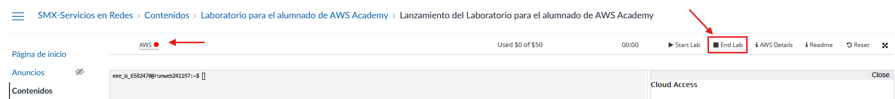{ .margintop10 .marginbottom10 }

## 7 Tarea RA6-CEbcd-2 - Instalación y conexión remota a Ubuntu Server 24.04 LTS en AWS

### 7.1 Instalación de Ubuntu Server 24.04 LTS en AWS

Repetiremos los pasos anteriores para crear una instancia EC2, pero esta vez seleccionaremos la imagen de Ubuntu Server 24.04 LTS.

- Seleccionamos la imagen de Ubuntu Server 24.04 LTS.
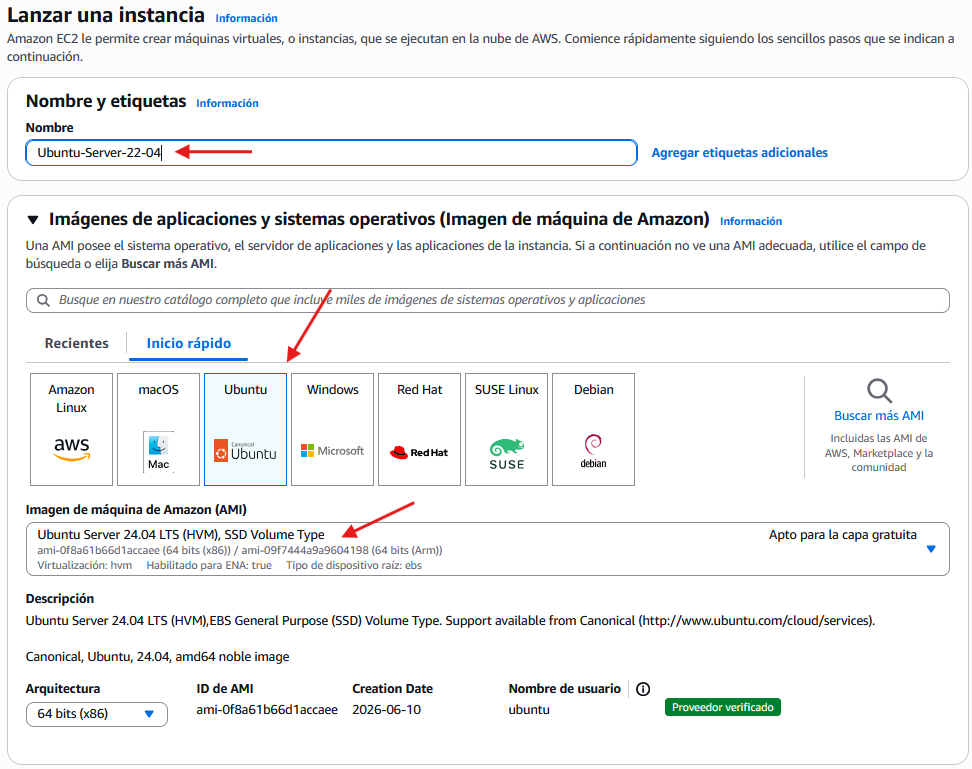{ .margintop10 .marginbottom10 .marco}
- Seleccionamos el tipo de instancia y el par de claves.
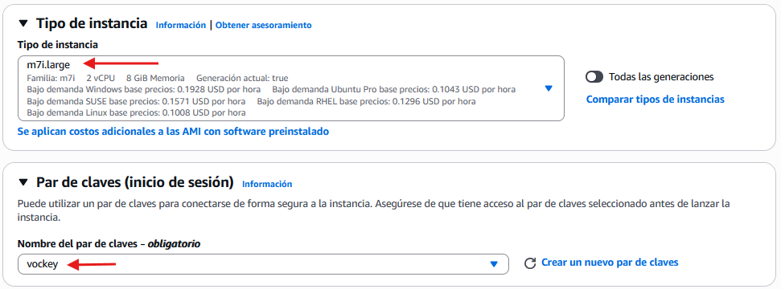{ .margintop10 .marginbottom10 .marco}
- Configuramos la red donde se desplegará la instancia.
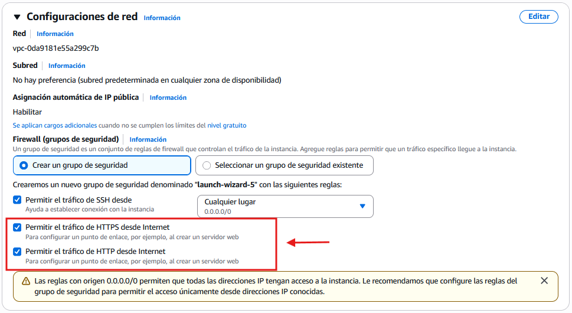{ .margintop10 .marginbottom10 .marco}
- Configuramos el almacenamiento de la instancia.
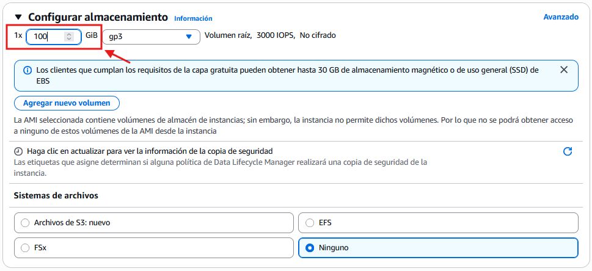{ .margintop10 .marginbottom10 .marco}

### 7.2 Conexión remota CLI a través del panel de control de AWS

- Al igual que en el caso de Windows Server 2025, seleccionaremos la instancia en la consola de AWS y pulsaremos conectar.
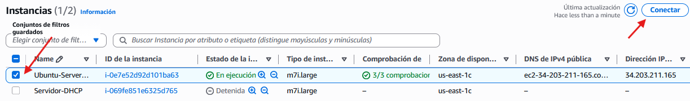{ .margintop10 .marginbottom10 .marco}
- AWS facilita la conexión remota a través de SSH de manera fácil e intuitiva.
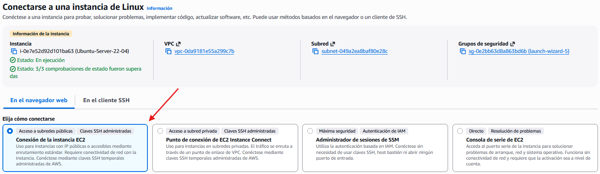{ .margintop10 .marginbottom10 .marco}
- Una vez establecida la conexión, se nos abrirá una ventana de terminal con la conexión SSH a la instancia de Ubuntu Server 24.04 LTS.
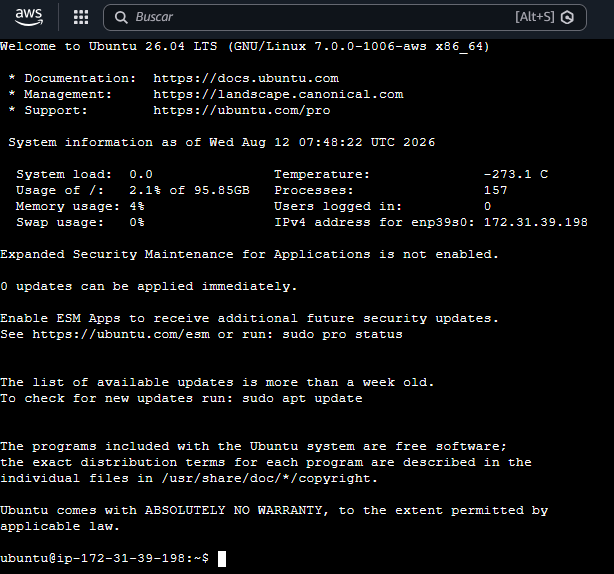{ .margintop10 .marginbottom10 }

### 7.3 Conexión remota desde SO Windows

- Para conectarnos a la instancia de Ubuntu Server 24.04 LTS desde un sistema operativo Windows, podemos utilizar la aplicación de conexión a escritorio remoto **MSTSC**.
- No obstante, tendremos que preparar la instancia para permitir conexiones así como instalar un cliente RDP y un entorno gráfico ligero en la instancia de Ubuntu Server 24.04 LTS.

#### 7.3.1 Apertura de puertos en la instancia

Con abrir los puertos necesarios en el firewall de la instancia de Ubuntu Server 24.04 LTS, podremos permitir conexiones remotas a través de RDP.

Aunque no sea una buena práctica, para fines educativos, no solo abriremos el puerto 3389 para los protocolos **TCP** y **UDP** sino que abriremos todos los puertos.

- Vamos a la consola de AWS y seleccionamos la instancia de Ubuntu Server 24.04 LTS.
- En la sección de **Seguridad**, seleccionamos el grupo de seguridad asociado a la instancia.
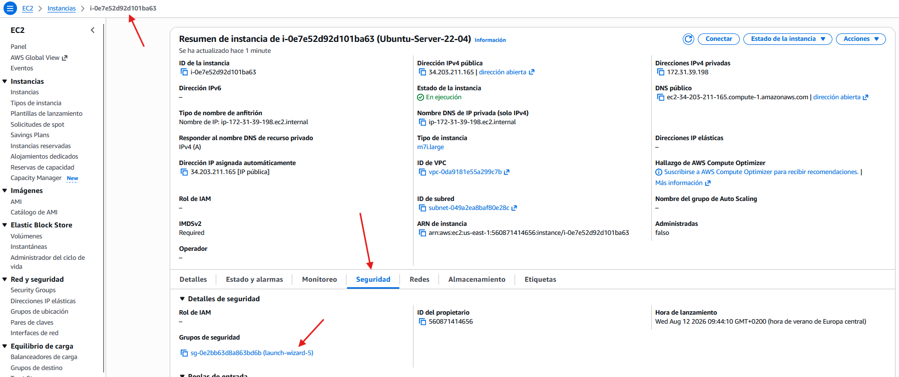{ .margintop10 .marginbottom10 .marco}
- Editamos las reglas de entrada.
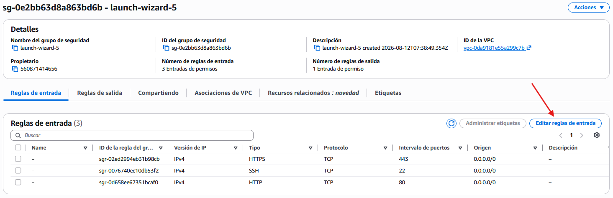{ .margintop10 .marginbottom10 .marco}
Agregamos una regla de entrada para permitir **el tráfico entrante desde internet sobre cualquier puerto**.
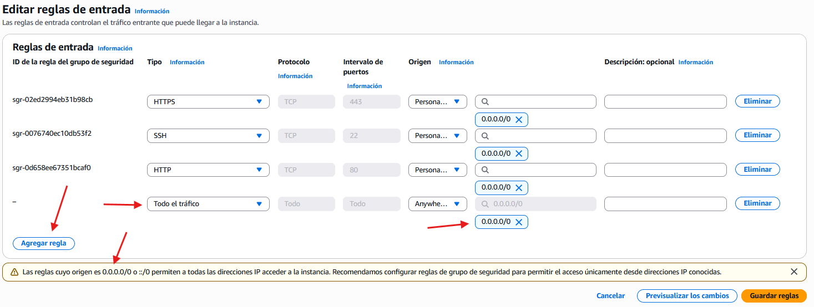{ .margintop10 .marginbottom10 .marco}  
Al final, obtendremos el siguiente resultado:
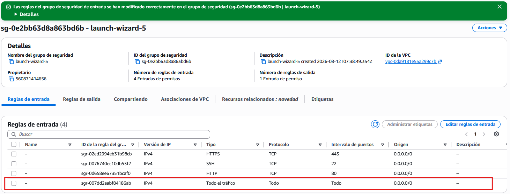{ .margintop10 .marginbottom10 .marco}

#### 7.3.2 Preparación de la instancia de Ubuntu Server 24.04 LTS

En la instancia de Ubuntu Server 24.04 LTS, instalaremos un servidor RDP para permitir conexiones remotas desde sistemas Windows. Para ello, primero nos conectaremos a la instancia a través de SSH y luego instalaremos el servidor RDP.

- Actualizamos los repositorios y actualizamos el sistema operativo.

```bash
sudo apt update && sudo apt upgrade -y
```

- De momento no disponemos de interfaz gráfica en la instancia de Ubuntu Server 24.04 LTS, por lo que instalaremos un entorno de escritorio ligero como **XFCE**.

```bash
sudo apt install xfce4 xfce4-goodies -y
```

- Instalamos el servidor RDP **XRDP**.

```bash
sudo apt install xrdp -y
```

- Habilitamos el servicio xrdp para que se inicie automáticamente al arrancar el sistema.

```bash
sudo systemctl enable xrdp
```

- Iniciamos el servicio xrdp.

```bash
sudo systemctl start xrdp
```

- Verificamos que el servicio xrdp esté activo y en ejecución.

```bash
sudo systemctl status xrdp
```

Obtendremos un resultado similar al siguiente.  
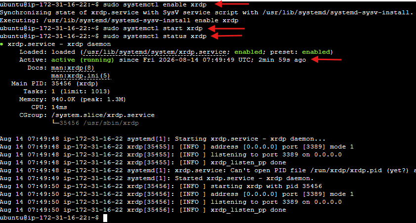{ .margintop10 .marginbottom10 }

- Cambiamos la contraseña del usuario para que pueda iniciar sesión a través de RDP.

```bash
sudo passwd <nombre_de_usuario>
```

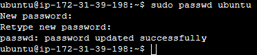{  .marginbottom10 }

- Para evitar conflictos con la elección de la interfaz gráfica por parte de XFCE, figuramos el archivo de sesion.

```bash
echo "startxfce4" > ~/.xsession
chmod +x ~/.xsession
```

- Nos aseguramos que la interfaz se aplica globalmente al servicio.

```bash
sudo sed -i.bak 's/exec \/etc\/X11\/Xsession/exec startxfce4/' /etc/xrdp/startwm.sh
```

- Reiniciamos el servicio XFCE

```bash
sudo systemctl restart xrdp
sudo systemctl status xrdp
```

#### 7.3.3 Conexión remota desde SO windows

- Lanzamos la aplicación de conexión a escritorio remoto **MSTSC** en nuestro sistema operativo Windows.
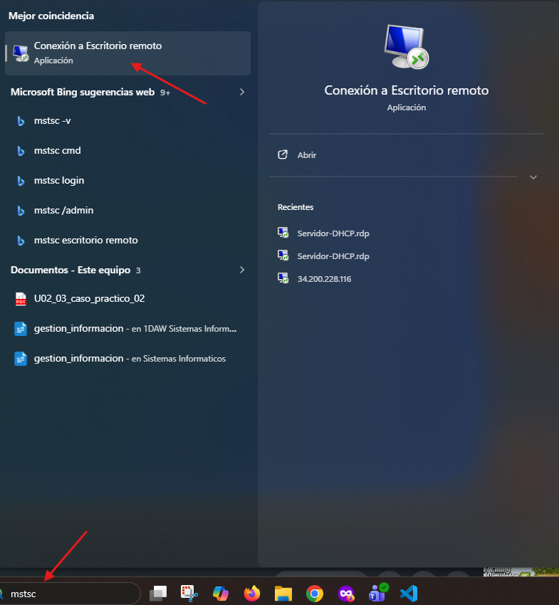{ .margintop10 .marginbottom10 }

- Escribimos la **IP pública** de la instancia a la que no vamos a conectar.
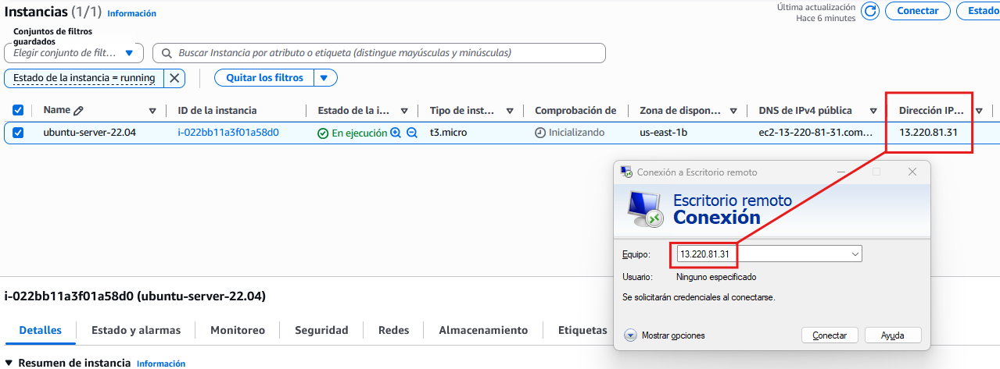{ .margintop10 .marginbottom10 .marco }

- Obviamos las advertencias de seguridad.
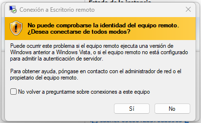{ .margintop10 .marginbottom10 }

- Una vez conectados introducimos las credenciales.
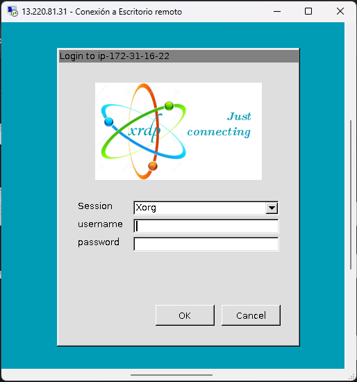{ .margintop10 .marginbottom10 }

- Si todo ha ido bien obtendremos una interfaz similar a la siguiente imagen.
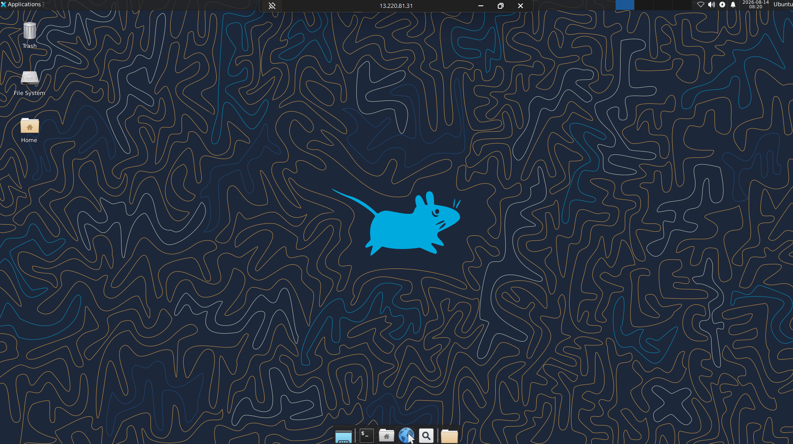{ .margintop10 .marginbottom10 }

## 8 - Tarea RA6-CEf-1 - Conexión remota desde Ubuntu Server 24.04 LTS a SO Windows

Para poder conectarnos desde una distribución de Linux a Windows necesitaremos una aplicación de acceso a escritorio como **Remmina**.

### 8.1 Comprobación e instalación de Remmina

- Remmina no viene instalada en todas las distribuciones de Linux así que comprobaremos si la tenemos instalada.

```bash
remmina --version
```

- Si nos devuelve un mensaje de error, instalaremos la aplicación.

```bash
sudo apt install remmina -y
```

### 8.2 Conexión a la instancia de Windows Server 2025

- Ejecutamos la aplicación

```bash
remmina
```

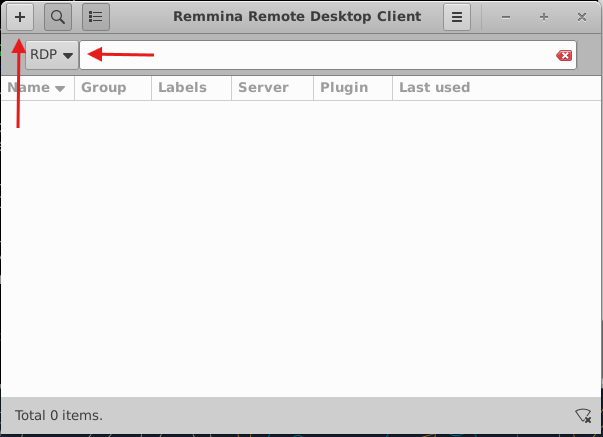{ .margintop10 .marginbottom10  }

- Introducimos los parámetros de la conexión
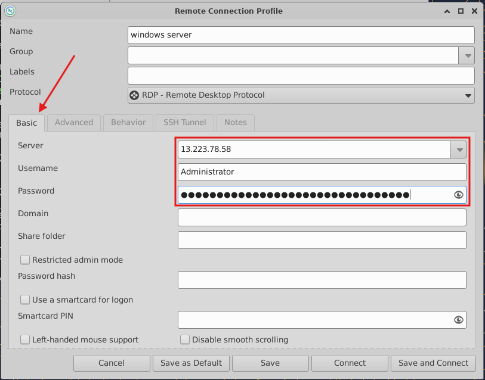{ .margintop10 .marginbottom10 }

- Guardamos los parametros de la conexión y lanzamos la conexión
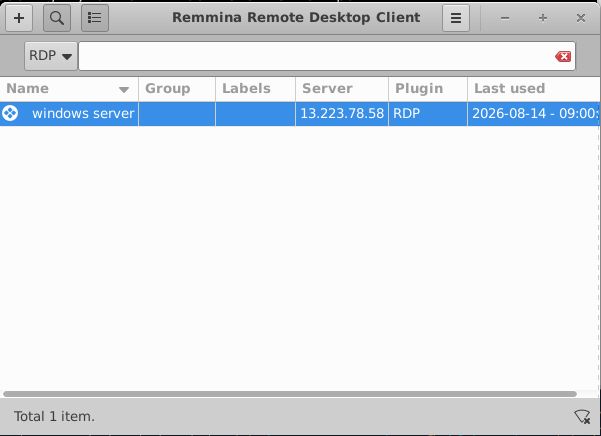{ .margintop10 .marginbottom10 }

- Aceptamos el certificado.
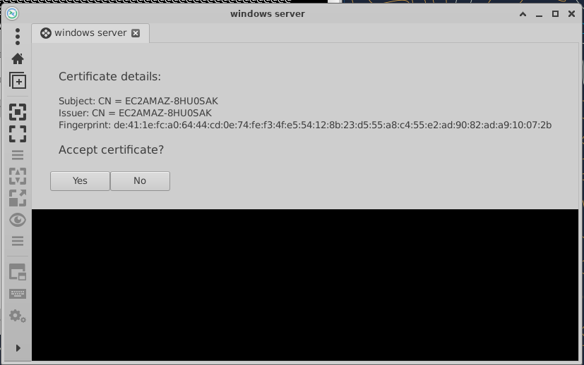{ .margintop10 .marginbottom10  }

- Si todo ha ido bien, estaremos en el escritorio de nuestra máquina Windows Server.
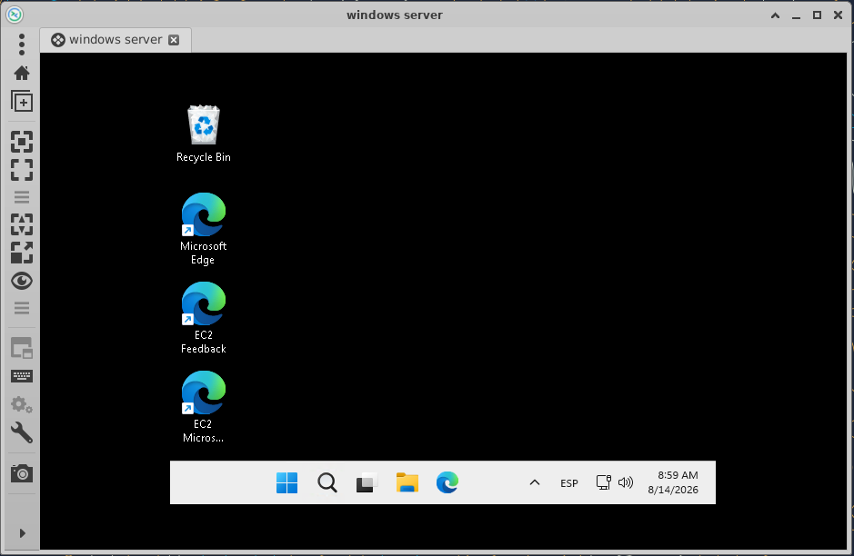{ .margintop10 .marginbottom10  }

### 8.3 Posibles problemas de conexión a la instancia de Windows Server 2025

Como ya hemos visto ambas máquinas deben estar en condiciones de acceptar conexiones remotas por RDP.

Así pues, verificaremos si Windows Server está configurado para aceptar conexiones remotas.

- Vamos a **Settings**.
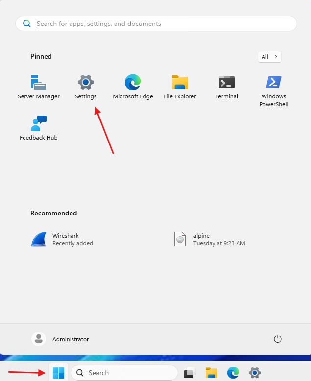{ .margintop10 .marginbottom10  }

- Abajo del todo seleccionamos **About**.
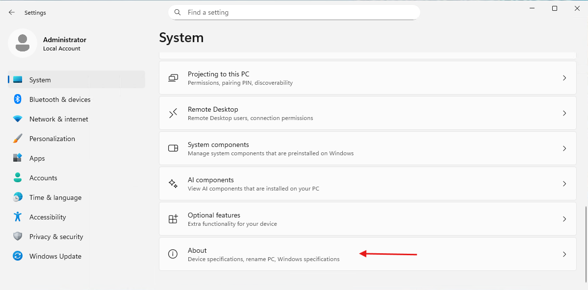{ .margintop10 .marginbottom10  }

- Buscamos Remote desktop.
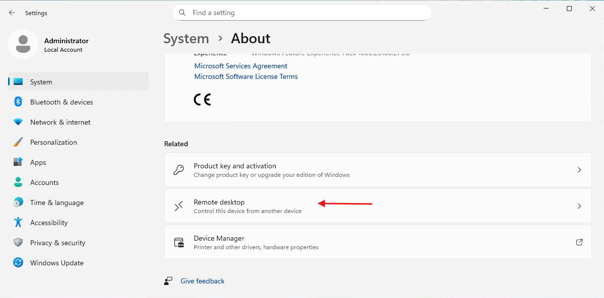{ .margintop10 .marginbottom10  }

- Comprobamos la configuración del **Remote Desktop**
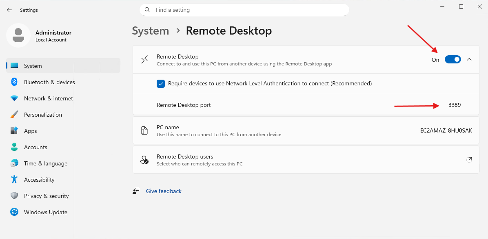{ .margintop10 .marginbottom10  }

!!! tip "Como podemos ver, Windows Server acepta por defecto las conexiones RDP. De no ser así no podriamos habernos conectado a la instancia en una práctica anterior."

## 9 - Administración remota segura con SSH (Secure Shell)

El protocolo SSH (Secure Shell) es **un protocolo de red** diseñado para acceder, administrar y controlar dispositivos de forma remota a través de una conexión totalmente cifrada. Surgió como un reemplazo seguro para protocolos tradicionales como **Telnet** o **FTP**, que transmitían la información y las contraseñas en texto plano.

### 9.1 Uso básico de SSH

Para conectar dos equipos mediante SSH se utiliza un modelo **cliente-servidor**:

- **Cliente:** La máquina local desde la que nos conectamos (CLI en Linux/macOS o GUI's como PuTTY/OpenSSH en Windows).
- **Servidor:** Equipo o servidor remoto que escucha peticiones de conexión (normalmente en el puerto TCP 22).

El comando básico en la terminal se compone de:

```bash
ssh usuario@direccion_ip_o_dominio
```

- **ssh:** Indica al sistema que inicie una sesión cifrada Secure Shell.
- **usuario:** Cuenta a la que deseamos acceder (p.e. root).
- **direccion_ip_o_dominio:** Dirección del servidor al que nos conectamos (p.e. 192.168.1.1 o servidor.com).

### 9.2 Mecanismos de cifrado en SSH

SSH combina **3 métodos criptográficos distintos** para garantizar la privacidad, la autenticación y la integridad de los datos.

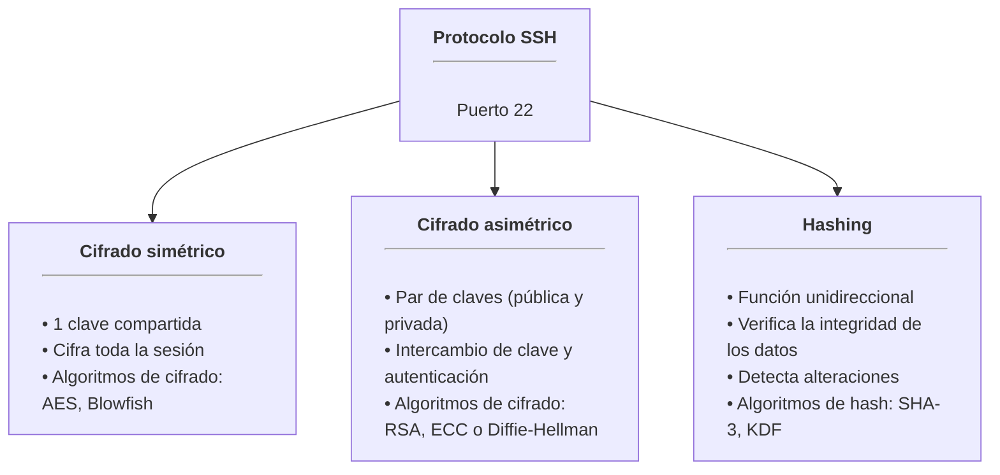
```mermaid
flowchart TB
    A["<b>Protocolo SSH</b><hr><br/>Puerto 22"] --> C["<b>Cifrado simétrico</b><hr><br/><div style='text-align: left;'>• 1 clave compartida</div><div style='text-align: left;'>• Cifra toda la sesión</div><div style='text-align: left;'>• Algoritmos de cifrado: AES, Blowfish</div>"]
    A --> D["<b>Cifrado asimétrico</b><hr><br/><div style='text-align: left;'>• Par de claves (pública y privada)</div><div style='text-align: left;'>• Intercambio de clave y autenticación</div><div style='text-align: left;'>• Algoritmos de cifrado: RSA, ECC o Diffie-Hellman</div>"]
    A --> E["<b>Hashing</b><hr><br/><div style='text-align: left;'>• Función unidireccional</div><div style='text-align: left;'>• Verifica la integridad de los datos</div><div style='text-align: left;'>• Detecta alteraciones</div><div style='text-align: left;'>• Algoritmos de hash: SHA-3, KDF</div>"]
```

1. **Cifrado simétrico**  
    - El cifrado simétrico utiliza **una única clave secreta** tanto para **cifrar como para descifrar** la información en ambos lados.  
    - **Uso en SSH:** Cifra la totalidad del tráfico y los comandos enviados durante la sesión activa.
    - **Seguridad:** La clave no se transmite por la red. El cliente y el servidor la generan de manera independiente durante el saludo inicial mediante un algoritmo de intercambio de claves.

1. **Cifrado Asimétrico**  
    - El cifrado asimétrico emplea **un par de claves matemáticamente enlazadas**.
        - **Una clave pública** que se puede compartir libremente.
        - **Una clave privada** que debe mantenerse secreta.  
    - Lo que se cifra con la clave pública solo puede descifrarse con la clave privada correspondiente.  
    - **Uso en SSH:** No se utiliza para cifrar toda la sesión (por ser computacionalmente más lento), sino para:
        - **Autenticar** la identidad del cliente y del servidor.
        - **Negociar** de forma segura la clave simétrica que se usará en la sesión.

1. **Hashing (Verificación de Integridad)**  
    - El hashing transforma cualquier entrada de datos en un valor único de longitud fija de forma unidireccional. No es posible de revertir es decir, con el hash no es posible obtener la información original.  
    - **Uso en SSH:** SSH utiliza HMAC (Hash-based Message Authentication Codes) para asegurar que los comandos e información transmitidos no hayan sido interceptados o alterados por terceros en tránsito.

### 9.3 Establecimiento de una conexión SSH

En la siguiente imagen se muestran, de forma simplificada, las principales etapas que intervienen en el establecimiento de una conexión SSH.
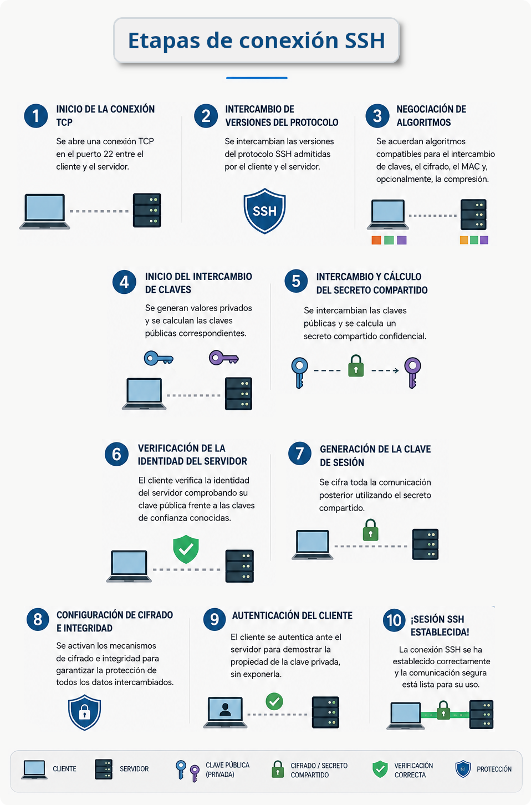{ .margintop10 .marginbottom10  }

**1 - Inicio de la conexión TCP:** El cliente establece una conexión TCP con el servidor, normalmente a través del puerto (de escucha) 22.  
**2 - Intercambio de versiones:** Cliente y servidor intercambian información sobre las versiones del protocolo SSH que admiten.
Negociación de algoritmos: Ambas partes acuerdan los algoritmos criptográficos que utilizarán para el intercambio de claves, el cifrado, la integridad (MAC) y, opcionalmente, la compresión de los datos.  
**3-4-5 - Intercambio de claves y generación del secreto compartido:** Mediante un protocolo de intercambio de claves, como Diffie-Hellman o ECDH, cliente y servidor generan un secreto compartido que permitirá establecer las claves de sesión utilizadas para cifrar la comunicación.  
**6 - Verificación de la identidad del servidor:** El cliente verifica la identidad del servidor mediante su clave pública, que se compara con una clave previamente conocida o almacenada en el archivo known_hosts.  
**7-8 - Configuración del cifrado:** Una vez establecido el secreto compartido, se activan los mecanismos de cifrado e integridad para proteger las comunicaciones posteriores.  
**9 - Autenticación del usuario:** El cliente demuestra su identidad ante el servidor, normalmente mediante contraseña, clave pública/privada SSH u otros mecanismos de autenticación configurados en el servidor.  
**10 - Establecimiento de la sesión:** Una vez autenticado el usuario, se establece una sesión SSH y el cliente puede solicitar un shell remoto, ejecutar comandos o utilizar otros servicios proporcionados por SSH.  

### 9.4 Tarea RA6-CEf-1 - Conexión SSH desde SO windows con PuTTy  

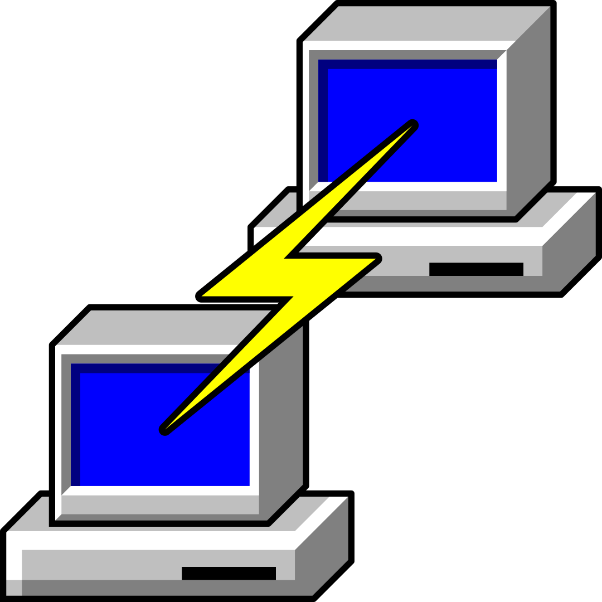{ .margintop10 .marginbottom10 .trescinco  }

En esta tarea instalaremos PuTTY en nuestra **instancia de Windows Server** y no conectaremos por **SSH** a la instancia de **Unbuntu Server**.

!!! warning "Antes de nada nos conectaremos a nuestra instancia de Windows Server"

Descargamos la aplicación desde [la página oficial](https://www.putty.org/index.html) y la instalaremos **en nuestra instancia de Windows Server**.

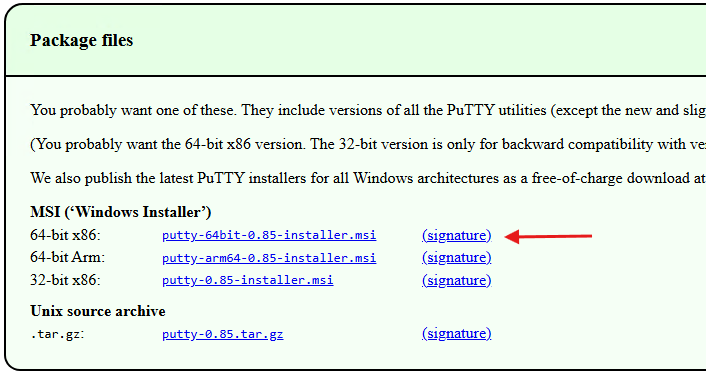{ .margintop10 .marginbottom10 .seiscinco }

Una vez instalado **PuTTy** consultaremos [la documentación de AWS](https://docs.aws.amazon.com/es_es/AWSEC2/latest/UserGuide/connect-linux-inst-from-windows.html) y la seguiremos paso a paso.

#### 9.4.1 Convertir la clave privada con PuTTYgen

- Ejecutamos PuTTYgen (instalado al mismo tiempo que PuTTy). En **Type of key to generate**, elegimos RSA. Si la versión de PuTTYGen no incluye esta opción, eligiremos SSH-2 RSA.
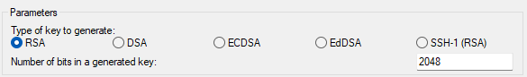{ .margintop10 .marginbottom10  }

- Elegimos Load.  
De forma predeterminada, PuTTYgen muestra solo archivos con **la extensión .ppk**. Para localizar el archivo .pem, seleccionamos la opción de mostrar todos los tipos de archivo.  
Seleccionamos **el archivo .pem** para el par de claves que se especificó cuando se lanzó la instancia y, a continuación, eligimos **Open (Abrir)**.
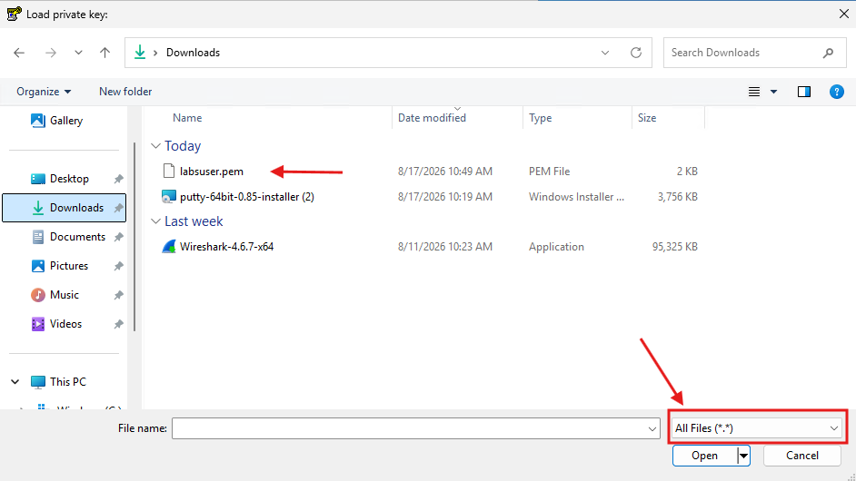{ .margintop10 .marginbottom10  }

- Si la importación se ha hecho correctamente, no aparecerá un aviso similar a la siguiente imagen.  
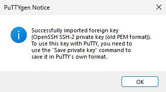{ .margintop10 .marginbottom10  }  

- Luego elegimos **Save private key** para guardar la clave en un formato que PuTTY pueda utilizar. Si no ponemos ninguna contraseña para el archivo de claves, PuTTYgen mostrará una advertencia (eligimos Yes si no queremos poner contraseña).  
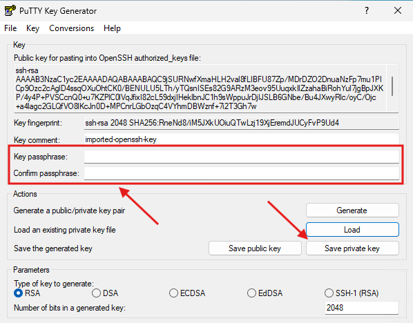{ .margintop10 .marginbottom10  }

- Especificaremos un nombre para el archivo de claves. PuTTY añadirá la extensión de archivo .ppk automáticamente.
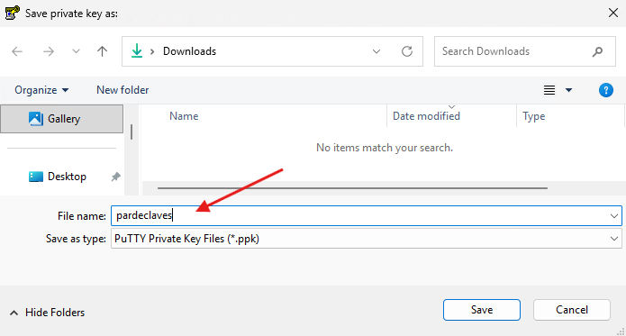{ .margintop10 .marginbottom10 .leftseiscero }

#### 9.4.2 Conexión con la instancia de Linux

- Ejecutamos PuTTY a vamos a **Connection** → **SSH** → **Auth** y en **Private key file** cargamos el archivo de claves que acabamos de crear.
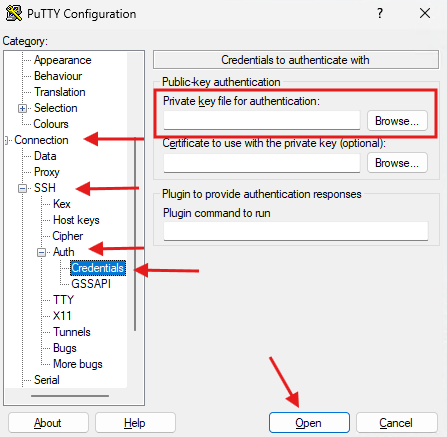{ .margintop10 .marginbottom10  }

- En la pantalla principal, introducimos la IP de nuestra instancia de **Ubuntu Server** y lanzamos la conexión.  
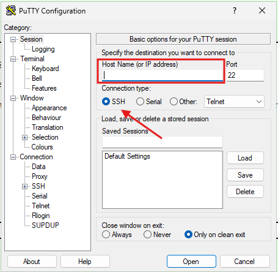{ .margintop10 .marginbottom10  }

- Si hemos puesto contraseña a nuestro archivo de claves, lo introducimos.
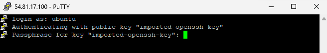{ .margintop10 .marginbottom10  }

- Obviamos las advertencias de seguridad.
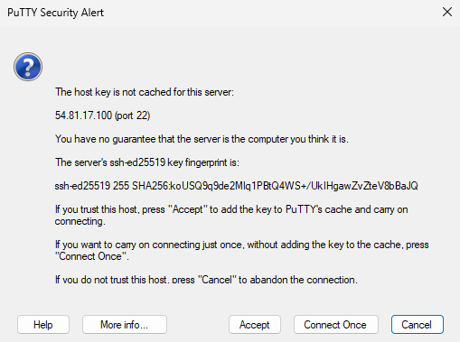{ .margintop10 .marginbottom10  }

- Si todo ha ido bien, tendremos acceso a la terminal de nuestra instancia.
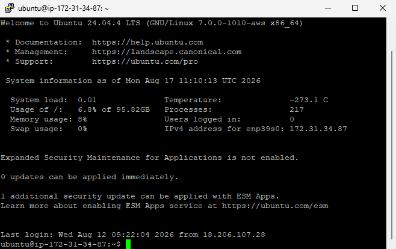{ .margintop10 .marginbottom10  }

!!! warning "Preparación de la siguiente tarea"

Para poder realizar la práctica siguiente, necesitaremos enviar el par de claves de nuestras instancias (LabUser). Ese tipo de proceder no es **una buena práctica, desde el punto de vista de la seguridad informática** pero, lo haremos para facilitar la conexión SSH entre instancias con distribuciones Linux en AWS.


### 9.4 Tarea RA6-CEf-1 - Conexión SSH desde Linux con cliente SSH

```bash
ssh -V
```

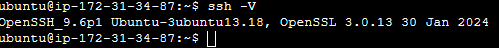{ .margintop10 .marginbottom10  }


<!-- https://marcosruiz.github.io/posts/servicio-ssh/ -->
<!-- https://www.hostinger.com/es/tutoriales/que-es-ssh/ -->
<!-- https://gatlenculp.medium.com/a-practical-guide-to-ssh-7dece875a41a -->


<!-- revisar -->

<!-- https://docs.google.com/presentation/d/1eJTYUdgqbQTfzIJDM4FhhvqMX3ICfIG85OaFwnReU3A/edit?slide=id.g1142a802_1_0#slide=id.g1142a802_1_0 -->
<!-- https://acastan.gitbook.io/servicios -->
<!-- https://www.educatica.es/informatica/sistemas-operativos-en-red/casos-practicos/2408-administracion-remota/administracion-remota/ -->
<!-- https://raul-profesor.github.io/SXI/section/P3.1/ -->