{ .img2 .marginbottom40}

**Resultados de aprendizaje y criterios de evaluacion que se evaluarán en esta unidad.**  

| **Resultados de aprendizaje de la unidad didáctica:**|
||
| **RA. 1:** Instala servicios de configuración dinámica, describiendo sus características y aplicaciones.|

|**Criterios de evaluación de la unidad didáctica:**|
||
|**a)** Se ha reconocido el funcionamiento de los mecanismos automatizados de configuración de los parámetros de red.|
|**b)** Se han identificado las ventajas que proporcionan.|
|**c)** Se han ilustrado los procedimientos y pautas que intervienen en una solicitud de configuración de los parámetros de red.|
|**d)** Se ha instalado un servicio de configuración dinámica de los parámetros de red.|
|**e)** Se ha preparado el servicio para asignar la configuración básica a los sistemas de una red local.|
|**f)** Se han realizado asignaciones dinámicas y estáticas.|
|**g)** Se han integrado en el servicio opciones adicionales de configuración.|
|**h)** Se ha verificando la correcta asignación de los parámetros.|

## 1 - Introducción

Con el crecimiento de las redes locales (LAN) y la expansión de internet, surgió la necesidad de un sistema más dinámico y flexible para la asignación de direcciones IP. Aquí es donde surge DHCP, que fue diseñado para superar las limitaciones de BOOTP, permitiendo la asignación automática, dinámica y más eficiente de las direcciones IP.

Los servicios DNS y DHCP son dos de los servicios más importantes en una red TCP/IP. Ambos permiten la **configuración automática de los parámetros de red** en los equipos clientes, lo que facilita la administración de redes y mejora la experiencia del usuario.

## 2 - DHCP (Dynamic Host Configuration Protocol)

El DHCP (Dynamic Host Configuration Protocol) es un protocolo de red que permite a los dispositivos obtener automáticamente una dirección IP y otros parámetros necesarios para conectarse a la red, como la máscara de subred, la puerta de enlace predeterminada y los servidores DNS. Esto elimina la necesidad de configurar manualmente cada dispositivo, facilitando enormemente la administración de redes grandes.

Antes del DHCP, las redes dependían del protocolo BOOTP (Bootstrap Protocol), que proporcionaba configuraciones básicas, como la asignación de direcciones IP. Sin embargo, BOOTP presentaba varias limitaciones:

- Configuración manual: Los administradores debían asignar manualmente una IP a cada dispositivo, lo que era tedioso y poco práctico en redes grandes.
- Asignación estática: Las direcciones IP eran fijas, lo que significaba que cada dispositivo mantenía la misma dirección aunque se desconectara, lo que no permitía un uso eficiente de las direcciones disponibles.
- Falta de flexibilidad: No estaba diseñado para gestionar redes dinámicas o móviles, como dispositivos que se mueven entre diferentes áreas de cobertura o redes.

### 2.1 Características principales de DHCP

- **Asignación automática de IPs:**  
DHCP permite la asignación dinámica de direcciones IP a los dispositivos cuando se conectan a la red. Esto asegura que no haya conflictos de direcciones IP duplicadas.

- **Escalabilidad:**  
Ideal para redes grandes, donde administrar direcciones IP de manera manual sería inviable. Con DHCP, se pueden gestionar cientos o miles de dispositivos de manera eficiente.

- **Facilidad de configuración:**  
Al automatizar la asignación de IPs y otros parámetros de red, los administradores pueden reducir significativamente el tiempo y esfuerzo que implicaría configurar manualmente cada dispositivo.

- **Compatibilidad con diferentes tipos de asignación:**  
Asignación manual: El administrador asigna una IP específica a un dispositivo, aunque este se conecte de manera dinámica.
Asignación automática: El servidor DHCP asigna una IP de forma permanente a un dispositivo desde el momento de su primera conexión.
Asignación dinámica: El servidor DHCP asigna una IP por un tiempo limitado (lease time), tras lo cual la IP puede ser reasignada si no se renueva el arrendamiento.

- **Administración centralizada:**  
Con un servidor DHCP centralizado, los administradores pueden gestionar y actualizar las configuraciones de red desde un solo lugar, en lugar de acceder a cada dispositivo de manera individual.

### 2.2 Componentes del funcionamiento de DHCP

La arquitectura de DHCP está formada por tres elementos principales: los servidores DHCP, los clientes DHCP y los agentes de retransmisión DHCP. La comunicación entre cliente y servidor se realiza a través de un intercambio de mensajes DHCP, mediante el cual el cliente obtiene y renueva tanto la concesión de su dirección IP como el resto de parámetros de configuración de red.

- **Servidor DHCP**
- **Cliente DHCP**
- **Relé DHCP**

#### 2.2.1 Servidor DHCP

El servidor DHCP constituye la pieza central de todo el protocolo. Su cometido es entregar direcciones IP y demás parámetros de red a los equipos que las solicitan. Para ello, mantiene un conjunto de direcciones disponibles (conocido como pool) y controla las concesiones que se van otorgando a cada cliente.

Entre los parámetros que el servidor puede asignar a los clientes se encuentran:

**Además, el servidor entrega parámetros como:**

- **Direcciones IP dinámicas** y temporales tomadas de un pool, asignadas a cualquier cliente dentro de una subred determinada (concesión dinámica).
- **Direcciones IP fijas** asociadas a un cliente concreto según su dirección MAC (concesión estática).
- **Máscara de subred**
- **Puerta de enlace predeterminada**
- **Servidor DNS**

Asimismo, el servidor DHCP guarda de forma persistente la información de red entregada a los clientes. Puesto que DHCP nació como una evolución de BOOTP, los servidores DHCP también son capaces de atender solicitudes procedentes de este protocolo anterior.

!!! tip "Ejemplo de configuración de un servidor DHCP de un router Asus rt-ax58u""
    

#### 2.2.2 Cliente DHCP

Se considera cliente DHCP a cualquier dispositivo IP de la red configurado para comportarse como host y solicitar a un servidor DHCP los parámetros necesarios para funcionar, entre ellos su dirección IP.

Cuando un equipo actúa como cliente DHCP, obtiene su configuración TCP/IP (incluida la dirección IP) desde un servidor DHCP externo a través de cualquiera de sus interfaces físicas.

Para habilitar este comportamiento es necesario configurar una interfaz lógica del dispositivo, de modo que solicite la dirección al servidor DHCP correspondiente. Además, deben definirse los siguientes parámetros:

- El identificador de clase de proveedor.
- El tiempo de concesión.
- La dirección del servidor DHCP.
- El número de intentos de retransmisión.
- El intervalo entre reintentos.

Las concesiones obtenidas como cliente pueden renovarse posteriormente.

!!! tip "Ejemplo de asignación de parámetros"
    En la siguiente imagen se muestra un fragmento del resultado de la ejecución del comando `ipconfig /all` en un equipo con Windows 11, donde se puede observar que la dirección IP ha sido asignada por un servidor DHCP.

    

#### 2.2.3 Relé DHCP

El agente de retransmisión DHCP es un host TCP/IP cuya función consiste en hacer de puente entre clientes y servidores DHCP cuando ambos se encuentran en subredes distintas, reenviando los mensajes correspondientes entre ellos. Gracias a este mecanismo, en redes de gran tamaño con múltiples subredes, basta con un único servidor DHCP para atender a todos los clientes, siempre que existan agentes de retransmisión situados en los routers que interconectan dichas subredes.

Un mismo dispositivo puede combinar ambos roles si gestiona distintas interfaces o subredes, pero no puede actuar simultáneamente como servidor DHCP y como agente de retransmisión DHCP para una misma interfaz o subred. La diferencia entre ambos roles es clara: el servidor responde directamente al cliente entregándole una dirección IP de su propio rango, mientras que el agente de retransmisión se limita a reenviar los mensajes DHCP entre el cliente y el servidor configurado, incluso cuando ambos pertenecen a redes IP distintas.

### 2.3 Modelo de cliente y servidor DHCP

{ .marginbottom40 .marco}

El proceso de asignación de direcciones IP mediante DHCP sigue un ciclo de cuatro pasos, conocido como DORA:

1. **Discover (Descubrimiento):**  
Cuando un dispositivo (cliente) se conecta a la red, envía un mensaje de broadcast llamado "DHCP Discover" para encontrar servidores DHCP disponibles.
1. **Offer (Oferta):**  
Los servidores DHCP responden con un mensaje "DHCP Offer", que contiene una dirección IP disponible y otros parámetros de red.
1. **Request (Solicitud):**  
El cliente selecciona una oferta y responde con un "DHCP Request" para aceptar la IP ofrecida.
1. **Acknowledge (Confirmación):**  
El servidor DHCP responde con un mensaje "DHCP Acknowledge", confirmando que la IP ha sido asignada y que el dispositivo puede usarla.

### 2.4 Ventajas y desventajas de DHCP

!!! success "Ventajas de DHCP"
Reducción de errores humanos: Al automatizar el proceso, se minimizan los errores que pueden ocurrir durante la configuración manual de direcciones IP.

Optimización de recursos: La capacidad de reutilizar direcciones IP gracias al tiempo de arrendamiento ayuda a optimizar el uso del espacio de direcciones IP en la red.

Configuración remota: Los administradores pueden realizar cambios en la configuración de red sin necesidad de acceso físico a los dispositivos.

!!! failure "Desventajas de DHCP"

Falta de control sobre la asignación de IPs: Al usar DHCP, puede haber menos control directo sobre qué dispositivos reciben qué IPs, a menos que se configure la asignación manual.

Punto único de fallo: Si el servidor DHCP falla, los dispositivos nuevos o que necesitan renovar su dirección IP no podrán conectarse a la red correctamente.

## 3 - Configuración de DHCP

{ .marco}

### 3.1 Configuración de un equipo a la red informática

Cualquier equipo que pertenece a una red requiere que se configure con unos parámetros mínimos, que son **la dirección IP, la máscara y la puerta de enlace por defecto**.  

La dirección IP identifica al equipo de manera única, y la máscara permite determinar la red o subred en la que se encuentra el equipo.

Con estos dos parámetros es suficiente para tener conectividad en la red. Si se quiere disponer de acceso fuera de la red propia (por ejemplo, a Internet o al resto de la red corporativa), es necesario definir también **la puerta de enlace predeterminada**.

Aparte de la configuración básica, los equipos pueden necesitar (y de hecho lo necesitan) más parámetros de configuración como, por ejemplo: el nombre del host, el servidor DNS, el archivo de inicio a descargar, etc.

### 3.2 Asignación de IP

Todo equipo de red necesita disponer de una dirección IP que lo identifique de manera única en la red.

Ejemplo de configuración de red de un equipo doméstico:

La mayoría de los usuarios disponen en casa de un equipo (o más) conectados a un router que proporciona el acceso a Internet. Este equipo está configurado como cliente DHCP y, al iniciarse, recibe la configuración de red del router. Puedes comprobar en tu casa qué configuración tienes. Una configuración de ejemplo podría ser:

#### 3.2.1 Dirección IP estática

Una dirección **IP estática** es una dirección que se asigna manualmente a un dispositivo y permanece fija a lo largo del tiempo. A diferencia de una **IP dinámica** (asignada por DHCP), la dirección estática no cambia, lo que es útil en casos donde se necesita una IP constante, como en servidores o dispositivos críticos.

!!! tip "Características de las direcciones IP estáticas:"
    - **Permanencia:** La dirección no cambia, a menos que el administrador lo decida.
    - **Configuración manual:** Las direcciones deben asignarse manualmente en el dispositivo o servidor de red.
    - **Uso en dispositivos críticos:** Suelen asignarse a servidores, impresoras, routers, cámaras de seguridad y otros equipos que requieren estabilidad.

!!! success "Ventajas de las IP estáticas:"
    - **Acceso remoto constante:** Es más sencillo acceder a dispositivos de forma remota sin preocuparse por cambios de IP.
    - **Estabilidad en servicios de red:** Es ideal para servicios que requieren una dirección IP fija, como servidores de correo, web o bases de datos.
    - **Configuración de reglas de red:** Facilita la creación de reglas para firewalls o VPN, ya que la dirección es predecible.

!!! failure "Desventajas de las IP estáticas:"  
    - **Conflictos de IP:** Si no se gestiona adecuadamente, puede haber conflictos cuando dos dispositivos intentan usar la misma dirección.
    - **Mayor carga administrativa:** Requiere mayor trabajo manual, lo que aumenta la posibilidad de errores en redes grandes.
    - **Menor flexibilidad:** En redes con muchos dispositivos que se conectan y desconectan, las direcciones estáticas son menos prácticas.

#### 3.2.2 Dirección IP dinámica

Una dirección **IP dinámica** es una dirección que se asigna automáticamente a un dispositivo por un servidor DHCP y puede cambiar con el tiempo. Esto permite una gestión más eficiente de las direcciones IP, especialmente en redes grandes o con muchos dispositivos que se conectan y desconectan.

!!! tip "Características de las direcciones IP dinámicas:"
    - **Asignación automática:** El servidor DHCP asigna la dirección IP sin intervención manual.
    - **Temporalidad:** La dirección puede cambiar después de un período de tiempo (lease time) o cuando el dispositivo se reconecta a la red.
    - **Uso eficiente del espacio de direcciones:** Permite reutilizar direcciones IP, optimizando su uso en redes con muchos dispositivos.

!!! success "Ventajas de las IP dinámicas:"
    - **Facilidad de administración:** Reduce la carga administrativa al eliminar la necesidad de asignar direcciones manualmente.
    - **Flexibilidad:** Ideal para redes con dispositivos que se conectan y desconectan frecuentemente, como laptops, smartphones y tablets.
    - **Prevención de conflictos de IP:** El servidor DHCP gestiona las direcciones, minimizando el riesgo de conflictos.

!!! failure "Desventajas de las IP dinámicas:"
    - **Cambio de dirección:** La dirección IP puede cambiar, lo que puede ser problemático para servicios que requieren una IP constante.
    - **Dependencia del servidor DHCP:** Si el servidor falla, los dispositivos pueden no obtener una dirección IP válida.
    - **Menor control sobre la asignación:** Puede ser más difícil rastrear qué dispositivo tiene qué dirección IP en un momento dado.

## 4 - Tarea RA1-def-1 - Instalación y configuración de un DHCP con Windows Server en AWS

### 4.1 Objetivo de la práctica

- Desplegar un servidor DHCP en Windows Server sobre AWS con virtualización anidada.
- En este primer paso instalaremos y configuraremos el rol **DHCP Server** en Windows Server, y observaremos en tiempo real cómo varios equipos cliente obtienen su configuración IP (DHCPDISCOVER → OFFER → REQUEST → ACK), reservas, exclusiones, ámbitos (scopes), opciones de ámbito (DNS, puerta de enlace, etc.).

### 4.2 Limitaciones de AWS para el despliegue de un servicio DHCP

Dentro de **una VPC** (virtual private cloud) de AWS, **el tráfico broadcast/multicast no se propaga entre instancias**.

DHCP depende de broadcasts (`255.255.255.255`), así que un cliente en una instancia EC2 **nunca "verá" un DHCPOFFER** de otra instancia EC2 en la misma subred.  
Cada tarjeta de red ENI (Elastic Network Interface) recibe su IP exclusivamente **del DHCP interno de AWS, que no se puede sustituir**.

**Solución:** Montar toda la práctica **dentro** de una sola instancia EC2, usando un hipervisor anidado (Hyper-V) donde sí existe broadcast real entre las VMs virtuales.

!!! important "Novedad Feb 2026"

    - Desde el **16 de febrero de 2026**, AWS soporta oficialmente virtualización anidada en instancias EC2 **normales** (no metal). ctica. 
    - Familias soportadas actualmente: `C8i`, `M8i`, `R8i`, `C8id`, `R8id`, `M8id`, `C8i-flex`, `R8i-flex`, `M8i-flex`, `X8i`, `C7i`, `R7i`, `M7i`, `C7id`, `R7id`, `M7id`, `C7i-flex`, `R7i-flex`, `M7i-flex`, `I7i`. 
    - Solo procesadores Intel (no Graviton). Hipervisores L1 soportados: **Hyper-V** y **KVM**.

### 4.3 Arquitectura del laboratorio

!!! important "Diagrama de la infraestructura de red"
    

```bash
Instancia EC2 (m7i.large, 100GB, Windows Server 2025 Base, Virtualización HVM)
│
├── Hyper-V
│   │
│   ├── Switch virtual "Interno" (Internal / Private) sin salida a la VPC
│   │
│   ├── Windows Server 2025 Base → Rol DHCP Server
│   │
│   ├── VM-1: Alpine Linux (cliente) → IP por DHCP
│   └── VM-2: Windows 10/11 (cliente) → IP por DHCP
│   
```

!!! tip "Con el switch en modo **Interno/Privado** (no "Externo"), el broadcast DHCP se queda encerrado dentro del propio hipervisor Hyper-V."

#### 4.3.1 Activar / comprobar el nested virtualization en una instancia YA existente

Para ello, nos conectaremos a la instancia de Windows Server creada en prácticas anteriores.
!!! question "Comprobación del Nested Virtualization"

    - Abrimos el Windows Powershell y escribimos el siguiente comando
    ```powershell
    Get-WindowsFeature -Name Hyper-V
    ```

    - Si Obtenemos el siguiente resultado ([ ] vacío + Available) significa que está **disponible por no instalado**.
    {.margintop10}

!!! success "Activar la virtualización de la CPU por la consola de AWS"

    - Abrimos el powershell de AWS y escribimos los siguientes comandos:  
    **Nota IMPORTANTE:** Cambiar la id por la **id de vuestra instancia**.
    ```powershell
    # 1. Parar la instancia (aunque la acabes de arrancar)
    aws ec2 stop-instances --instance-ids i-069fe851e6325d765

    # 2. Esperar a que quede realmente parada
    aws ec2 wait instance-stopped --instance-ids i-069fe851e6325d765

    # 3. Activar nested virtualization con el comando correcto
    aws ec2 modify-instance-cpu-options \
      --instance-id i-069fe851e6325d765 \
      --nested-virtualization enabled

    # 4. Arrancarla de nuevo
    aws ec2 start-instances --instance-ids i-069fe851e6325d765
    ```

    - Lanzar el powershell de AWS.
    {.margintop10}
    - Comandos en ejecución.  
    {.margintop10 .leftcien}

!!! Success "Activación del Nested Vitualization"

    - Activaremos la virtualización anidada con el siguiente comando.
    ```powershell
    Install-WindowsFeature -Name Hyper-V -IncludeManagementTools -Restart
    ```
    {.leftcien}
    - Como hemos incluido la opción de reinicio del sistema, perderemos la conexión con la instancia...
    
!!! question "Comprobación del Nested Virtualization por CLI"

    - Nos conectamos de nuevo a la instancia.
    Abrimos el Windows Powershell y escribimos el siguiente comando
    ```powershell
    Get-WindowsFeature -Name Hyper-V
    ```
    - Si nos aparece [X] Hyper-V, significa que el servicio se ha instalado correctamente.
    {.margintop10}

!!! question "Comprobación del Nested Virtualization en la consola de Windows Server"

    - Abrimos el **Server Manager**.
    {.margintop10}
    - Seleccionamos Local Server → Services → buscamos hyper-V 
    {.margintop10}

#### 4.3.2 Crear el switch virtual interno

- Vamos a **Hyper-V Manager** → **Virtual Switch Manager**:
{.margintop10 .marginbottom10}

- Luego seleccionamos → **New virtual network switch**
{.margintop10 .marginbottom10}

- Tipo: **Internal**. Esto asegura que el tráfico DHCP nunca sale hacia la red de AWS ni a otras instancias. También seleccionaremos **Enable virtual LAN id...**. De ese modo el adaptador de red virtual aparecerá con cualquier otro adaptador.
{.margintop10 .marginbottom10}
Después de **ipconfig**
{.margintop10 .marginbottom10}

- Si volvemos a **Hyper-V** → **SERVERS** → Refrescamos el estado del servidor (solo tenemos uno) veremos que tenemos unaIP interna del servidor en nuestra red virtual privada, siendo la otra IP, la IP de la instancia dentro de **la VPC de AWS**.
{.margintop10 .marginbottom10}

#### 4.3.3 Configurar los parámetros de red

- Como podemos ver en las capturas anteriores, el servidor tiene asignada la IP 169.254.200.142.
- Esto se debe a la falta de un servidor DHCP en la red virtual, lo que provoca la activación automática de una dirección APIPA (Automatic Private IP Addressing).
- Hasta que no despleguemos el servidor DHCP, la asignación de IPs en la red privada no podrá realizarse de forma automática, por lo que deberemos configurar manualmente la IP del servidor.

- Nos dirigimos a **Local Server** → **Properties** → **vEthernet**
{.margintop10 .marginbottom10}

- Una vez encontrado el adaptador, configuraremos **el protocolo TCP/IPv4**.
{.margintop10 .marginbottom10}

- Refrescamos la información y ya tendremos la IP esperada para nuestro servidor.
{.margintop10 .marginbottom10}

- Con esto ya tendremos montada la red virtual de Windows Server. El siguiente paso será montar el servicio DHCP sobre el servidor de Windows Server.
{.margintop10 .marginbottom10}

### 4.4 Instalación y configuración del rol DHCP en el host (Windows Server anfitrión)

#### 4.4.1 Instalar el rol DHCP

- Nos dirigimos a la consola de Windows Server y seleccionamos **Add roles and features**.
{ .margintop10 .marginbottom10 }
- En server roles seleccionamos el servicio que queremos implementar.
{ .margintop10 .marginbottom10 }
- Confirmamos las caracteristicas necesarias para el servivio DHCP.
{ .margintop10 .marginbottom10 }
- Recordatorios: De nada sirve lanzar un servicio sin un planteamiento previo.
{ .margintop10 .marginbottom10 }
- La instalación del servicio DHCP **no requiere reinicio** pero, lo ticamos de todos modos.
{ .margintop10 .marginbottom10}
- Se inicia la instalación.
{ .margintop10 .marginbottom10}
- Al final el instalador dirá que el DHCP requiere configuración. Lo haremos en el siguiente paso. De momento cerramos el asistente.
{ .margintop10 .marginbottom10}

#### 4.4.2 Configurar el rol DHCP

- Volvemos al panel de control dónde veremos que tenemos el servicio DHCP disponible.
{ .margintop10 .marginbottom10}
- Completamos la configuración del DHCP.
{ .margintop10 .marginbottom10}
- Hacemos un commit.
{ .margintop10 .marginbottom10}
- Vamos al panel de control del DHCP y comprobamos que el servicio sobre IPv4 y IPv6 está implementado.
{ .margintop10 .marginbottom10}
{ .margintop10 .marginbottom10}

#### 4.4.3 Crear el ámbito (scope)

Una vez instalado el rol de servidor DHCP, el siguiente paso es crear un ámbito (scope), es decir, el rango de direcciones IP que el servidor podrá asignar automáticamente a los equipos de la red. En este apartado configuraremos dicho rango junto con los parámetros básicos necesarios (máscara de subred, puerta de enlace, duración de la concesión, etc.) para que los clientes de la red privada puedan obtener su configuración de red de forma automática.

- Vamos a la consola de configuración de DHCP.
{ .margintop10 .marginbottom10}
- Seleccionamos **new scope** y damos un nombre al ámbito.
{ .margintop10 .marginbottom10}
- Estableceremos un rango de direcciones suficiente, siempre en función de nuestras necesidades. También tendremos que tener en cuenta dejar fuera del rango DHCP las direcciones IP reservadas para los sistemas que requieren **IP estática**, como switches, servidores de dominio, servidores DHCP, impresoras o sistemas de almacenamiento en red. Por último, deberemos reservar otro rango de direcciones IP para los dispositivos no anclados a la red, como tabletas, ordenadores portátiles o teléfonos móviles.
{ .margintop10 .marginbottom10}
- Dejamos en blanco la pantalla de **Add Exclusions and Delay**.
- Configurar la duración del lease (lease duration) es decir, el tiempo durante el cual un cliente mantendrá asignada una dirección IP antes de tener que renovarla. Este valor debe ajustarse según el tipo de red y de dispositivos que la componen: en redes estables con equipos fijos conviene establecer una duración larga (varios días), mientras que en redes con gran cantidad de dispositivos móviles o temporales resulta más adecuado un lease corto, ya que permite liberar y reutilizar las direcciones IP con mayor frecuencia.
En nuestro caso, estableceremos una duración de lease de 8 días (valor por defecto).
- En **Configure DHCP Options** seleccionamos la opción **No** para configurarlo más adelante.
{ .margintop10 .marginbottom10}
- En post installation no saldrá un aviso de reiniciar el servicio.
{ .margintop10 .marginbottom10}
- Reiniciamos el servicio.
{ .margintop10 .marginbottom10}

#### 4.4.4 Activar el scope

- Vamos a la consola de DHCo y veremos nuestro scope en rojo (desactivado).
{ .margintop10 .marginbottom10}
- Haremos clic derecho y lo activaremos.
{ .margintop10 .marginbottom10}

#### 4.4.5 Configurar opciones del ámbito

Las opciones de ámbito son parámetros de configuración adicionales que el servidor DHCP puede asignar a los clientes DHCP por ejemplo el DNS y la puerta de enlace (enrutador).

- Vamos a scope y seleccionamos **Configure Options...**
{ .margintop10 .marginbottom10}
- Buscamos la opción **003 Enrutador**, que permitirá a las máquinas conectadas a la red virtual acceder a Internet. No configuraremos el DNS, ya que lo veremos en otra unidad, ni definiremos un controlador de dominio, puesto que la implementación de Active Directory se tratará más adelante y queda fuera del alcance de este apartado.
{ .margintop10 .marginbottom10}
- Comprobamos que la option se ha guardado correctamente.
{ .margintop10 .marginbottom10}

#### 4.4.6 Best Practices analyzer

No es una herramienta especifica del servicio DHCP sino de todo el ecosistema de Windows Server.

- Vamos a BPA → **TASKS** → Start BPA Scan
{ .margintop10 .marginbottom10}

**Nota:**  
Algunos de los errores o advertencias que aparecen se deben a las limitaciones de nuestra infraestructura. No los tendremos en cuenta. 

## 4.4.7 Comprobar el servicio por CLI

```powershell
Get-DhcpServerV4Scope
Get-DhcpServerV4OptionValue -ScopeId 192.168.10.0
```

{ .marginbottom10}

```powershell
ipconfig
```

{ .marginbottom10}

- Con esto ya tendremos montada la red virtual de Windows Server y el servidor DHCP. El siguiente paso será montar clientes con Alpine Linux y comprobar si las asignaciones de IP y el acceso a internet se hace correctamente.
{ .margintop10 .marginbottom10}


<!-- https://www.youtube.com/watch?v=nc-ratzt1MU&t=750s -->


<!-- https://claude.ai/chat/c361c6cb-e1f9-429c-b062-5ea3be3912a9 -->


<!-- https://www.youtube.com/watch?v=ItmHj-j5spI -->

## Paso 5 — Crear las máquinas virtuales cliente

Con RAM limitada (p. ej. `m7i.large` con 8 GiB), lo más eficiente es que **el propio host Windows Server actúe como servidor DHCP** (no hace falta una VM `SRV-DHCP` aparte) y usar Hyper-V solo para las VMs cliente. Como cliente, **Alpine Linux** es la opción más ligera (256–512 MB por VM) y perfectamente válida para ver el proceso DHCP completo.

### 5.1 Carpetas de trabajo
```powershell
New-Item -Path "C:\ISOs" -ItemType Directory -Force
New-Item -Path "C:\VMs" -ItemType Directory -Force
```

### 5.2 Descargar el ISO
```powershell
Invoke-WebRequest -Uri "https://dl-cdn.alpinelinux.org/alpine/v3.20/releases/x86_64/alpine-standard-3.20.3-x86_64.iso" -OutFile "C:\ISOs\alpine.iso"
```
Comprueba que la descarga es correcta (debe rondar 190-250 MB, no unos pocos KB):
```powershell
Get-Item "C:\ISOs\alpine.iso" | Select-Object Name, Length
```

### 5.3 Crear la VM
```powershell
New-VM -Name "CLIENTE-1" `
  -MemoryStartupBytes 512MB `
  -Generation 2 `
  -NewVHDPath "C:\VMs\CLIENTE-1.vhdx" `
  -NewVHDSizeBytes 4GB `
  -SwitchName "LAN-Laboratorio-DHCP"

Set-VMFirmware -VMName "CLIENTE-1" -EnableSecureBoot Off   # Alpine no está firmado con la clave de MS
```

### 5.4 Añadir la unidad de DVD y montar el ISO
> **Importante:** las VMs Generation 2 **no traen unidad de DVD por defecto** (a diferencia de Generation 1). Hay que añadirla explícitamente con `Add-VMDvdDrive`, no basta con `Set-VMDvdDrive` sobre una unidad que no existe (falla en silencio y luego la VM intenta arrancar por red/PXE).
```powershell
Add-VMDvdDrive -VMName "CLIENTE-1" -Path "C:\ISOs\alpine.iso"
Get-VMDvdDrive -VMName "CLIENTE-1"   # debe mostrar el Path del ISO
```

### 5.5 Forzar el orden de arranque (DVD antes que red)
```powershell
Stop-VM -Name "CLIENTE-1" -TurnOff -Force
Set-VMFirmware -VMName "CLIENTE-1" -FirstBootDevice (Get-VMDvdDrive -VMName "CLIENTE-1")
Start-VM -Name "CLIENTE-1"
```

### 5.6 Conectar a la consola de la VM
Abre **Hyper-V Manager** → doble clic en `CLIENTE-1` (o clic derecho → Connect). Deberías ver arrancar el live system de Alpine. El candado rojo abierto que aparece arriba es solo el indicador de Secure Boot desactivado — no es un error.

En el prompt `localhost login:` entra con:
```
root
```
(sin contraseña).

Repite los pasos 5.1–5.6 con `CLIENTE-2` si quieres un segundo cliente.

**Alternativa Windows:** si prefieres un cliente Windows (más pesado, ~2 GB RAM) en vez de Alpine, usa el mismo procedimiento pero descargando un ISO de Windows Server/10/11 desde el Centro de evaluación de Microsoft.


## Paso 7 — Verificar desde los clientes

### En un cliente Alpine
Dentro de la consola de la VM (root, sin contraseña):
```sh
ip link show          # confirma el nombre real de la interfaz (eth0, enp0s3...)
ip link set eth0 up    # si aparece "state DOWN", súbela manualmente antes de pedir IP
udhcpc -i eth0
```
Si da `network is down`, es que la interfaz está apagada a nivel de enlace — el `ip link set eth0 up` lo soluciona. Si persiste, revisa en el host que el adaptador de la VM está conectado al switch correcto:
```powershell
Get-VMNetworkAdapter -VMName "CLIENTE-1" | Select-Object Name, SwitchName, Status
```

### En un cliente Windows
```cmd
ipconfig /release
ipconfig /renew
ipconfig /all
```

En ambos casos, los alumnos deberían ver la IP asignada dentro del rango del ámbito, la puerta de enlace y el DNS entregados por el servidor.

## Paso 8 — Ver el proceso de broadcast y asignación (DORA) en detalle

Esta es la parte más didáctica: ver el intercambio DHCPDISCOVER → DHCPOFFER → DHCPREQUEST → DHCPACK, no solo el resultado final.

### 8.1 Ver los leases concedidos (resultado, no proceso)
```powershell
Get-DhcpServerV4Lease -ScopeId 192.168.10.0
```
Muestra IP, MAC del cliente, nombre de host y expiración del lease.

### 8.2 Log de auditoría del propio DHCP (sin instalar nada extra)
Windows Server DHCP registra cada fase del proceso en un log diario:
```powershell
Get-Content "C:\Windows\System32\dhcp\DhcpSrvLog-$(Get-Date -Format 'ddd').log" -Tail 30
```
Contiene códigos de evento (10 = nuevo lease, 11 = renovación, etc.) con timestamps — buen ejercicio para que el alumnado interprete el log como evidencia textual del DORA.

### 8.3 Captura con tcpdump en el cliente Alpine (ver el DORA en vivo, lado cliente)
```sh
apk add tcpdump
tcpdump -i eth0 -n port 67 or port 68 -v
```
Con la captura corriendo, repite `udhcpc -i eth0` en otra sesión (o tras liberar la IP) para ver los 4 paquetes en tiempo real con IPs y puertos 67/68.

### 8.4 Captura con Wireshark en el host (lado servidor, análisis de campos BOOTP/DHCP)
```powershell
Invoke-WebRequest -Uri "https://2.na.dl.wireshark.org/win64/Wireshark-latest-x64.exe" -OutFile "C:\Wireshark-installer.exe"
Start-Process "C:\Wireshark-installer.exe"
```
Instala con opciones por defecto (incluye Npcap). Captura en el adaptador **`vEthernet (LAN-Laboratorio-DHCP)`** con el filtro:
```
bootp
```
Permite inspeccionar campo a campo (Option 53 - Message Type, Option 51 - Lease Time, Client MAC...), justo el nivel de detalle que suele pedirse en el currículo de SMR.

> Si el host no ve tráfico este-oeste de las VMs en Wireshark, activa port mirroring en el adaptador de la VM:
> ```powershell
> Set-VMNetworkAdapter -VMName "CLIENTE-1" -PortMirroring Source
> ```

### 8.5 Ejercicios adicionales con valor curricular
- **Reservas** por MAC: `Add-DhcpServerV4Reservation`.
- **Exclusiones** dentro del ámbito: `Add-DhcpServerV4ExclusionRange`.
- **Liberar y renovar** (contraste DISCOVER completo de 4 paquetes vs. renovación de 2 paquetes): en Alpine, `udhcpc -R` para liberar y volver a pedir.
- **Agotamiento del ámbito**: crear un ámbito de prueba muy pequeño (p. ej. solo 2-3 IPs) para que los alumnos vean qué ocurre cuando un cliente no puede recibir oferta.
- **Dos clientes simultáneos**: añadir `CLIENTE-2` y comparar cómo el servidor evita duplicados de IP.

---

## Escalar la práctica a varios alumnos/grupos

Opciones, de más simple a más automatizada:

1. **Una instancia por alumno**, lanzada manualmente siguiendo la guía — válido para grupos pequeños.
2. **AMI personalizada**: una vez que tengas una instancia con Windows Server + Hyper-V + switch interno + VMs base ya creadas (apagadas), crea una **AMI** a partir de ella. Cada alumno lanza su propia instancia desde esa AMI y ya tiene el entorno listo, solo falta que configuren el DHCP (que es justo la parte que queréis que hagan ellos).
3. **CloudFormation / Launch Template** para lanzar N instancias idénticas de golpe (una por alumno), reutilizando la AMI del punto 2. Esto os interesa si repetís la práctica cada curso.

¿Quieres que te prepare la plantilla de **CloudFormation** para lanzar automáticamente una instancia por alumno (con nested virtualization activado, AMI personalizada y tags por nombre de alumno), o prefieres primero montar y probar tú una instancia "maestra" de forma manual antes de automatizar?

---

## Notas de coste
- `m7i.xlarge` en On-Demand: revisa el precio actual en la [calculadora de AWS](https://calculator.aws) para tu región, ya que varía.
- Recuerda **detener (no solo cerrar RDP)** las instancias fuera del horario de clase — el hipervisor anidado no reduce el coste de la instancia base.
- Considera usar **Spot Instances** si la práctica no requiere disponibilidad garantizada, para abaratar costes en un aula.


<!-- https://www.youtube.com/watch?v=ItmHj-j5spI -->


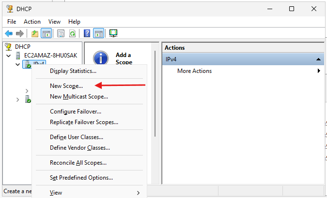{ .marco}
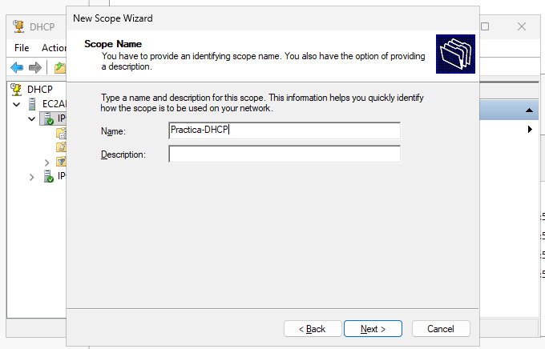{ .marco}
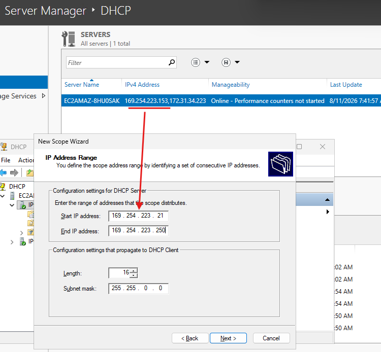{ .marco}
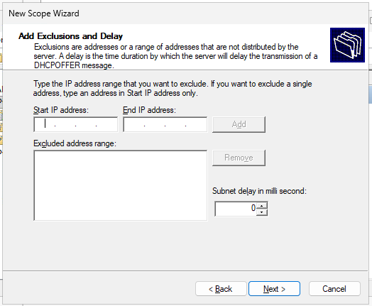{ .marco}
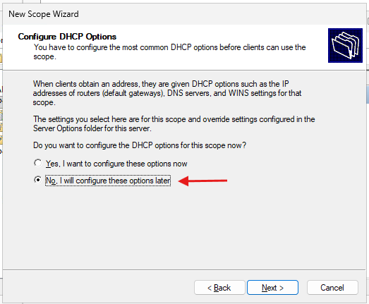{ .marco}
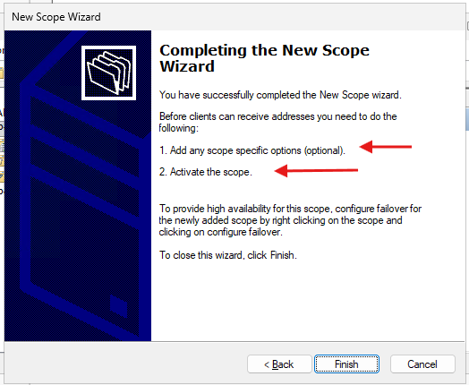{ .marco}
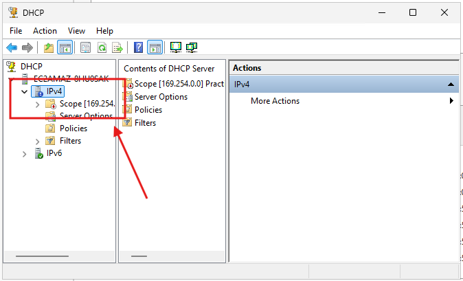{ .marco}
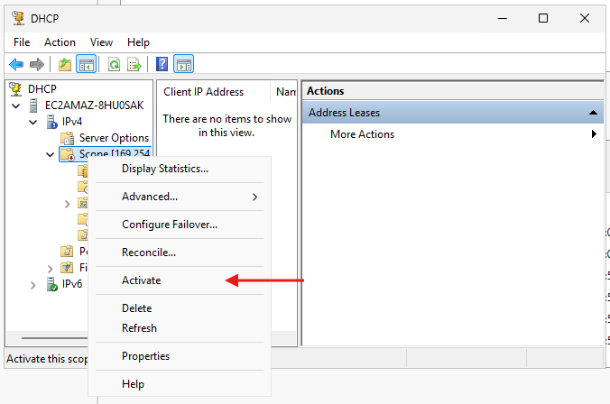{ .marco}
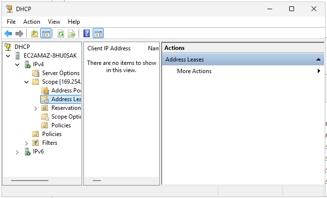{ .marco}
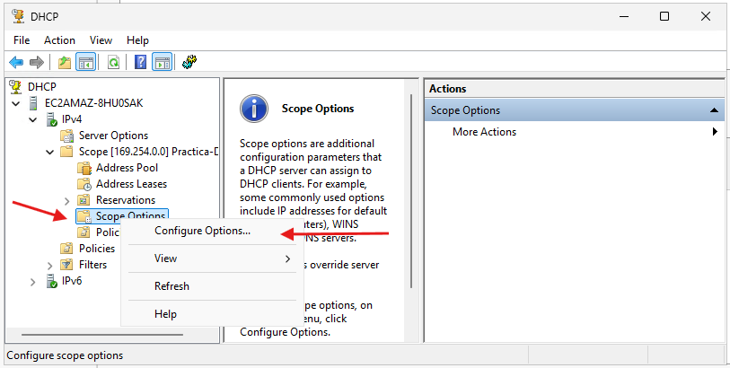{ .marco}
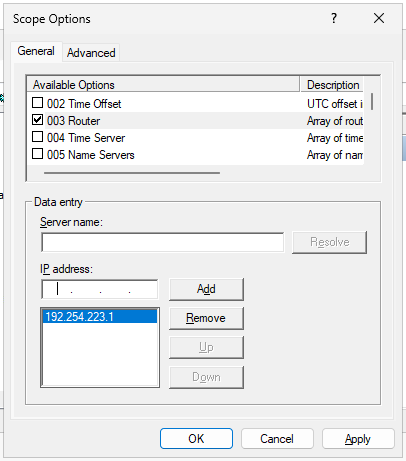{ .marco}
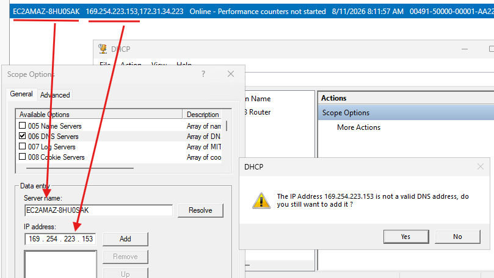{ .marco}
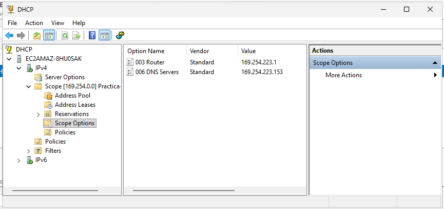{ .marco}
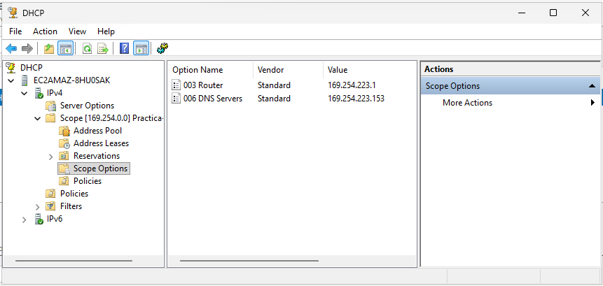{ .marco}
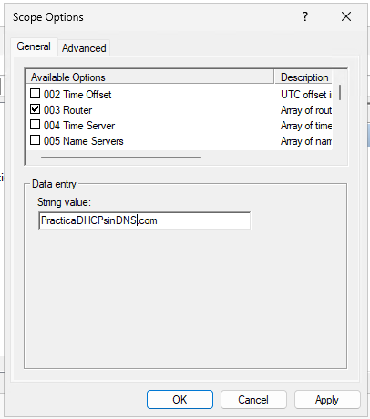{ .marco}
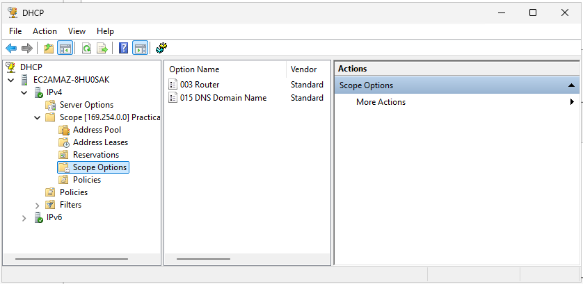{ .marco}
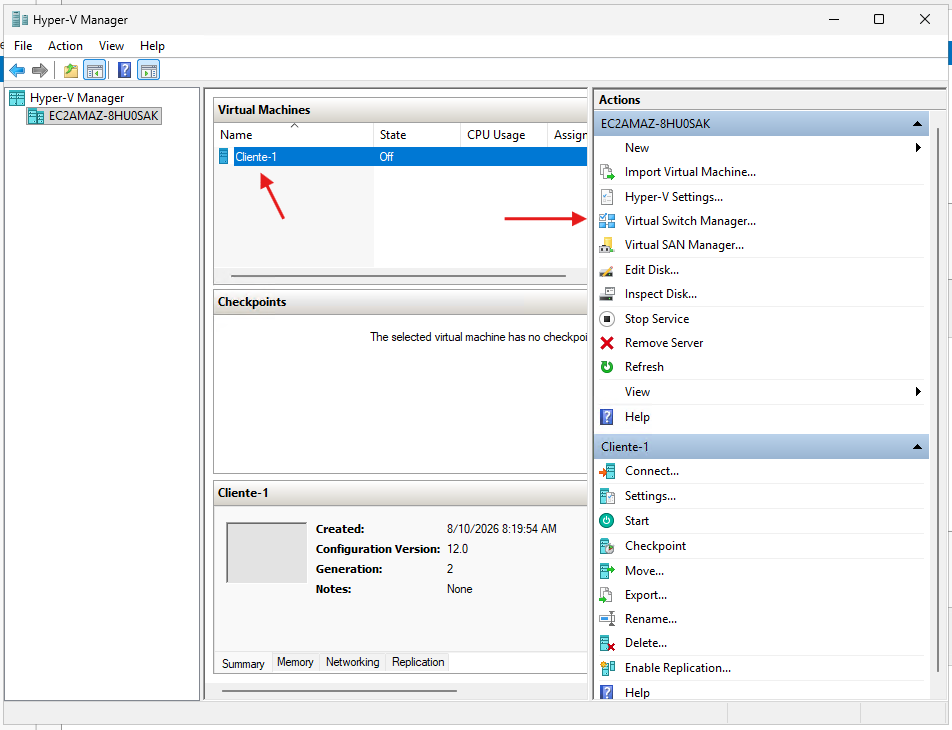{ .marco}
{ .marco}
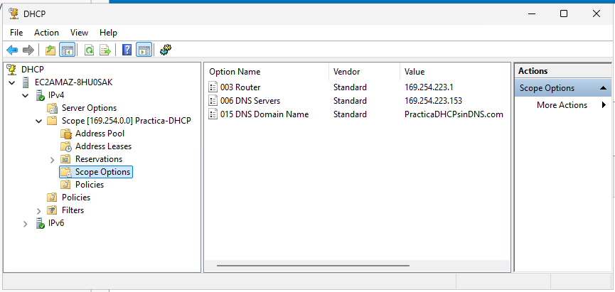{ .marco}
{ .marco}


<!-- DHCP -->
<!-- Follow link (ctrl + click) -->
<!-- https://www.akamai.com/es/glossary/what-is-dhcp -->
<!-- https://learn.microsoft.com/es-es/troubleshoot/windows-server/networking/troubleshoot-dhcp-guidance -->
<!-- https://www.ibm.com/docs/es/ssw_ibm_i_75/pdf/rzakgpdf.pdf -->
<!-- https://www.juniper.net/documentation/mx/es/software/junos/dhcp/topics/topic-map/dhcp-overview.html -->

<!-- https://www.manageengine.com/latam/oputils/direcciones-ip-fundamentos.html -->
<!-- https://itadmins.es/networking-ii-dispositivos-de-red-y-tipos-de-trafico/ -->

<!--
NAT
https://www.redeszone.net/tutoriales/redes-cable/calcular-subnetting-ip-red-mascara-subred-ipv4/
https://itadmins.es/networking-ii-dispositivos-de-red-y-tipos-de-trafico/
https://www.1nce.com/es-es/recursos/iot-knowledge-base/que-es-el-mecanismo-nat
https://openwebinars.net/blog/nat-que-es-y-para-que-sirve/

-->

<!-- 

http://www.newdevices.com/tutoriales/ipv4/2.html

https://www.paessler.com/es/it-explained/ip-address

https://usuaris.tinet.cat/fbd/comunicaciones/tcpip/a.htm

https://www.sapalomera.cat/moodlecf/RS/1/course/module10/#10.2.1.3

https://www.sapalomera.cat/moodlecf/RS/1/course/module9/#9.0.1.1

https://www.sapalomera.cat/moodlecf/RS/1/course/module8/#8.1.1.2

https://www.sapalomera.cat/moodlecf/RS/1/course/module8/#8.0.1.1

https://itadmins.es/networking-ii-dispositivos-de-red-y-tipos-de-trafico/

http://127.0.0.1:5500/docs/SMX/SMX_2/SX/sxe/UD01/1_arquitectura_de_xarxa_tcpip.html

https://aules.edu.gva.es/docent/pluginfile.php/5719248/mod_resource/content/1/XL_UT03_Interconnexio%CC%81%20d%E2%80%99equips%20en%20xarxes%20locals%20i%20muntatge%20de%20connectors-IP.pdf

https://www.redeszone.net/tutoriales/internet/protocolos-basicos-redes/#286115-protocolos-basicos-en-redes 

-->
