{ .img2 .marginbottom40}

**Resultados de aprendizaje y criterios de evaluacion que se evaluarán en esta unidad.**  

| **Resultados de aprendizaje de la unidad didáctica:**|
||
| **RA. 1:** Instala servicios de configuración dinámica, describiendo sus características y aplicaciones.|

|**Criterios de evaluación de la unidad didáctica:**|
||
|**a)** Se ha reconocido el funcionamiento de los mecanismos automatizados de configuración de los parámetros de red.|
|**b)** Se han identificado las ventajas que proporcionan.|
|**c)** Se han ilustrado los procedimientos y pautas que intervienen en una solicitud de configuración de los parámetros de red.|
|**d)** Se ha instalado un servicio de configuración dinámica de los parámetros de red.|
|**e)** Se ha preparado el servicio para asignar la configuración básica a los sistemas de una red local.|
|**f)** Se han realizado asignaciones dinámicas y estáticas.|
|**g)** Se han integrado en el servicio opciones adicionales de configuración.|
|**h)** Se ha verificando la correcta asignación de los parámetros.|

## 1 - Introducción

Con el crecimiento de las redes locales (LAN) y la expansión de internet, surgió la necesidad de un sistema más dinámico y flexible para la asignación de direcciones IP. Aquí es donde surge DHCP, que fue diseñado para superar las limitaciones de BOOTP, permitiendo la asignación automática, dinámica y más eficiente de las direcciones IP.

Los servicios DNS y DHCP son dos de los servicios más importantes en una red TCP/IP. Ambos permiten la **configuración automática de los parámetros de red** en los equipos clientes, lo que facilita la administración de redes y mejora la experiencia del usuario.

## 2 - DHCP (Dynamic Host Configuration Protocol)

El DHCP (Dynamic Host Configuration Protocol) es un protocolo de red que permite a los dispositivos obtener automáticamente una dirección IP y otros parámetros necesarios para conectarse a la red, como la máscara de subred, la puerta de enlace predeterminada y los servidores DNS. Esto elimina la necesidad de configurar manualmente cada dispositivo, facilitando enormemente la administración de redes grandes.

Antes del DHCP, las redes dependían del protocolo BOOTP (Bootstrap Protocol), que proporcionaba configuraciones básicas, como la asignación de direcciones IP. Sin embargo, BOOTP presentaba varias limitaciones:

- Configuración manual: Los administradores debían asignar manualmente una IP a cada dispositivo, lo que era tedioso y poco práctico en redes grandes.
- Asignación estática: Las direcciones IP eran fijas, lo que significaba que cada dispositivo mantenía la misma dirección aunque se desconectara, lo que no permitía un uso eficiente de las direcciones disponibles.
- Falta de flexibilidad: No estaba diseñado para gestionar redes dinámicas o móviles, como dispositivos que se mueven entre diferentes áreas de cobertura o redes.

### 2.1 Características principales de DHCP

- **Asignación automática de IPs:**  
DHCP permite la asignación dinámica de direcciones IP a los dispositivos cuando se conectan a la red. Esto asegura que no haya conflictos de direcciones IP duplicadas.

- **Escalabilidad:**  
Ideal para redes grandes, donde administrar direcciones IP de manera manual sería inviable. Con DHCP, se pueden gestionar cientos o miles de dispositivos de manera eficiente.

- **Facilidad de configuración:**  
Al automatizar la asignación de IPs y otros parámetros de red, los administradores pueden reducir significativamente el tiempo y esfuerzo que implicaría configurar manualmente cada dispositivo.

- **Compatibilidad con diferentes tipos de asignación:**  
Asignación manual: El administrador asigna una IP específica a un dispositivo, aunque este se conecte de manera dinámica.
Asignación automática: El servidor DHCP asigna una IP de forma permanente a un dispositivo desde el momento de su primera conexión.
Asignación dinámica: El servidor DHCP asigna una IP por un tiempo limitado (lease time), tras lo cual la IP puede ser reasignada si no se renueva el arrendamiento.

- **Administración centralizada:**  
Con un servidor DHCP centralizado, los administradores pueden gestionar y actualizar las configuraciones de red desde un solo lugar, en lugar de acceder a cada dispositivo de manera individual.

### 2.2 Componentes del funcionamiento de DHCP

La arquitectura de DHCP está formada por tres elementos principales: los servidores DHCP, los clientes DHCP y los agentes de retransmisión DHCP. La comunicación entre cliente y servidor se realiza a través de un intercambio de mensajes DHCP, mediante el cual el cliente obtiene y renueva tanto la concesión de su dirección IP como el resto de parámetros de configuración de red.

- **Servidor DHCP**
- **Cliente DHCP**
- **Relé DHCP**

#### 2.2.1 Servidor DHCP

El servidor DHCP constituye la pieza central de todo el protocolo. Su cometido es entregar direcciones IP y demás parámetros de red a los equipos que las solicitan. Para ello, mantiene un conjunto de direcciones disponibles (conocido como pool) y controla las concesiones que se van otorgando a cada cliente.

Entre los parámetros que el servidor puede asignar a los clientes se encuentran:

**Además, el servidor entrega parámetros como:**

- **Direcciones IP dinámicas** y temporales tomadas de un pool, asignadas a cualquier cliente dentro de una subred determinada (concesión dinámica).
- **Direcciones IP fijas** asociadas a un cliente concreto según su dirección MAC (concesión estática).
- **Máscara de subred**
- **Puerta de enlace predeterminada**
- **Servidor DNS**

Asimismo, el servidor DHCP guarda de forma persistente la información de red entregada a los clientes. Puesto que DHCP nació como una evolución de BOOTP, los servidores DHCP también son capaces de atender solicitudes procedentes de este protocolo anterior.

!!! tip "Ejemplo de configuración de un servidor DHCP de un router Asus rt-ax58u""
    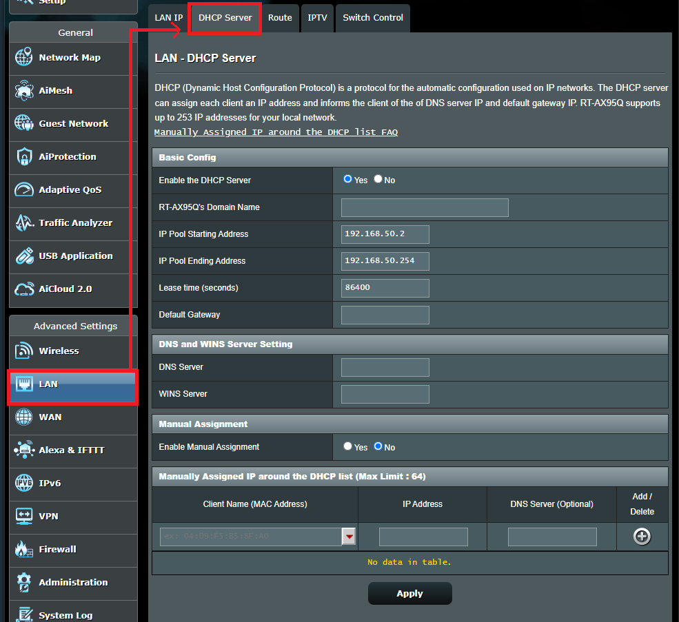

#### 2.2.2 Cliente DHCP

Se considera cliente DHCP a cualquier dispositivo IP de la red configurado para comportarse como host y solicitar a un servidor DHCP los parámetros necesarios para funcionar, entre ellos su dirección IP.

Cuando un equipo actúa como cliente DHCP, obtiene su configuración TCP/IP (incluida la dirección IP) desde un servidor DHCP externo a través de cualquiera de sus interfaces físicas.

Para habilitar este comportamiento es necesario configurar una interfaz lógica del dispositivo, de modo que solicite la dirección al servidor DHCP correspondiente. Además, deben definirse los siguientes parámetros:

- El identificador de clase de proveedor.
- El tiempo de concesión.
- La dirección del servidor DHCP.
- El número de intentos de retransmisión.
- El intervalo entre reintentos.

Las concesiones obtenidas como cliente pueden renovarse posteriormente.

!!! tip "Ejemplo de asignación de parámetros"
    En la siguiente imagen se muestra un fragmento del resultado de la ejecución del comando `ipconfig /all` en un equipo con Windows 11, donde se puede observar que la dirección IP ha sido asignada por un servidor DHCP.

    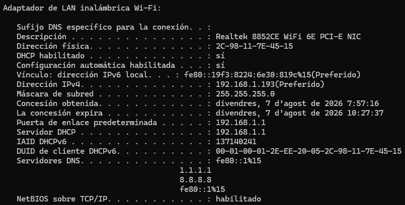

#### 2.2.3 Relé DHCP

El agente de retransmisión DHCP es un host TCP/IP cuya función consiste en hacer de puente entre clientes y servidores DHCP cuando ambos se encuentran en subredes distintas, reenviando los mensajes correspondientes entre ellos. Gracias a este mecanismo, en redes de gran tamaño con múltiples subredes, basta con un único servidor DHCP para atender a todos los clientes, siempre que existan agentes de retransmisión situados en los routers que interconectan dichas subredes.

Un mismo dispositivo puede combinar ambos roles si gestiona distintas interfaces o subredes, pero no puede actuar simultáneamente como servidor DHCP y como agente de retransmisión DHCP para una misma interfaz o subred. La diferencia entre ambos roles es clara: el servidor responde directamente al cliente entregándole una dirección IP de su propio rango, mientras que el agente de retransmisión se limita a reenviar los mensajes DHCP entre el cliente y el servidor configurado, incluso cuando ambos pertenecen a redes IP distintas.

### 2.3 Modelo de cliente y servidor DHCP

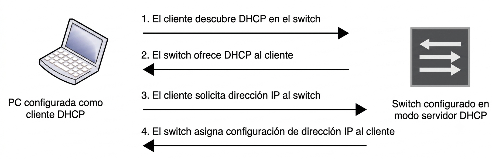{ .marginbottom40 .marco}

El proceso de asignación de direcciones IP mediante DHCP sigue un ciclo de cuatro pasos, conocido como DORA:

1. **Discover (Descubrimiento):**  
Cuando un dispositivo (cliente) se conecta a la red, envía un mensaje de broadcast llamado "DHCP Discover" para encontrar servidores DHCP disponibles.
1. **Offer (Oferta):**  
Los servidores DHCP responden con un mensaje "DHCP Offer", que contiene una dirección IP disponible y otros parámetros de red.
1. **Request (Solicitud):**  
El cliente selecciona una oferta y responde con un "DHCP Request" para aceptar la IP ofrecida.
1. **Acknowledge (Confirmación):**  
El servidor DHCP responde con un mensaje "DHCP Acknowledge", confirmando que la IP ha sido asignada y que el dispositivo puede usarla.

### 2.4 Ventajas y desventajas de DHCP

!!! success "Ventajas de DHCP"
Reducción de errores humanos: Al automatizar el proceso, se minimizan los errores que pueden ocurrir durante la configuración manual de direcciones IP.

Optimización de recursos: La capacidad de reutilizar direcciones IP gracias al tiempo de arrendamiento ayuda a optimizar el uso del espacio de direcciones IP en la red.

Configuración remota: Los administradores pueden realizar cambios en la configuración de red sin necesidad de acceso físico a los dispositivos.

!!! failure "Desventajas de DHCP"

Falta de control sobre la asignación de IPs: Al usar DHCP, puede haber menos control directo sobre qué dispositivos reciben qué IPs, a menos que se configure la asignación manual.

Punto único de fallo: Si el servidor DHCP falla, los dispositivos nuevos o que necesitan renovar su dirección IP no podrán conectarse a la red correctamente.

## 3 - Configuración de DHCP

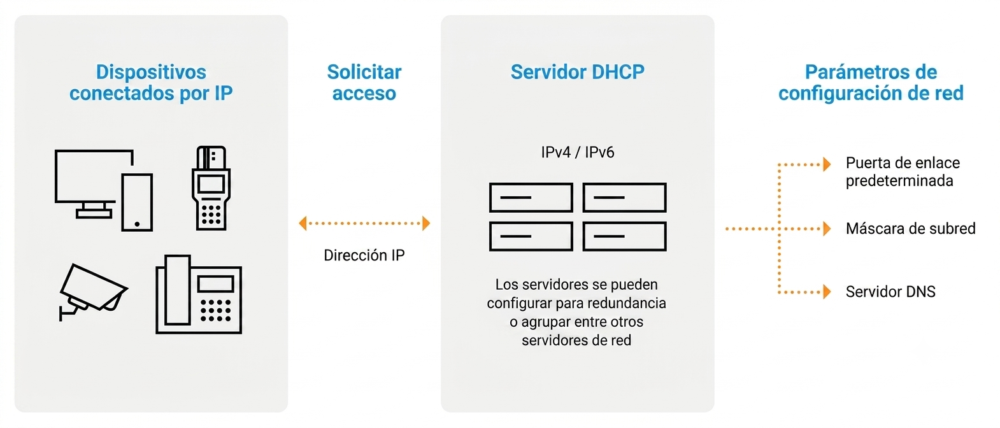{ .marco}

### 3.1 Configuración de un equipo a la red informática

Cualquier equipo que pertenece a una red requiere que se configure con unos parámetros mínimos, que son **la dirección IP, la máscara y la puerta de enlace por defecto**.  

La dirección IP identifica al equipo de manera única, y la máscara permite determinar la red o subred en la que se encuentra el equipo.

Con estos dos parámetros es suficiente para tener conectividad en la red. Si se quiere disponer de acceso fuera de la red propia (por ejemplo, a Internet o al resto de la red corporativa), es necesario definir también **la puerta de enlace predeterminada**.

Aparte de la configuración básica, los equipos pueden necesitar (y de hecho lo necesitan) más parámetros de configuración como, por ejemplo: el nombre del host, el servidor DNS, el archivo de inicio a descargar, etc.

### 3.2 Asignación de IP

Todo equipo de red necesita disponer de una dirección IP que lo identifique de manera única en la red.

Ejemplo de configuración de red de un equipo doméstico:

La mayoría de los usuarios disponen en casa de un equipo (o más) conectados a un router que proporciona el acceso a Internet. Este equipo está configurado como cliente DHCP y, al iniciarse, recibe la configuración de red del router. Puedes comprobar en tu casa qué configuración tienes. Una configuración de ejemplo podría ser:

#### 3.2.1 Dirección IP estática

Una dirección **IP estática** es una dirección que se asigna manualmente a un dispositivo y permanece fija a lo largo del tiempo. A diferencia de una **IP dinámica** (asignada por DHCP), la dirección estática no cambia, lo que es útil en casos donde se necesita una IP constante, como en servidores o dispositivos críticos.

!!! tip "Características de las direcciones IP estáticas:"
    - **Permanencia:** La dirección no cambia, a menos que el administrador lo decida.
    - **Configuración manual:** Las direcciones deben asignarse manualmente en el dispositivo o servidor de red.
    - **Uso en dispositivos críticos:** Suelen asignarse a servidores, impresoras, routers, cámaras de seguridad y otros equipos que requieren estabilidad.

!!! success "Ventajas de las IP estáticas:"
    - **Acceso remoto constante:** Es más sencillo acceder a dispositivos de forma remota sin preocuparse por cambios de IP.
    - **Estabilidad en servicios de red:** Es ideal para servicios que requieren una dirección IP fija, como servidores de correo, web o bases de datos.
    - **Configuración de reglas de red:** Facilita la creación de reglas para firewalls o VPN, ya que la dirección es predecible.

!!! failure "Desventajas de las IP estáticas:"  
    - **Conflictos de IP:** Si no se gestiona adecuadamente, puede haber conflictos cuando dos dispositivos intentan usar la misma dirección.
    - **Mayor carga administrativa:** Requiere mayor trabajo manual, lo que aumenta la posibilidad de errores en redes grandes.
    - **Menor flexibilidad:** En redes con muchos dispositivos que se conectan y desconectan, las direcciones estáticas son menos prácticas.

#### 3.2.2 Dirección IP dinámica

Una dirección **IP dinámica** es una dirección que se asigna automáticamente a un dispositivo por un servidor DHCP y puede cambiar con el tiempo. Esto permite una gestión más eficiente de las direcciones IP, especialmente en redes grandes o con muchos dispositivos que se conectan y desconectan.

!!! tip "Características de las direcciones IP dinámicas:"
    - **Asignación automática:** El servidor DHCP asigna la dirección IP sin intervención manual.
    - **Temporalidad:** La dirección puede cambiar después de un período de tiempo (lease time) o cuando el dispositivo se reconecta a la red.
    - **Uso eficiente del espacio de direcciones:** Permite reutilizar direcciones IP, optimizando su uso en redes con muchos dispositivos.

!!! success "Ventajas de las IP dinámicas:"
    - **Facilidad de administración:** Reduce la carga administrativa al eliminar la necesidad de asignar direcciones manualmente.
    - **Flexibilidad:** Ideal para redes con dispositivos que se conectan y desconectan frecuentemente, como laptops, smartphones y tablets.
    - **Prevención de conflictos de IP:** El servidor DHCP gestiona las direcciones, minimizando el riesgo de conflictos.

!!! failure "Desventajas de las IP dinámicas:"
    - **Cambio de dirección:** La dirección IP puede cambiar, lo que puede ser problemático para servicios que requieren una IP constante.
    - **Dependencia del servidor DHCP:** Si el servidor falla, los dispositivos pueden no obtener una dirección IP válida.
    - **Menor control sobre la asignación:** Puede ser más difícil rastrear qué dispositivo tiene qué dirección IP en un momento dado.

## 4 - Tarea RA1-def-1 - Instalación y configuración de un DHCP con Windows Server en AWS

### 4.1 Objetivo de la práctica

- Desplegar un servidor DHCP en Windows Server sobre AWS con virtualización anidada.
- En este primer paso instalaremos y configuraremos el rol **DHCP Server** en Windows Server, y observaremos en tiempo real cómo varios equipos cliente obtienen su configuración IP (DHCPDISCOVER → OFFER → REQUEST → ACK), reservas, exclusiones, ámbitos (scopes), opciones de ámbito (DNS, puerta de enlace, etc.).

### 4.2 Limitaciones de AWS para el despliegue de un servicio DHCP

Dentro de **una VPC** (virtual private cloud) de AWS, **el tráfico broadcast/multicast no se propaga entre instancias**.

DHCP depende de broadcasts (`255.255.255.255`), así que un cliente en una instancia EC2 **nunca "verá" un DHCPOFFER** de otra instancia EC2 en la misma subred.  
Cada tarjeta de red ENI (Elastic Network Interface) recibe su IP exclusivamente **del DHCP interno de AWS, que no se puede sustituir**.

**Solución:** Montar toda la práctica **dentro** de una sola instancia EC2, usando un hipervisor anidado (Hyper-V) donde sí existe broadcast real entre las VMs virtuales.

!!! important "Novedad Feb 2026"

    - Desde el **16 de febrero de 2026**, AWS soporta oficialmente virtualización anidada en instancias EC2 **normales** (no metal). ctica. 
    - Familias soportadas actualmente: `C8i`, `M8i`, `R8i`, `C8id`, `R8id`, `M8id`, `C8i-flex`, `R8i-flex`, `M8i-flex`, `X8i`, `C7i`, `R7i`, `M7i`, `C7id`, `R7id`, `M7id`, `C7i-flex`, `R7i-flex`, `M7i-flex`, `I7i`. 
    - Solo procesadores Intel (no Graviton). Hipervisores L1 soportados: **Hyper-V** y **KVM**.

### 4.3 Arquitectura del laboratorio

!!! important "Diagrama de la infraestructura de red"
    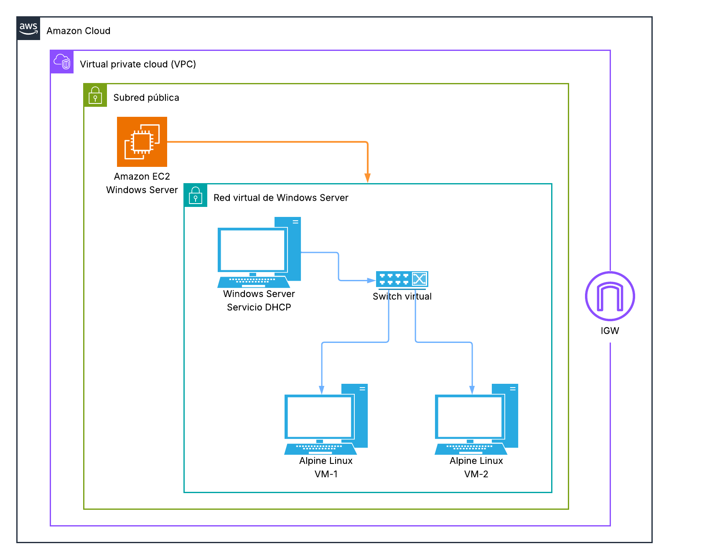

```bash
Instancia EC2 (m7i.large, 100GB, Windows Server 2025 Base, Virtualización HVM)
│
├── Hyper-V
│   │
│   ├── Switch virtual "Interno" (Internal / Private) sin salida a la VPC
│   │
│   ├── Windows Server 2025 Base → Rol DHCP Server
│   │
│   ├── VM-1: Alpine Linux (cliente) → IP por DHCP
│   └── VM-2: Windows 10/11 (cliente) → IP por DHCP
│   
```

!!! tip "Con el switch en modo **Interno/Privado** (no "Externo"), el broadcast DHCP se queda encerrado dentro del propio hipervisor Hyper-V."

#### 4.3.1 Activar / comprobar el nested virtualization en una instancia YA existente

Para ello, nos conectaremos a la instancia de Windows Server creada en prácticas anteriores.
!!! question "Comprobación del Nested Virtualization"

    - Abrimos el Windows Powershell y escribimos el siguiente comando
    ```powershell
    Get-WindowsFeature -Name Hyper-V
    ```

    - Si Obtenemos el siguiente resultado ([ ] vacío + Available) significa que está **disponible por no instalado**.
    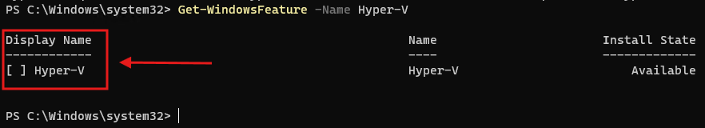{.margintop10}

!!! success "Activar la virtualización de la CPU por la consola de AWS"

    - Abrimos el powershell de AWS y escribimos los siguientes comandos:  
    **Nota IMPORTANTE:** Cambiar la id por la **id de vuestra instancia**.
    ```powershell
    # 1. Parar la instancia (aunque la acabes de arrancar)
    aws ec2 stop-instances --instance-ids i-069fe851e6325d765

    # 2. Esperar a que quede realmente parada
    aws ec2 wait instance-stopped --instance-ids i-069fe851e6325d765

    # 3. Activar nested virtualization con el comando correcto
    aws ec2 modify-instance-cpu-options \
      --instance-id i-069fe851e6325d765 \
      --nested-virtualization enabled

    # 4. Arrancarla de nuevo
    aws ec2 start-instances --instance-ids i-069fe851e6325d765
    ```

    - Lanzar el powershell de AWS.
    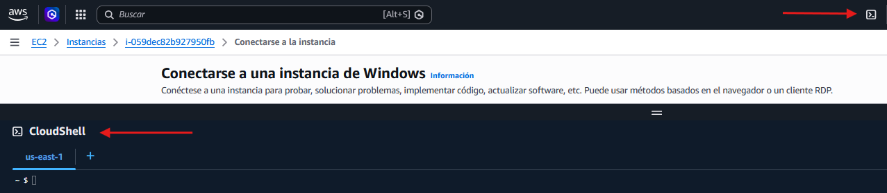{.margintop10}
    - Comandos en ejecución.  
    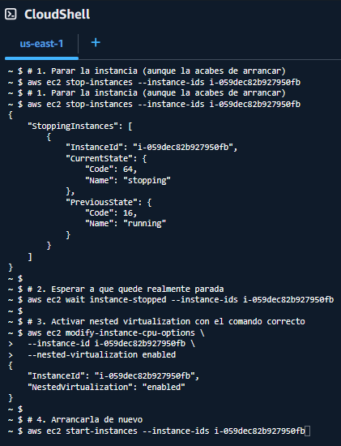{.margintop10 .leftcien}

!!! Success "Activación del Nested Vitualization"

    - Activaremos la virtualización anidada con el siguiente comando.
    ```powershell
    Install-WindowsFeature -Name Hyper-V -IncludeManagementTools -Restart
    ```
    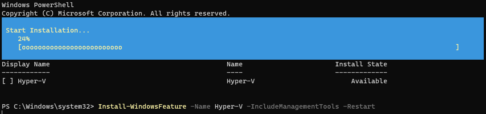{.leftcien}
    - Como hemos incluido la opción de reinicio del sistema, perderemos la conexión con la instancia...
    
!!! question "Comprobación del Nested Virtualization por CLI"

    - Nos conectamos de nuevo a la instancia.
    Abrimos el Windows Powershell y escribimos el siguiente comando
    ```powershell
    Get-WindowsFeature -Name Hyper-V
    ```
    - Si nos aparece [X] Hyper-V, significa que el servicio se ha instalado correctamente.
    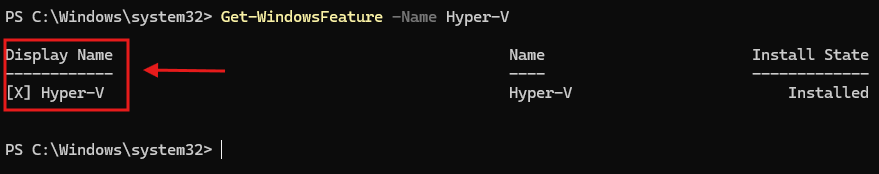{.margintop10}

!!! question "Comprobación del Nested Virtualization en la consola de Windows Server"

    - Abrimos el **Server Manager**.
    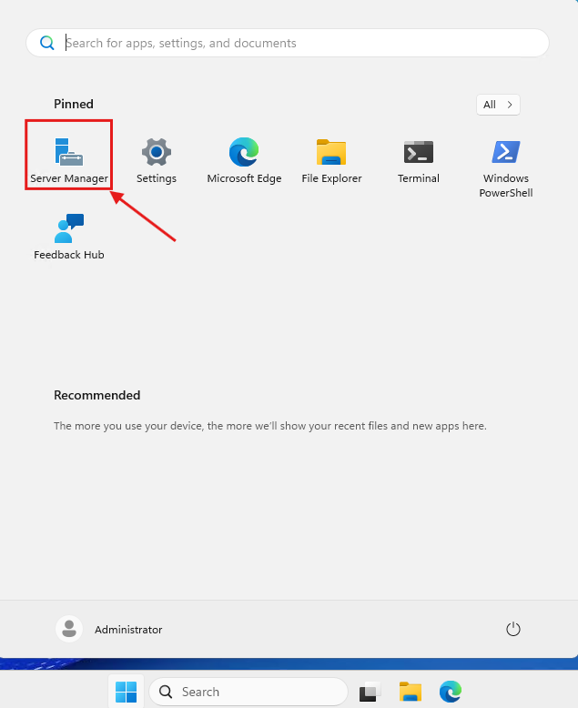{.margintop10}
    - Seleccionamos Local Server → Services → buscamos hyper-V 
    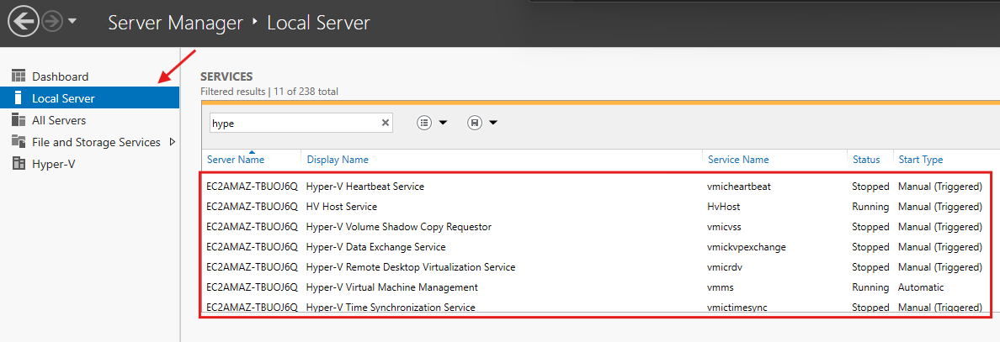{.margintop10}

#### 4.3.2 Crear el switch virtual interno

- Vamos a **Hyper-V Manager** → **Virtual Switch Manager**:
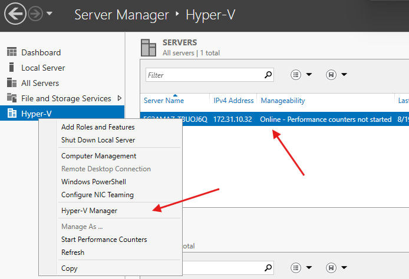{.margintop10 .marginbottom10}

- Luego seleccionamos → **New virtual network switch**
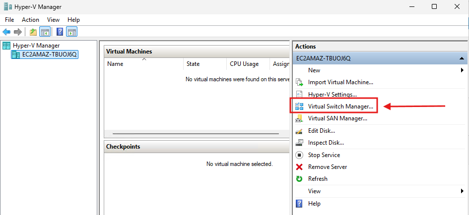{.margintop10 .marginbottom10}

- Tipo: **Internal**. Esto asegura que el tráfico DHCP nunca sale hacia la red de AWS ni a otras instancias. También seleccionaremos **Enable virtual LAN id...**. De ese modo el adaptador de red virtual aparecerá con cualquier otro adaptador.
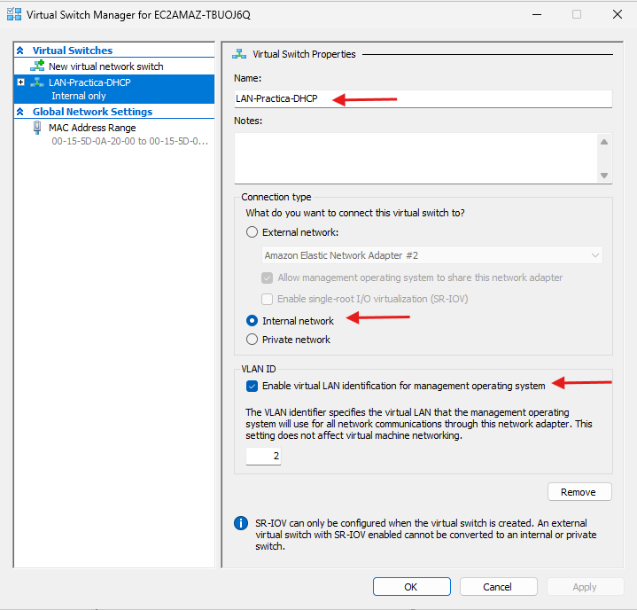{.margintop10 .marginbottom10}
Después de **ipconfig**
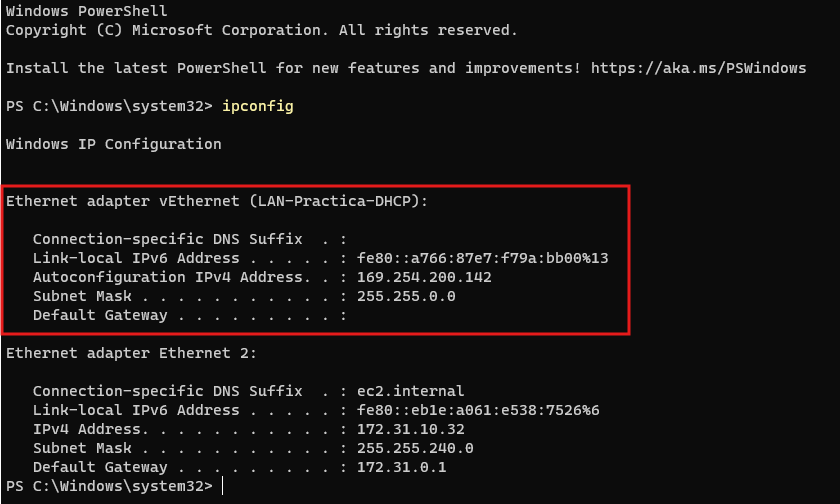{.margintop10 .marginbottom10}

- Si volvemos a **Hyper-V** → **SERVERS** → Refrescamos el estado del servidor (solo tenemos uno) veremos que tenemos unaIP interna del servidor en nuestra red virtual privada, siendo la otra IP, la IP de la instancia dentro de **la VPC de AWS**.
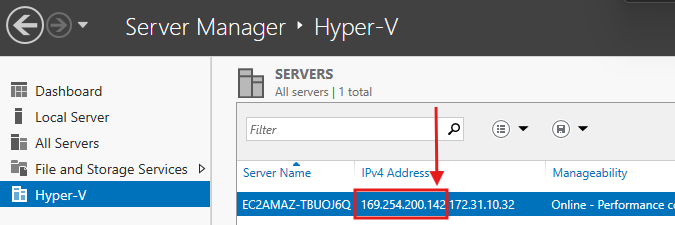{.margintop10 .marginbottom10}

#### 4.3.3 Configurar los parámetros de red

- Como podemos ver en las capturas anteriores, el servidor tiene asignada la IP 169.254.200.142.
- Esto se debe a la falta de un servidor DHCP en la red virtual, lo que provoca la activación automática de una dirección APIPA (Automatic Private IP Addressing).
- Hasta que no despleguemos el servidor DHCP, la asignación de IPs en la red privada no podrá realizarse de forma automática, por lo que deberemos configurar manualmente la IP del servidor.

- Nos dirigimos a **Local Server** → **Properties** → **vEthernet**
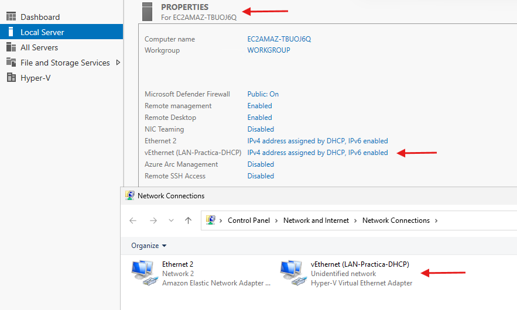{.margintop10 .marginbottom10}

- Una vez encontrado el adaptador, configuraremos **el protocolo TCP/IPv4**.
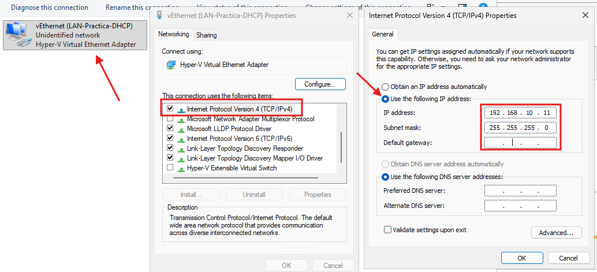{.margintop10 .marginbottom10}

- Refrescamos la información y ya tendremos la IP esperada para nuestro servidor.
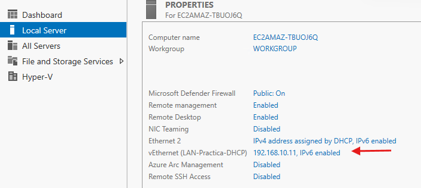{.margintop10 .marginbottom10}

- Con esto ya tendremos montada la red virtual de Windows Server. El siguiente paso será montar el servicio DHCP sobre el servidor de Windows Server.
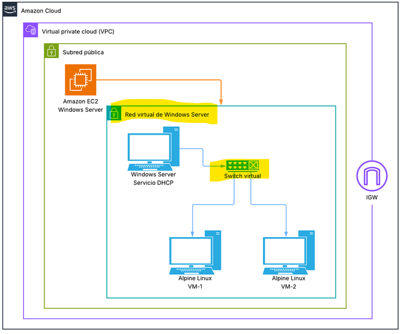{.margintop10 .marginbottom10}

### 4.4 Instalación y configuración del rol DHCP en el host (Windows Server anfitrión)

#### 4.4.1 Instalar el rol DHCP

- Nos dirigimos a la consola de Windows Server y seleccionamos **Add roles and features**.
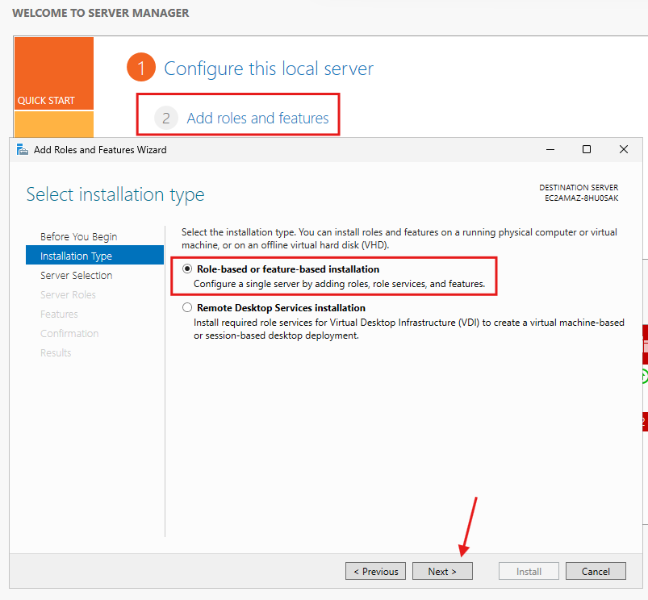{ .margintop10 .marginbottom10 }
- En server roles seleccionamos el servicio que queremos implementar.
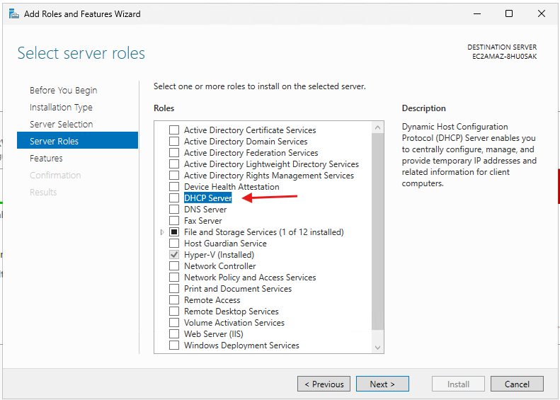{ .margintop10 .marginbottom10 }
- Confirmamos las caracteristicas necesarias para el servivio DHCP.
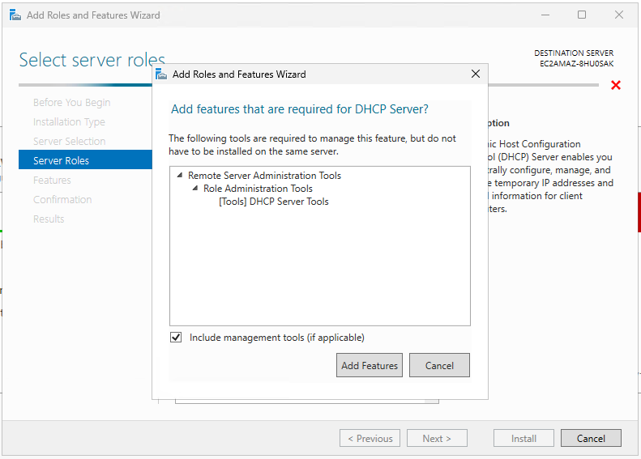{ .margintop10 .marginbottom10 }
- Recordatorios: De nada sirve lanzar un servicio sin un planteamiento previo.
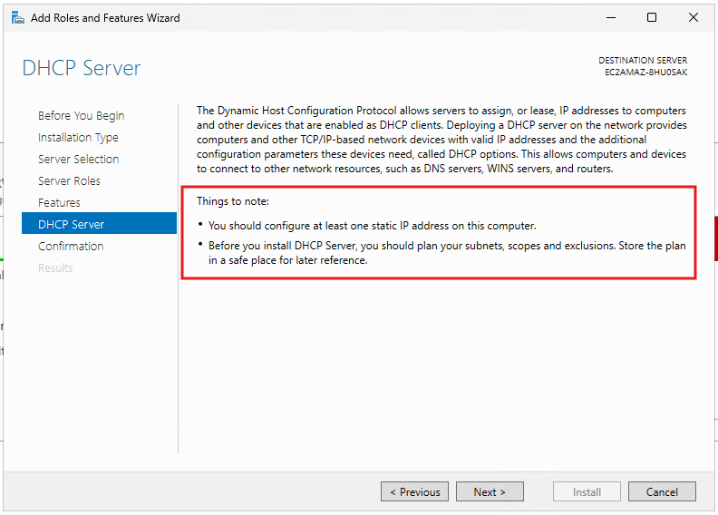{ .margintop10 .marginbottom10 }
- La instalación del servicio DHCP **no requiere reinicio** pero, lo ticamos de todos modos.
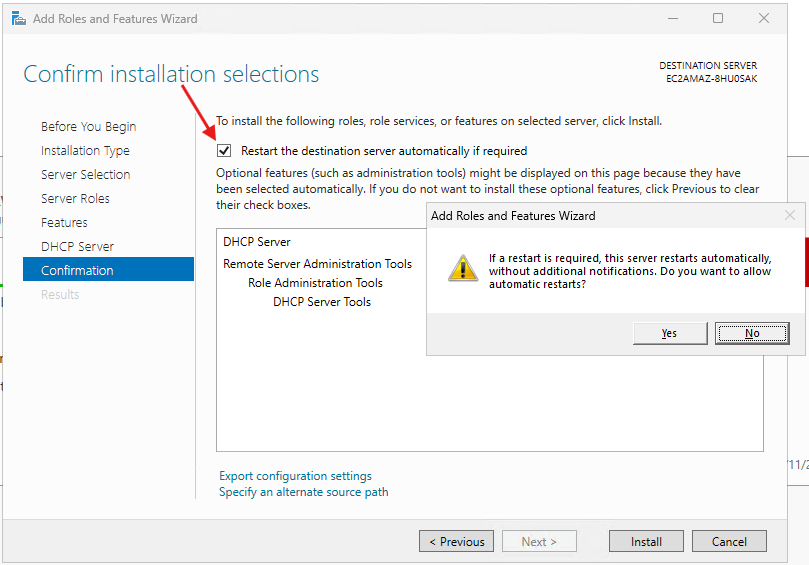{ .margintop10 .marginbottom10}
- Se inicia la instalación.
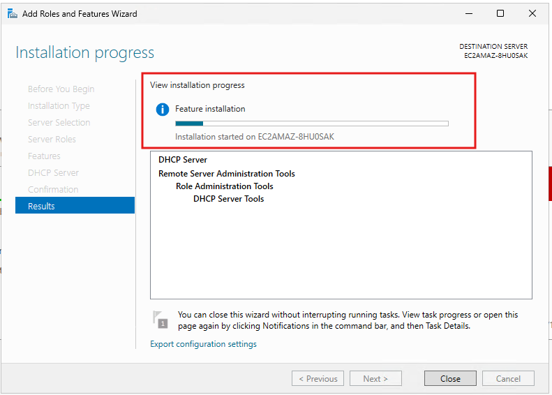{ .margintop10 .marginbottom10}
- Al final el instalador dirá que el DHCP requiere configuración. Lo haremos en el siguiente paso. De momento cerramos el asistente.
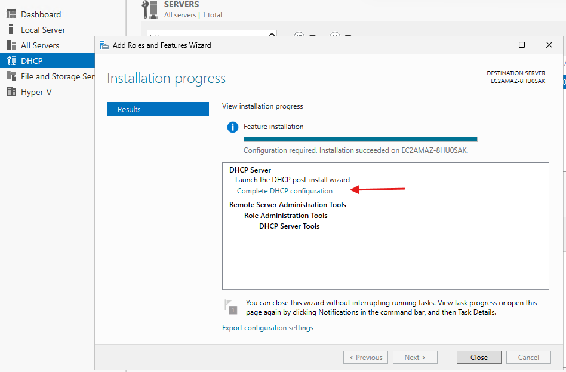{ .margintop10 .marginbottom10}

#### 4.4.2 Configurar el rol DHCP

- Volvemos al panel de control dónde veremos que tenemos el servicio DHCP disponible.
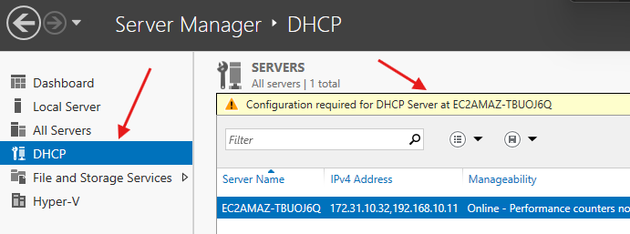{ .margintop10 .marginbottom10}
- Completamos la configuración del DHCP.
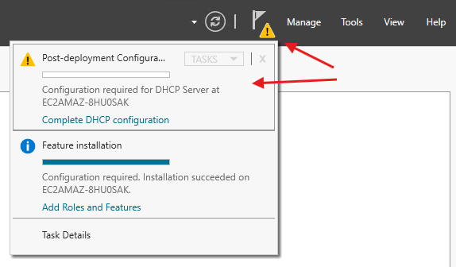{ .margintop10 .marginbottom10}
- Hacemos un commit.
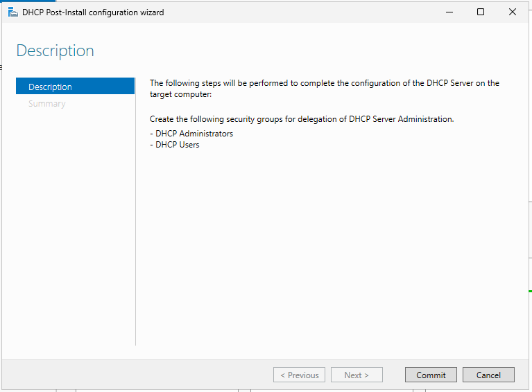{ .margintop10 .marginbottom10}
- Vamos al panel de control del DHCP y comprobamos que el servicio sobre IPv4 y IPv6 está implementado.
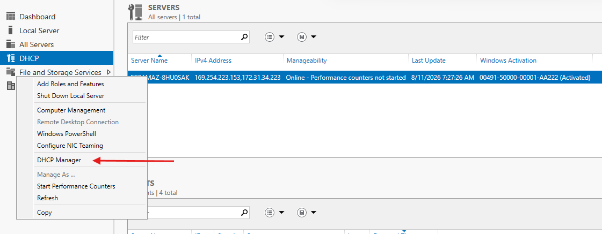{ .margintop10 .marginbottom10}
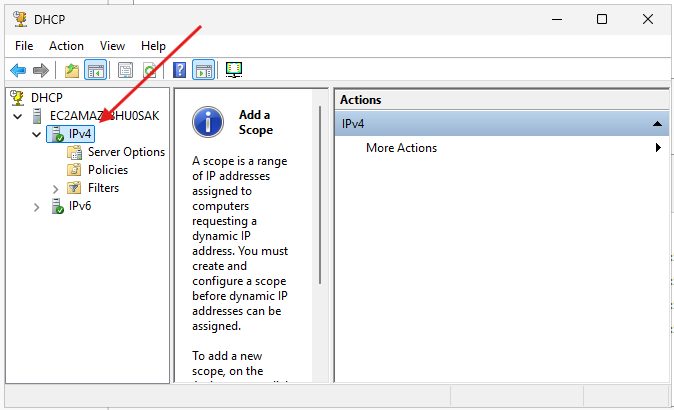{ .margintop10 .marginbottom10}

#### 4.4.3 Crear el ámbito (scope)

Una vez instalado el rol de servidor DHCP, el siguiente paso es crear un ámbito (scope), es decir, el rango de direcciones IP que el servidor podrá asignar automáticamente a los equipos de la red. En este apartado configuraremos dicho rango junto con los parámetros básicos necesarios (máscara de subred, puerta de enlace, duración de la concesión, etc.) para que los clientes de la red privada puedan obtener su configuración de red de forma automática.

- Vamos a la consola de configuración de DHCP.
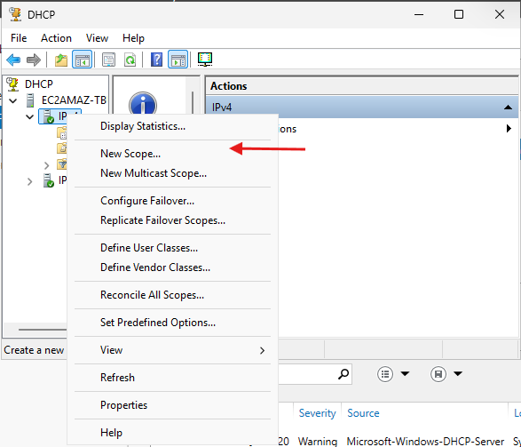{ .margintop10 .marginbottom10}
- Seleccionamos **new scope** y damos un nombre al ámbito.
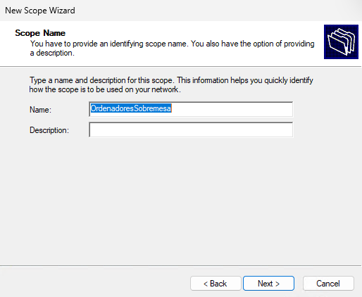{ .margintop10 .marginbottom10}
- Estableceremos un rango de direcciones suficiente, siempre en función de nuestras necesidades. También tendremos que tener en cuenta dejar fuera del rango DHCP las direcciones IP reservadas para los sistemas que requieren **IP estática**, como switches, servidores de dominio, servidores DHCP, impresoras o sistemas de almacenamiento en red. Por último, deberemos reservar otro rango de direcciones IP para los dispositivos no anclados a la red, como tabletas, ordenadores portátiles o teléfonos móviles.
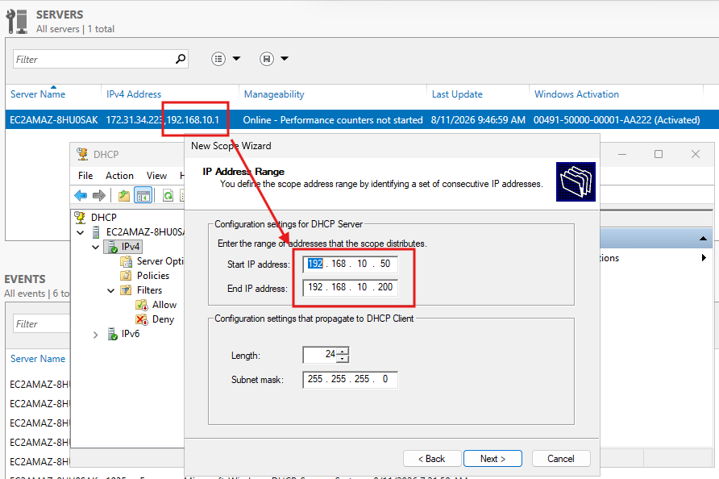{ .margintop10 .marginbottom10}
- Dejamos en blanco la pantalla de **Add Exclusions and Delay**.
- Configurar la duración del lease (lease duration) es decir, el tiempo durante el cual un cliente mantendrá asignada una dirección IP antes de tener que renovarla. Este valor debe ajustarse según el tipo de red y de dispositivos que la componen: en redes estables con equipos fijos conviene establecer una duración larga (varios días), mientras que en redes con gran cantidad de dispositivos móviles o temporales resulta más adecuado un lease corto, ya que permite liberar y reutilizar las direcciones IP con mayor frecuencia.
En nuestro caso, estableceremos una duración de lease de 8 días (valor por defecto).
- En **Configure DHCP Options** seleccionamos la opción **No** para configurarlo más adelante.
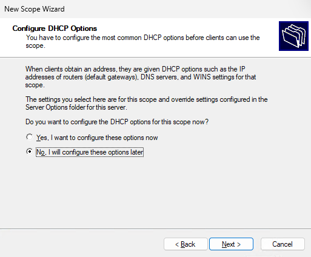{ .margintop10 .marginbottom10}
- En post installation no saldrá un aviso de reiniciar el servicio.
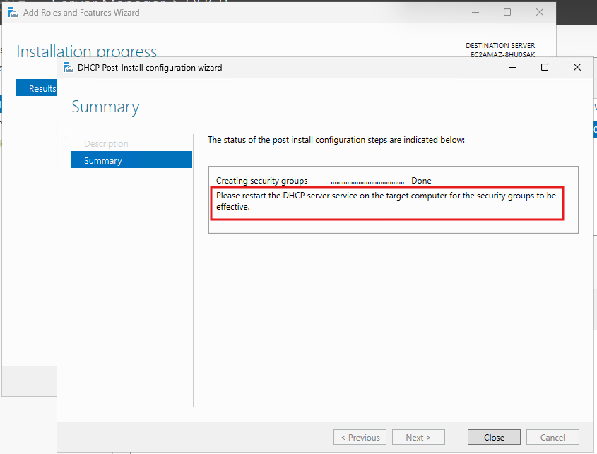{ .margintop10 .marginbottom10}
- Reiniciamos el servicio.
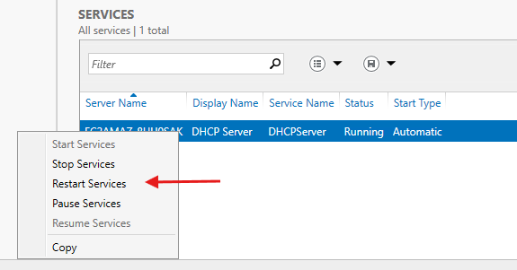{ .margintop10 .marginbottom10}

#### 4.4.4 Activar el scope

- Vamos a la consola de DHCo y veremos nuestro scope en rojo (desactivado).
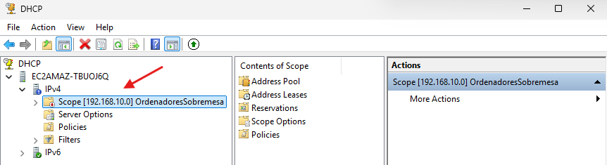{ .margintop10 .marginbottom10}
- Haremos clic derecho y lo activaremos.
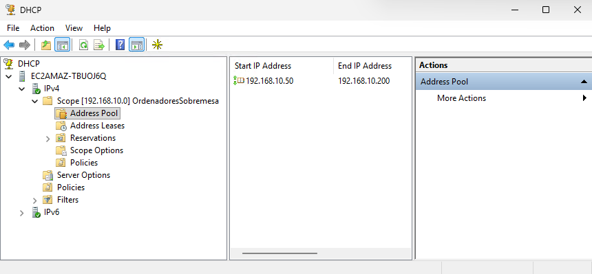{ .margintop10 .marginbottom10}

#### 4.4.5 Configurar opciones del ámbito

Las opciones de ámbito son parámetros de configuración adicionales que el servidor DHCP puede asignar a los clientes DHCP por ejemplo el DNS y la puerta de enlace (enrutador).

- Vamos a scope y seleccionamos **Configure Options...**
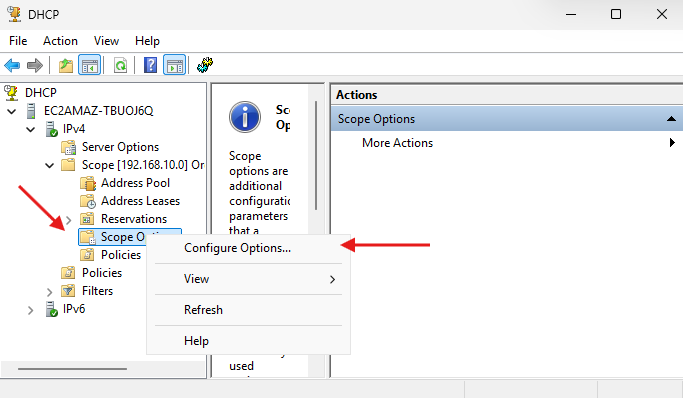{ .margintop10 .marginbottom10}
- Buscamos la opción **003 Enrutador**, que permitirá a las máquinas conectadas a la red virtual acceder a Internet. No configuraremos el DNS, ya que lo veremos en otra unidad, ni definiremos un controlador de dominio, puesto que la implementación de Active Directory se tratará más adelante y queda fuera del alcance de este apartado.
{ .margintop10 .marginbottom10}
- Comprobamos que la option se ha guardado correctamente.
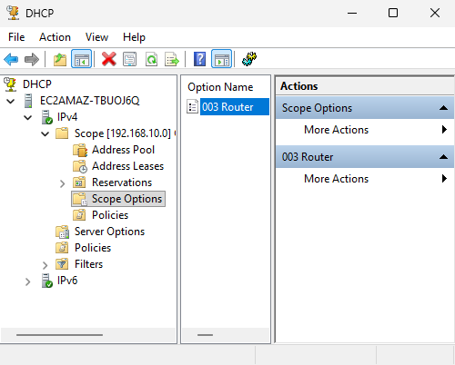{ .margintop10 .marginbottom10}

#### 4.4.6 Best Practices analyzer

No es una herramienta especifica del servicio DHCP sino de todo el ecosistema de Windows Server.

- Vamos a BPA → **TASKS** → Start BPA Scan
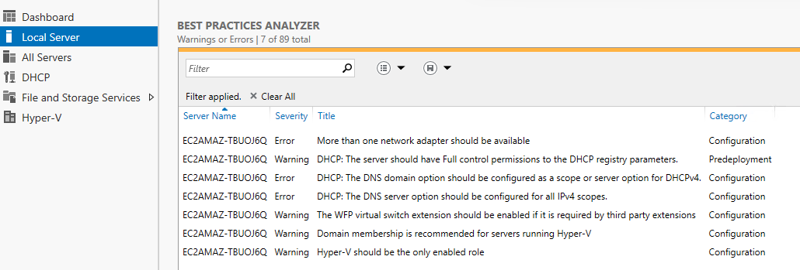{ .margintop10 .marginbottom10}

**Nota:**  
Algunos de los errores o advertencias que aparecen se deben a las limitaciones de nuestra infraestructura. No los tendremos en cuenta. 

#### 4.4.7 Comprobar el servicio por CLI

```powershell
Get-DhcpServerV4Scope
Get-DhcpServerV4OptionValue -ScopeId 192.168.10.0
```

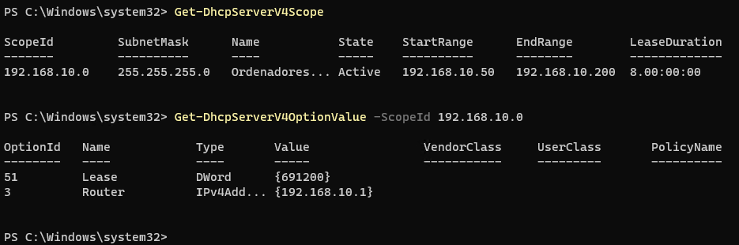{ .marginbottom10}

```powershell
ipconfig
```

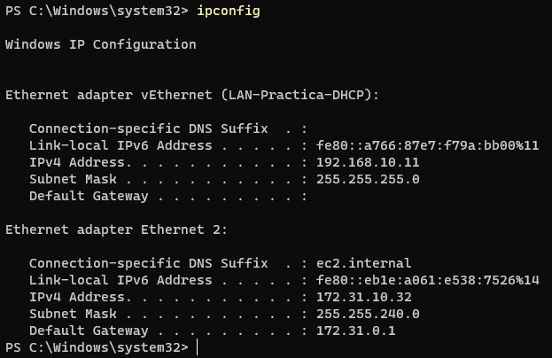{ .marginbottom10}

- Con esto ya tendremos montada la red virtual de Windows Server y el servidor DHCP. El siguiente paso será montar clientes con Alpine Linux y comprobar si las asignaciones de IP y el acceso a internet se hace correctamente.
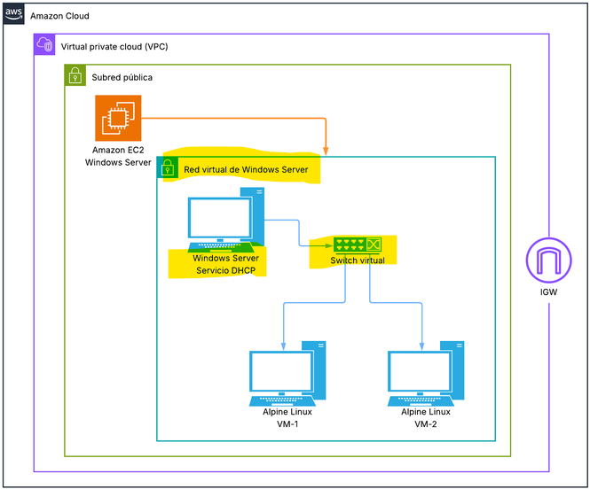{ .margintop10 .marginbottom10}

### 4.5 Creación de las máquinas virtuales cliente

- Con RAM limitada (`m7i.large` con 8 GiB), lo más eficiente es que **el propio host Windows Server actúe como servidor DHCP** y usar Hyper-V solo para las VMs cliente.  
- Como cliente, **Alpine Linux** es la opción más ligera (256–512 MB por VM) y perfectamente válida para ver el proceso DHCP completo.

#### 4.5.1 Creación de las carpetas de trabajo

Crearemos dos carpetas de trabajo: **ISOs** y **VMs**.

- **ISO** contendrá los archivos .iso de los sistemas operativos que descargaremos.
- **VM** contendrá los discos duros de las máquinas virtuales que lanzaremos.

La creación de las carpetas se puede realizar tanto desde el explorador de archivos como en línea de comandos:

```powershell
New-Item -Path "C:\ISO" -ItemType Directory -Force
New-Item -Path "C:\VM" -ItemType Directory -Force
```

#### 4.5.2 Descargar el ISO

- Como ya hemos comentado, descargaremos [Alpine Linux](https://alpinelinux.org/downloads/) al ser una versión muy ligera de linux.
- La versión elegida para nuestras prácticas será la versión optimizada para virtualización y arquitectura de 32 bits (Virtual + x86).
- Al igual que para la creación de las carpetas, la imagen se puede descargar con la ayuda del navegador o por línea de comandos.

```powershell
Invoke-WebRequest -Uri "https://dl-cdn.alpinelinux.org/alpine/v3.24/releases/x86/alpine-virt-3.24.1-x86.iso" -OutFile "C:\ISO\alpine.iso"
```

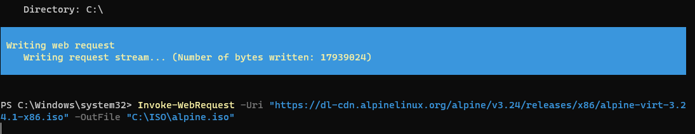{  .marginbottom10 }

- Comprobamos que la descarga es correcta (debe rondar los 45-50 MB):

```powershell
Get-Item "C:\ISO\alpine.iso" | Select-Object Name, Length
```

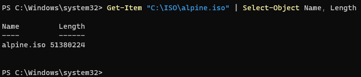{  .marginbottom10 }

### 4.5.3 Crear la VM

!!! tip "Podemos usar el asistente para la creación de la máquina virtual."

    - Para ello iremos a **Hyper-V Manager** → **New** → **Virtual Machine**"
    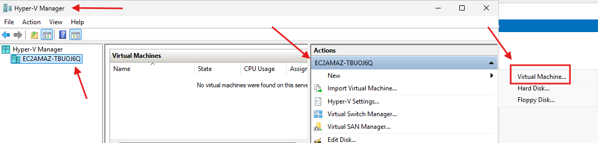{.margintop10  .marginbottom10 }
    - Damos un nombre a la máquina.
    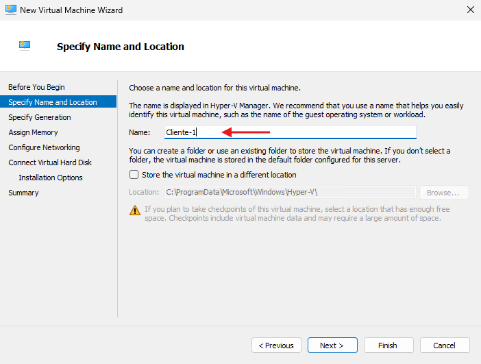{ .margintop10 .marginbottom10 }
    - Seleccionamos **Generation 1**.
    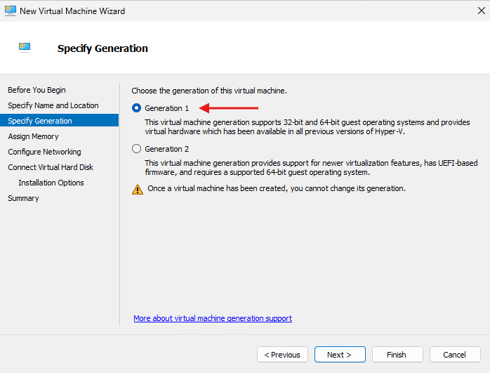{ .margintop10  .marginbottom10 }
    - Asignamos 512MB de memoria RAM para la máquina.
    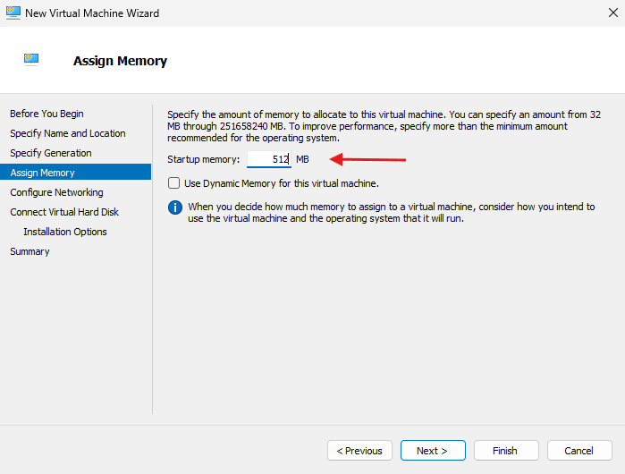{ .margintop10 .marginbottom10 }
    - Conectamos la máquina a nuestro switch virtual.
    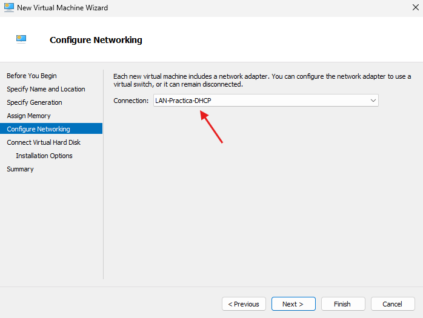{ .margintop10 .marginbottom10 }
    - Disco duro virtaul. Ubicaremos el disco duro en la carpeta **VM* creada anteriormente.
    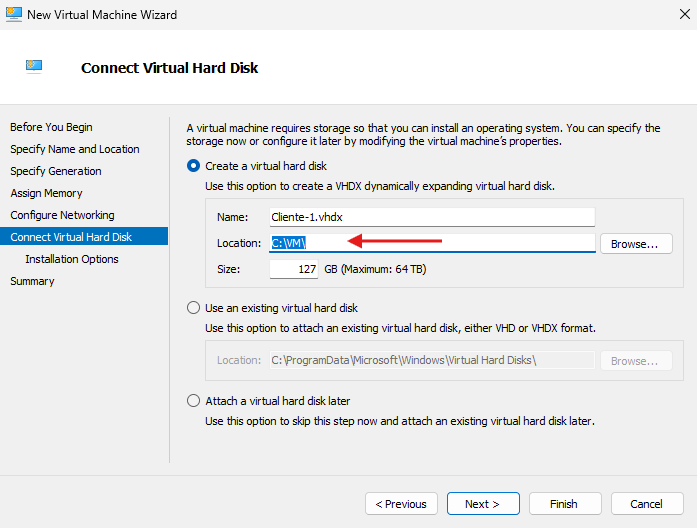{ .margintop10 .marginbottom10 }
    - Opciones de instalación del SO. En **Image file** ponemos la ubicación de nuestra imagen.iso.
    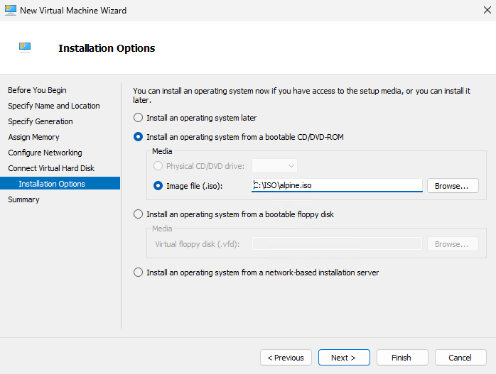{.margintop10  .marginbottom10 }
    - Finalizamos la creación de la máquina virtual.
    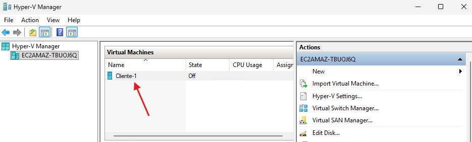{ .margintop10   }

!!! tip "Creación de la máquina virtual por línea de comando."

    - Declarar la máquina    

    ```powershell
    New-VM -Name "Cliente-1" `
    -MemoryStartupBytes 512MB `
    -Generation 1 `
    -NewVHDPath "C:\VM\Cliente-1.vhdx" `
    -NewVHDSizeBytes 4GB `
    -SwitchName "LAN-Práctica-DHCP"
    ```

    - Declarar la unidad de DVD  y montar el **ISO**.
    !!! warning "Las VMs Generation 1 traen una unidad de DVD por defecto (a diferencia de Generation 2, donde hay que añadirla explícitamente con Add-VMDvdDrive). Por tanto, basta con usar Set-VMDvdDrive para montar la ISO en la unidad ya existente.

    ```powershell
    Set-VMDvdDrive -VMName "CLIENTE-1" -Path "C:\ISOs\alpine.iso"
    Get-VMDvdDrive -VMName "CLIENTE-1"   # debe mostrar el Path del ISO
    ```

    - definir el orden de arranque (DVD antes que red)
    
    ```powershell
    Stop-VM -Name "Cliente-1" -TurnOff -Force
    Set-VMFirmware -VMName "Cliente-1" -FirstBootDevice (Get-VMDvdDrive -VMName "Cliente-1")
    Start-VM -Name "Cliente-1"
    ```

### 4.5.4 Arrancar la VM

- Arrancamos la máquina virtual desde el **Hyper-V Manager**
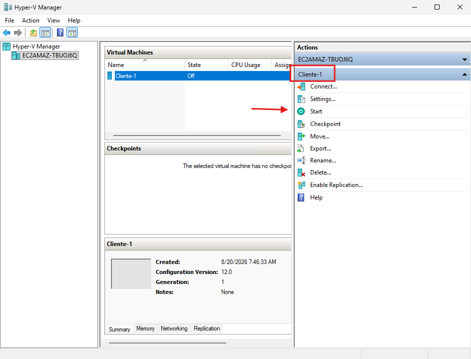{ .margintop10 .marginbottom10 }
- Esperamos a que se cargue el SO.
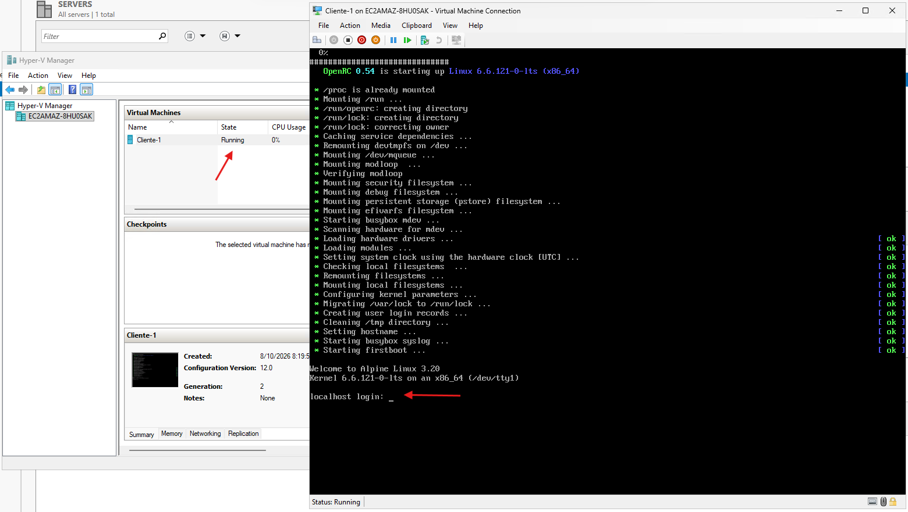{ .margintop10 .marginbottom10 }
- La contraseña del login es **root**.
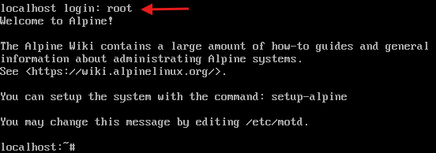{ .margintop10 .marginbottom10 }

### 4.5.4 Verificar la conexión a la red a la asignación de la IP por parte del DHCP

- Dentro de la consola de la VM confirmaremos el nombre real de la interfaz (eth0, enp0s3...):  
    ```shell
    ip link show           
    ```

    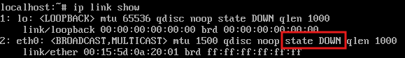

- Si aparece "state DOWN", levantaremos la interfaz.
    ```shell
    ip link set eth0 up    
    ```  

    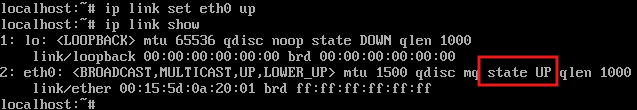{ .margintop10}

- Solicitamos una dirección IP con:
    ```shell
    udhcpc -i eth0
    ```

    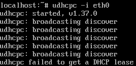

- Como podemos ver, la solicitud no se realiza. Eso se puede deber a, al menos 2 causas.  
No hemos asociado el **Switch Virtual** a nuestra **máquina anfitrión**.
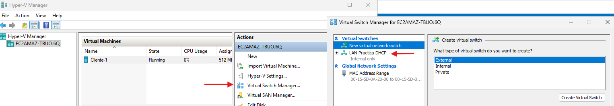{ .margintop10 .marginbottom20}
Cuando hemos creado el switch virtual hemos autorizado el VLAN ID → Lo deseleccionaremos.
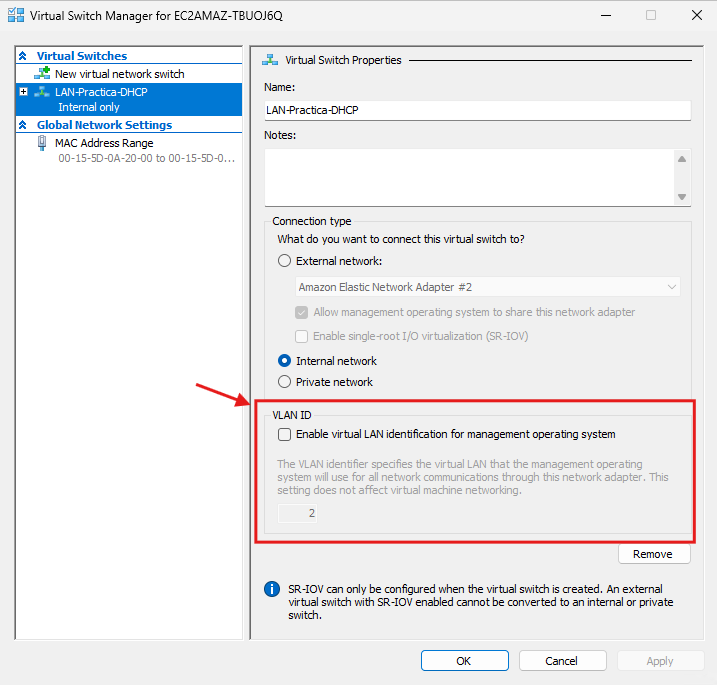{ .margintop10 .marginbottom10}

- Solicitamos de nuevo una dirección IP:
    ```shell
    udhcpc -i eth0
    ```

    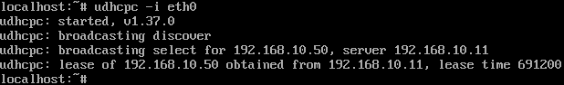

### 4.6 Supervisión del proceso de broadcast y asignación (DORA) con Wireshark

- En esta parte supervisaremos la activida de red con **Wireshark** para ver el proceso DORA: DHCPDISCOVER → DHCPOFFER → DHCPREQUEST → DHCPACK.
- Wireshark es un popular analizador de protocolos de red de código abierto.  
- Permite capturar y examinar **en tiempo real** el tráfico de datos que pasa por una red de comunicaciones, mostrando los paquetes individuales de información.

### 4.6.1 Descargar e instalar Wireshark

!!! tip "Por línea de comandos"
    ```powershell
    Invoke-WebRequest -Uri "https://2.na.dl.wireshark.org/win64/Wireshark-latest-x64.exe" -OutFile "C:\Wireshark-installer.exe"
    Start-Process "C:\Wireshark-installer.exe"
    ```

!!! tip "Descargar desde la página oficial"
    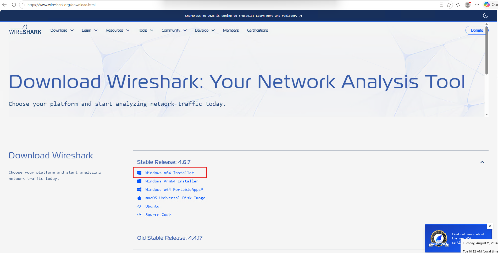

### 4.6.2 Primeras capturas con Wireshark

- Una vez en ejecución la aplicación nos mostrará todos los adaptadores de red disponibles.
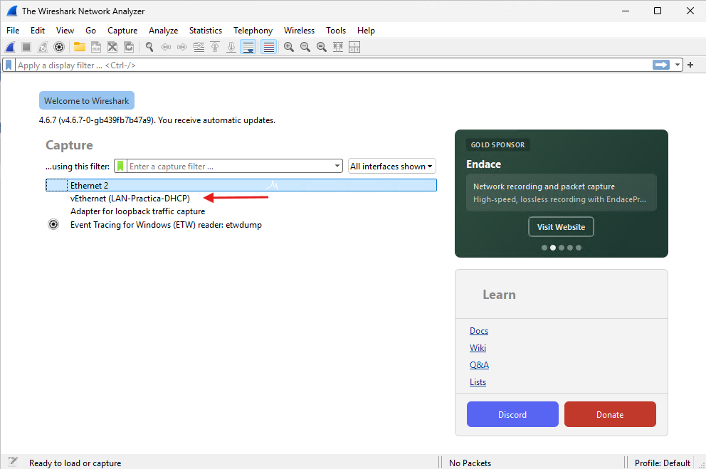{ .margintop10 .marginbottom10}
- Si no se detecta ninguna actividad de red, ponemos forzar tráfico haciendo ping desde la máquina virtual con Alpine Linux a otros dispositvos de la red. De esa manera también nos aseguraremos que todo funciona correctamente.
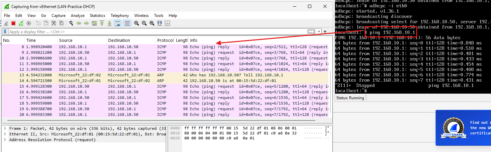{ .margintop10 .marginbottom10 }

### 4.6.3 Capturas del DORA entre MV y DHCP

- Wireshark solo captura el tráfico a partir del momento en el cual se está ejecutando. Por ese motivo deberemos forzar el DORA entre MV y DHCP. Para ello forzaremos a la MV a devolver la IP asignada y negociaremos otra.
- Primero comprobaremos que la MV está conectada a la red. Si no lo está levantaremos el servicio.
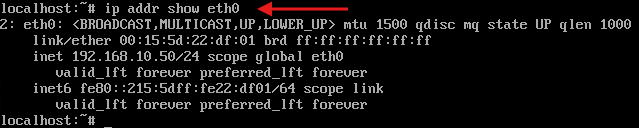{ .margintop10 .marginbottom10}
- Si la MV estaba conectada, devolveremos la IP asignada.
{ .margintop10 .marginbottom10}
- Forzamos la negociación de una nueva IP con el servidor DHCP.
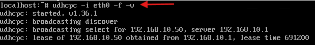{ .margintop10 .marginbottom10}
- Aplicando filtros o simplemente ordenando los protocolos en orden alfabetico podremos ver las 4 fases del procesa DORA.
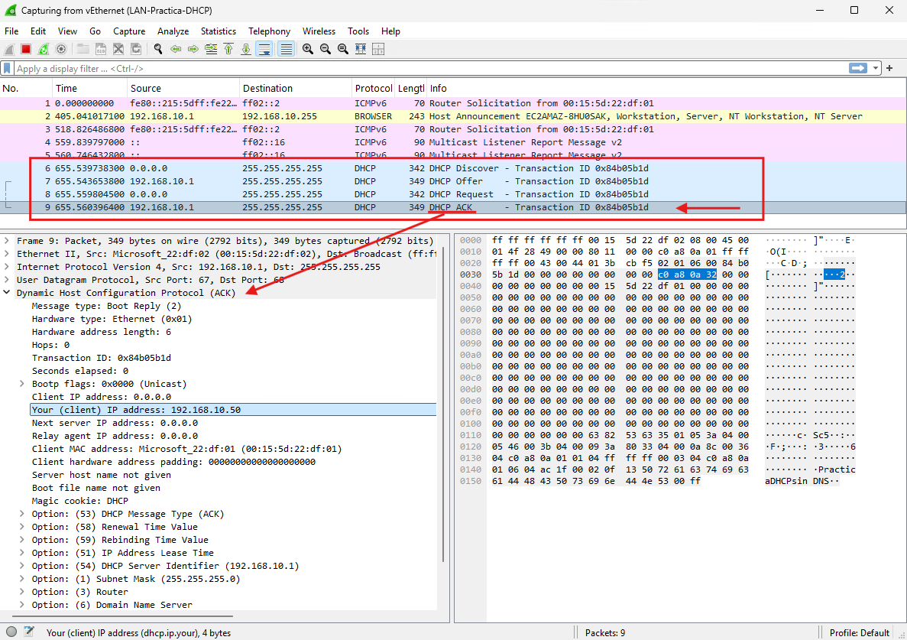{ .margintop10 .marginbottom10}

### 4.7 Creación de otra máquina virtual

Para comprobar que los conocimientos han sido asimilados correctamente. Lanzar otra máquina virtual y comprobar con Wireshark el proceso DORA.

La máquina virtual podrá ser del mismo tipo que la MV anterior o estar montada con un SO de *Windows**.

Si elegís esta última opción podreís descargar un SO de uso limitado desde [el centro de evaluación de Microsoft](https://www.microsoft.com/es-es/evalcenter/).

!!! tip "Comandos para devolver IP y solicitarla de nuevo"
    ```cmd
    ipconfig /release
    ipconfig /renew
    ipconfig /all
    ```

## 5 - Tarea RA1-def-2 - Instalación y configuración de un DHCP con Ubuntu Server en AWS

### 5.1 Objetivo de la práctica

- Desplegar un servidor DHCP en Ubuntu Server 22.04 LTS sobre AWS con virtualización anidada.
- En este primer paso instalaremos y configuraremos el rol **DHCP Server** en Ubuntu Server, y observaremos en tiempo real cómo varios equipos cliente obtienen su configuración IP (DHCPDISCOVER → OFFER → REQUEST → ACK), reservas, exclusiones, ámbitos (scopes), opciones de ámbito (DNS, puerta de enlace, etc.).

### 5.2 Arquitectura del laboratorio

- Instancia EC2 (m7i.large, 100GB, Unbuntu Server 24.04 LTS
- Virtualización KVM + QEMU + libvirt)

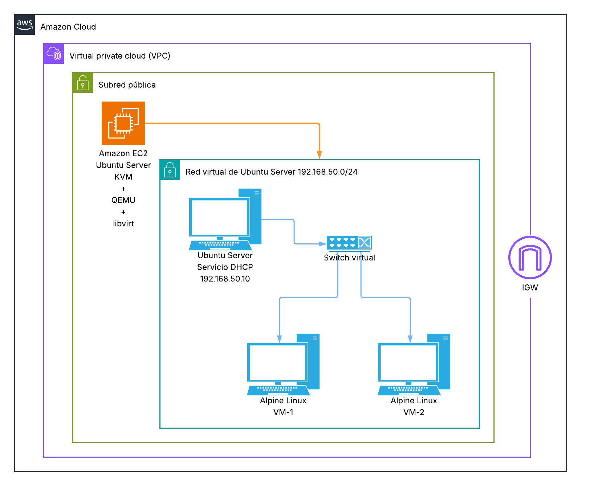{  .marginbottom10}

<!-- ┌───────────────────────────────┐
          │         UBUNTU SERVER         │
          │                               │
          │      KVM + QEMU + libvirt     │ 
          │                               │
          │   ┌───────────────────────┐   │
          │   │       RED DHCP        │   │
          │   │    192.168.50.0/24    │   │
          │   │                       │   │
          │   │   ┌───────────────┐   │   │
          │   │   │ DHCP SERVER   │   │   │
          │   │   │ Ubuntu Server │   │   │
          │   │   │ 192.168.50.10 │   │   │
          │   │   └───────┬───────┘   │   │
          │   │           │           │   │
          │   │      ┌────┴────┐      │   │
          │   │      │ virtual │      │   │
          │   │      │ switch  │      │   │
          │   │      └─┬──┬──┬─┘      │   │
          │   │        │  │  │        │   │
          │   │      VM1 VM2 VM3      │   │
          │   │     DHCP DHCP DHCP    │   │
          │   │                       │   │
          │   └───────────────────────┘   │
          └───────────────────────────────┘
-->

<!-- ```mermaid
flowchart TB
    subgraph Host["UBUNTU SERVER (KVM + QEMU + libvirt)"]
        direction TB
        
        subgraph Red["RED DHCP (192.168.50.0/24)"]
            direction TB
            
            DHCP["<b>DHCP SERVER</b><br/>Ubuntu Server<br/>192.168.50.10"]
            Switch["virtual switch"]
            
            subgraph VMs["Clientes DHCP"]
                direction LR
                VM1["VM1<br/>(DHCP)"]
                VM2["VM2<br/>(DHCP)"]
                VM3["VM3<br/>(DHCP)"]
            end
            
            DHCP --- Switch
            Switch --- VM1
            Switch --- VM2
            Switch --- VM3
        end
    %% Estilos visuales
    style Host fill:#f9f9f9,stroke:#333,stroke-width:2px
    style Red fill:#e1f5fe,stroke:#0288d1,stroke-width:2px
    style DHCP fill:#fff3e0,stroke:#f57c00,stroke-width:1px
    style Switch fill:#e8f5e9,stroke:#388e3c,stroke-width:1px
    style VMs fill:#ffffff,stroke:none
    end
``` -->

**Dónde:**

- **KVM + QEMU + libvirt** es la pila de virtualización nativa de Linux y está pensada para virtualización de servidores. 
    - **KVM** → proporciona la virtualización mediante el kernel.
    - **QEMU** → ejecuta/emula el hardware de las máquinas virtuales.
    - **libvirt** → capa de administración de KVM/QEMU.
- **virt-manager** → interfaz gráfica para administrar libvirt.

!!! tip "Equivalencia con Windows Server"  
    | Windows Server                    | Ubuntu Server                            |
    | --------------------------------- | ---------------------------------------- |
    | **Hyper-V**                       | **KVM + QEMU**                           |
    | Hyper-V Manager                   | **virt-manager**                         |
    | PowerShell / herramientas Hyper-V | **virsh / virt-install**                 |
    | Virtual Switch                    | **Redes virtuales de libvirt / bridges** |
    | VM                                | VM KVM/QEMU                              |
    | VHDX                              | qcow2 / raw                              |
    | Hyper-V NAT / switches            | NAT / bridge de libvirt                  |

### 5.3 Instalación de GNOME en Ubuntu Server 22.04

- Para facilitar algunas etapas de la configuración de esta práctica, instalaremos la interfaz gráfica **GNOME** sobre la instancia de Ubuntu Server que hemos creado anteriormente.
- Instalar un escritorio gráfico no se suele recomendar en entornos de producción, por rendimiento y seguridad pero, dentro de un contexto de prácticas, puede estar plenamente justificado.
- GNOME propone un escrotorio completo o mínimo, siendo el completo el que instalaremos.

!!! tip "Instalación de GNOME"

    - Nos conectamos a nuestra instancia desde la consola de AWS.
    - Instalamos las actualizaciones disponibles en los repositorios.
    ```bash
    sudo apt update && sudo apt upgrade -y
    ```
    - Instalamos **tasksel** que nos permitirá instalar todo el entorno de escritorio en un solo paso.
    ```bash
    sudo apt install tasksel -y
    ```
    - Instalamos GNOME
    ```bash
    sudo apt install ubuntu-desktop -y
    ```
    - Configurar el archivo **.xsession** para el usuario. Aquí nos aseguraremos de que **Xrdp** sepa exactamente qué entorno de escritorio debe lanzar al autenticarse.
    ```bash
    echo "gnome-session" > ~/.xsession
    ```

    - Evitar que GDM3 bloquee el arranque gráfico. En servidores en la nube (AWS/Cloud) sin monitor físico, GDM entra en conflicto con las sesiones remotas de Xrdp. Detendremos el servicio gdm3:
    ```bash
    sudo systemctl stop gdm3
    sudo systemctl disable gdm3
    ```

    - Reiniciar el servicio de Xrdp. Aplicaremos los cambios y reiniciaremos el demonio de escritorio remoto:
    ```bash
    sudo systemctl restart xrdp
    ```

### 5.4 Primera conexión por escritorio gráfico a Ubuntu Server

- Lanzamos desde Windows la aplicación de conexión a escritorio remoto e introducimos la contraseña de nuestra máquina.  
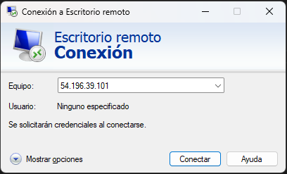{ .margintop10 .marginbottom10}
- Para la práctica no tendremos en cuenta la advertencias de seguridad.
- Introducimos nuestras credenciales en la pasarela (servidor Xrdp).
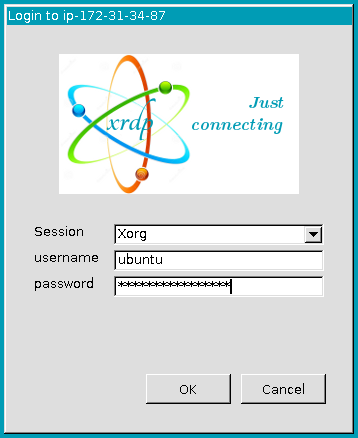{ .margintop10 .marginbottom10}
- Si la sesión de ubuntu se ha cerrado, introducimos de nuevo las credenciales.
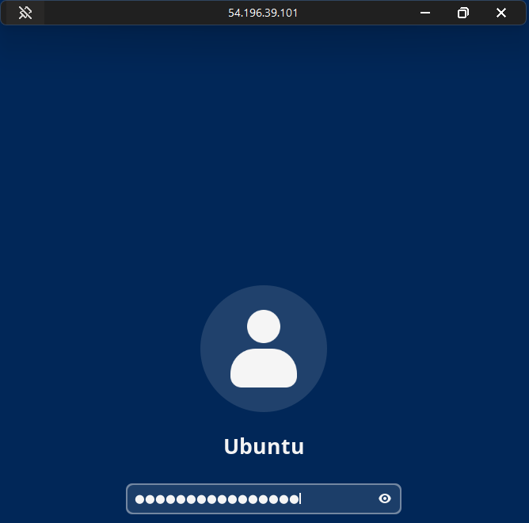{ .margintop10 .marginbottom10}
- Si todo ha ido bien, estaremos en el escritorio gráfico típico de Ubuntu Desktop.
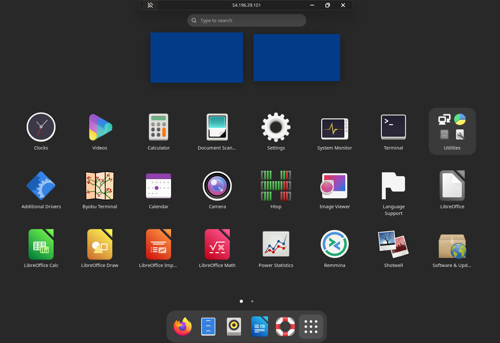{ .margintop10 .marginbottom10}

### 5.5 Activar la virtualización de la CPU por la consola de AWS

!!! success "Activar la virtualización de la CPU por la consola de AWS"

    - Abrimos el powershell de AWS y escribimos los siguientes comandos:  
    **Nota IMPORTANTE:** Cambiar la id por la **id de vuestra instancia**.
    ```bash
    # 1. Parar la instancia (aunque la acabes de arrancar)
    aws ec2 stop-instances --instance-ids i-069fe851e6325d765

    # 2. Esperar a que quede realmente parada
    aws ec2 wait instance-stopped --instance-ids i-069fe851e6325d765

    # 3. Activar nested virtualization con el comando correcto
    aws ec2 modify-instance-cpu-options \
      --instance-id i-069fe851e6325d765 \
      --nested-virtualization enabled

    # 4. Arrancarla de nuevo
    aws ec2 start-instances --instance-ids i-069fe851e6325d765
    ```

!!! tip "Comprobar la virtualización de la instancia"

    - Desde la consola de AWS ejecutamos el comando
    ```bash
    aws ec2 describe-instances --instance-ids i-069fe851e6325d765 \
    --query "Reservations[].Instances[].CpuOptions"
    ```
    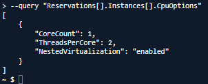{  .marginbottom10}
    - También lo podemos comprobar desde la propia instancia con:
    ```bash
    egrep -c '(vmx|svm)' /proc/cpuinfo
    ```
    Si nos devuelve un valor mayor que 0, significa que la CPU expone las extensiones de virtualización (Intel VT-x/ AMD AMD-V).  
    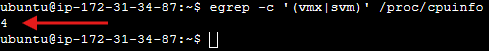{ .margintop10 .marginbottom10}
    - Otra manera sería usando la aplicación **cpu-checker**
    ```bash
    sudo apt update
    sudo apt install -y cpu-checker
    sudo kvm-ok
    ```
    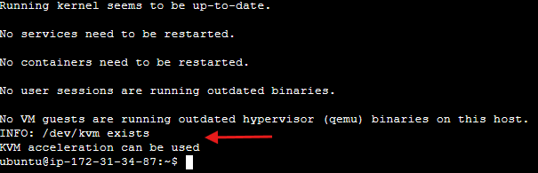{ .marginbottom10}

### 5.6 Instalación de KVM y herramientas relacionadas

```bash
sudo apt install -y qemu-kvm libvirt-daemon-system libvirt-clients bridge-utils virtinst virt-manager
```

- **qemu-kvm** → el hipervisor en sí.
- **libvirt-daemon-system / libvirt-clients** → capa de gestión (permite usar virsh, virt-install, etc.).
- **bridge-utils** → para redes puente entre las VMs anidadas.
- **virtinst** → herramientas para crear VMs desde línea de comandos (virt-install).
- **virt-manager** → interfaz gráfica de gestión (solo si disponemos de entorno gráfico).

### 5.7 Añadir usuarios a los grupos necesarios

Para poder utilizar las opciones de virtualización deberemos añadir nuestro usuario **a los grupos libvirt y kvm**.

```bash
sudo usermod -aG libvirt $USER
sudo usermod -aG kvm $USER
```

!!! warning "Desloggearse para que los cambios surtan efecto"

### 5.8 Comprobar que el servicio libvirt está activo

```bash
sudo systemctl status libvirtd
```

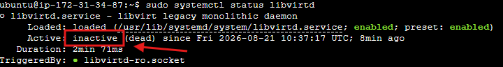{ .marginbottom10}

Si, como en el caso de la imagen, nos muestra inactive, los activaremos con:

```bash
sudo systemctl start libvirtd
sudo systemctl status libvirtd
```

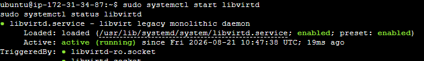{ .marginbottom10}

### 5.9 Verificar que /dev/kvm existe y los permisos de usuario del directorio

```bash
ls -l /dev/kvm
```
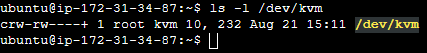{ .marginbottom10}

**rw-rw----+** → El propietario **root** y el grupo **kvm** tienen permisos de lectura y escritura (rw-). El símbolo + indica que tiene Listas de Control de Acceso (ACL) adicionales aplicadas.

### 5.10 Listar el hipervisor detectado

```bash
virsh list --all
```
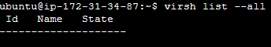{ .marginbottom10}

A esta altura de la práctica, que la lista esté vacía no es motivo de preocupación. Aún no hemos creado ninguna máquina virtual.

De no devolver un error tipo *failed to connect to the hypervisor* confirma que:

- **libvirtd** se está ejecutando correctamente.
- Nuestro usuario tiene permisos **para comunicarse con el hipervisor**.
- **KVM/QEMU** están listos para usarse.

!!! tip "Virt-Manager"
    
    - Si nos conectamos por escritorio remoto, también podremos ver que el asistente (gráfico) de virtualización (virt-manager) está instalado.
    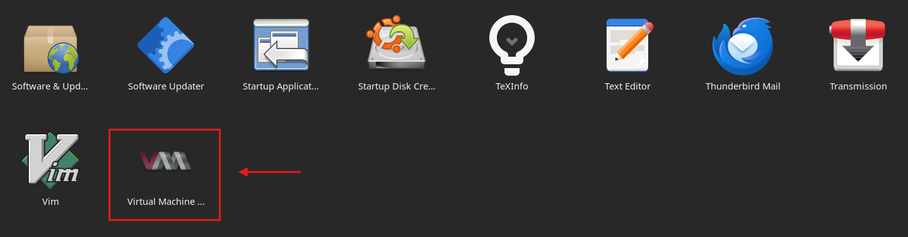{ .margintop10 . marginbottom10}
    - Escritorio de Virt-Manager
    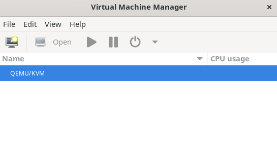{ .margintop10}

### 5.11 Crear la red aislada y el switch virtual sin acceso al exterior

Como el la práctica anterior, crearemos una red privada para evitar ingerencias de AWS a la hora de asignar IPs.

```bash
cat > ~/Documents/UbunterServerDHCP.xml << 'EOF'
<network>
  <name>RedPrivada-DHCP</name>
  <bridge name='Switch-Virtual' stp='on' delay='0'/>
</network>
EOF

sudo virsh net-define ~/Documents/UbunterServerDHCP.xml
sudo virsh net-start RedPrivada-DHCP
sudo virsh net-autostart RedPrivada-DHCP
```

!!! warning "Importante"
    Al **no** incluir ningún bloque `<forward>` ni `<ip>`, esta red queda en modo *isolated*. Libvirt no le asigna su propio DHCP interno ni la conecta a internet.

- Verificaremos que se ha creado switch virtual correctamente:  

    ```bash
    ip link show Switch-Virtual
    virsh net-list --all
    ```  

    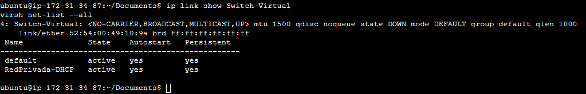

### 5.12 Configurar el switch virtual

A diferencia de la práctica de Windows Server aquí sí que podemos / debemos asignar un IP al switch virtual.

```bash
sudo ip addr add 192.168.50.1/24 dev Switch-Virtual
sudo ip link set Switch-Virtual up
```

### 5.13 Configurar la máquina anfitriona como servidor DHCP

- Instalamos el servicio DHCP

    ```bash
    sudo apt install -y isc-dhcp-server
    ```

- Definir qué interfaz debe escuchar el servidor DHCP
Para ello tendremos que editar el archivo `/etc/default/isc-dhcp-server`

    ```bash
    sudo nano /etc/default/isc-dhcp-server
    ```

    Bajamos hasta la línea INTERFACESv4="" y ponemos el valor Switch-Virtual
    ```
    INTERFACESv4="Switch-Virtual"
    ```
    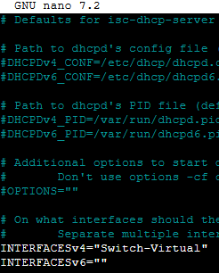{.marco}

### 5.14 Configurar el ámbito de nuestro servidor DHCP

- Para configurar el ámbito editaremos el archivo `/etc/dhcp/dhcpd.conf`

    ```bash
    sudo nano /etc/dhcp/dhcpd.conf
    ```

- Añadiremos al final:

    ```
    subnet 192.168.50.0 netmask 255.255.255.0 {
      range 192.168.50.100 192.168.50.200;
      option routers 192.168.50.1;
      option domain-name-servers 8.8.8.8;
      option subnet-mask 255.255.255.0;
      default-lease-time 600;
      max-lease-time 7200;
    }
    ```

    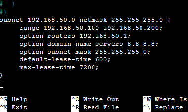

### 5.15 Arrancar el servicio DHCP

```bash
sudo systemctl restart isc-dhcp-server
sudo systemctl status isc-dhcp-server
```


!!! tip "Si falla al arrancar"
    
    - Revisar si `INTERFACESv4` apunta a una interfaz que no existe todavía o el archivo `dhcpd.conf`.
    - Si hay un error de sintaxis usar:
        ```bash
        sudo dhcpd -t -cf /etc/dhcp/dhcpd.conf
        ```

### 5.16 Descargar la imagen de las máquinas virtuales cliente

Igual que en la práctica de Windows Server, usaremos **Alpine Linux** por su ligereza (256–512 MB por VM).

- Podemos usar el escritorio gráfico para descargar la iso del SO de Alpine Linux pero, lo haremos por línea de comando.

    ```bash
    mkdir -p ~/Documents/iso ~/Documents/vm
    wget -O ~/Documents/iso/alpine.iso https://dl-cdn.alpinelinux.org/alpine/v3.24/releases/x86/alpine-virt-3.24.1-x86.iso
    ls -lh ~/iso/alpine.iso   
    ```

    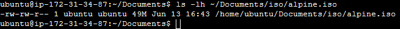

# hasta aqui

### 5.17 Crear la VM con virt-install (consola de texto, sin necesidad de GUI)

```bash
sudo virt-install \
  --name cliente1 \
  --memory 512 \
  --vcpus 1 \
  --disk path=/var/lib/libvirt/images/cliente1.qcow2,size=4 \
  --cdrom ~/isos/alpine.iso \
  --network network=lab-dhcp \
  --graphics none \
  --console pty,target_type=serial \
  --os-variant alpinelinux3.19
```
Esto te conecta automáticamente a la **consola serie** de la VM en la misma terminal SSH — no necesitas RDP ni VNC. Verás arrancar el live system de Alpine ahí mismo.

> Si `--os-variant alpinelinux3.19` da error porque `osinfo-db` no lo reconoce, quítalo o usa `--os-variant generic` — no afecta a la funcionalidad, solo son optimizaciones de la plantilla.

En el prompt `localhost login:` entra con:
```
root
```
(sin contraseña).

Para salir de la consola serie sin apagar la VM: `Ctrl + ]`.


<!-- https://claude.ai/chat/062d0a59-02ce-4044-b774-4249a42049e9 -->
<!-- https://gemini.google.com/u/1/app/ad715c98d45d977e?hl=es-ES -->
<!-- https://chatgpt.com/c/6a87ef1d-7130-83ed-8c1c-e4a9da08330f -->

### 5.3 Reconectar a la consola más tarde
```bash
virsh console cliente1
```

### 5.4 Segundo cliente (opcional)
Repite 5.2 cambiando `--name cliente2` y la ruta del disco.

## Paso 6 — Instalar y configurar isc-dhcp-server en el host

### 6.1 Averiguar la interfaz del host en la red aislada
Al crear la red `lab-dhcp`, libvirt creó el puente `virbr-lab` en el host — es el equivalente al `vEthernet (LAN-Laboratorio-DHCP)` de Windows:
```bash
ip addr show virbr-lab
```

 
## Paso 7 — Verificar desde los clientes

En la consola serie de `cliente1` (Alpine):
```sh
ip link show                # confirma el nombre de la interfaz (normalmente eth0)
ip link set eth0 up         # si aparece "state DOWN"
udhcpc -i eth0
```

Deberías ver:
```
udhcpc: sending discover
udhcpc: sending select for 192.168.10.10x
udhcpc: lease of 192.168.10.10x obtained
```

## Paso 8 — Ver el proceso de broadcast y asignación (DORA) en detalle

### 8.1 Leases concedidos (resultado)
```bash
cat /var/lib/dhcp/dhcpd.leases
```

### 8.2 Log del propio servicio en vivo (equivalente al DhcpSrvLog de Windows)
```bash
sudo journalctl -u isc-dhcp-server -f
```
Déjalo corriendo en una terminal SSH y repite `udhcpc -i eth0` en la consola de la VM en otra — verás las líneas DHCPDISCOVER/DHCPOFFER/DHCPREQUEST/DHCPACK en tiempo real, con IP y MAC del cliente.

### 8.3 Captura con tcpdump en el cliente (lado cliente)
```sh
apk add tcpdump
tcpdump -i eth0 -n port 67 or port 68 -v
```

### 8.4 Captura con tcpdump en el host, sobre el puente (lado servidor)
Como no hay GUI en Ubuntu Server, usamos `tcpdump`/`tshark` y, si se quiere inspección visual campo a campo, se exporta el `.pcap` y se abre con Wireshark en el portátil del alumno:
```bash
sudo tcpdump -i virbr-lab -n port 67 or port 68 -w /tmp/dhcp-capture.pcap
```
Detén la captura con `Ctrl+C` tras generar tráfico, y descárgala a tu equipo local para abrirla con Wireshark:
```bash
scp -i mi-clave.pem ubuntu@<IP-instancia>:/tmp/dhcp-capture.pcap .
```
También puedes instalar `tshark` en el propio host si prefieres inspeccionar sin salir de la terminal:
```bash
sudo apt install -y tshark
sudo tshark -i virbr-lab -Y bootp
```


### 8.5 Ejercicios adicionales con valor curricular
- **Reservas** por MAC: `Add-DhcpServerV4Reservation`.
- **Exclusiones** dentro del ámbito: `Add-DhcpServerV4ExclusionRange`.
- **Liberar y renovar** (contraste DISCOVER completo de 4 paquetes vs. renovación de 2 paquetes): en Alpine, `udhcpc -R` para liberar y volver a pedir.
- **Agotamiento del ámbito**: crear un ámbito de prueba muy pequeño (p. ej. solo 2-3 IPs) para que los alumnos vean qué ocurre cuando un cliente no puede recibir oferta.


<!-- DHCP -->
<!-- Follow link (ctrl + click) -->
<!-- https://learn.microsoft.com/es-es/troubleshoot/windows-server/networking/troubleshoot-dhcp-guidance -->
<!-- para paja -->
 
<!-- para nat -->
<!-- tipo de elementos de red -->
<!-- https://itadmins.es/networking-ii-dispositivos-de-red-y-tipos-de-trafico/ -->

<!-- # NAT -->
<!-- https://www.manageengine.com/latam/oputils/direcciones-ip-fundamentos.html
https://www.redeszone.net/tutoriales/redes-cable/calcular-subnetting-ip-red-mascara-subred-ipv4/
https://www.1nce.com/es-es/recursos/iot-knowledge-base/que-es-el-mecanismo-nat
https://openwebinars.net/blog/nat-que-es-y-para-que-sirve/
-->

<!-- 
https://aules.edu.gva.es/docent/pluginfile.php/5719248/mod_resource/content/1/XL_UT03_Interconnexio%CC%81%20d%E2%80%99equips%20en%20xarxes%20locals%20i%20muntatge%20de%20connectors-IP.pdf
-->


<!-- instalar virtualizacion virt-manager https://youtu.be/fjCWPm-BDto?si=cKZzFsvAcjfM9Cd7&t=477 -->
<!-- windows server instalar dhcp https://www.youtube.com/watch?v=nc-ratzt1MU&t=750s -->
<!-- windows server instalar dhcp  https://www.youtube.com/watch?v=ItmHj-j5spI -->