{ .img2 .marginbottom40}

**Resultados de aprendizaje y criterios de evaluacion que se evaluarán en esta unidad.**  

| **Resultados de aprendizaje de la unidad didáctica:**|
||
| **RA. 2 Instala servicios de resolución de nombres, describiendo sus características y aplicaciones.**|

|**Criterios de evaluación de la unidad didáctica:**|
||
|**a)** Se han identificado y descrito escenarios en los que surge la necesidad de un servicio de resolución de nombres.|
|**b)** Se han clasificado los principales mecanismos de resolución de nombres.|
|**c)** Se ha descrito la estructura, nomenclatura y funcionalidad de los sistemas de nombres jerárquicos.|
|**d)** Se ha instalado un servicio jerárquico de resolución de nombres.|
|**e)** Se ha preparado el servicio para almacenar las respuestas procedentes de servidores de redes públicas y servirlas a los equipos de la red local.|
|**f)** Se han añadido registros de nombres correspondientes a una zona nueva, con opciones relativas a servidores de correo y alias.|
|**g)** Se ha trabajado en grupo para realizar transferencias de zona entre dos o más servidores.|
|**h)** Se ha comprobado el funcionamiento correcto del servidor.|

## 1 - Introducción

!!! question "¿Qué es el DNS?"


El **DNS** (*Domain Name System* o **Sistema de Nombres de Dominio**) es un sistema **distribuido y jerárquico** que permite asociar nombres de dominio legibles para las personas, como `www.aules.edu.gva.es`, con **direcciones IP**, como `195.77.20.168`, que los dispositivos utilizan para localizar servicios y comunicarse en una red.

El DNS suele describirse popularmente como la **"guía telefónica de Internet"**. Al igual que la agenda de un teléfono móvil nos evita tener que memorizar los números de teléfono de cada persona, el DNS evita que los usuarios tengan que memorizar direcciones IP para acceder a los diferentes servicios de una red.

Aunque normalmente pensamos en el DNS como un sistema que traduce nombres de dominio en direcciones IP, también permite realizar otro tipo de consultas. Por ejemplo, puede indicar qué servidores se encargan del correo electrónico de un dominio o proporcionar direcciones IPv6.

!!! question "¿Para qué sirve?"
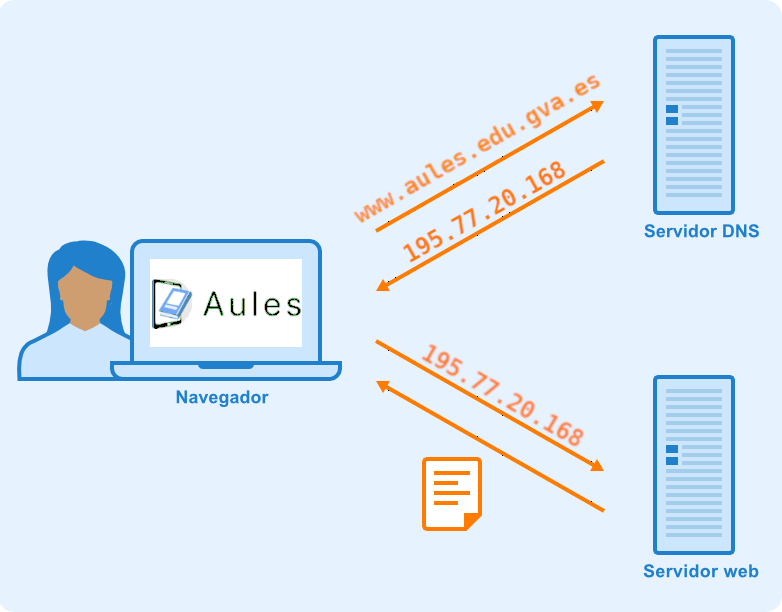

La utilidad del sistema DNS es fundamental para el funcionamiento de Internet y de **muchas redes privadas**. Entre sus principales funciones encontramos:

- **Simplifica el acceso a los servicios de red:** permite utilizar nombres fáciles de recordar en lugar de direcciones IP.

- **Aporta flexibilidad:** si un servicio cambia de servidor o de dirección IP, es posible modificar la información DNS manteniendo el mismo nombre de dominio. De esta forma, los usuarios pueden continuar utilizando el mismo nombre para acceder al servicio.

- **Permite localizar servicios de red:** los dispositivos pueden consultar el DNS para obtener información sobre la ubicación de diferentes servicios, como servidores web o servidores de correo electrónico.

- **Facilita la administración de redes:** en las redes locales también es posible utilizar DNS para asociar nombres a equipos y servicios, evitando tener que recordar sus direcciones IP.

- **Interviene en numerosos servicios de Internet**, como:  

    - **Acceder a páginas web**.
    - **Enviar y recibir correos electrónicos**.
    - **Utilizar servicios de streaming**.
    - **Jugar a videojuegos online**.
    - **Acceder a diferentes servicios y aplicaciones de Internet**.

!!! warning "Resolución de nombre inversa"

    - La resolución de nombre inversa (o *reverse DNS lookup*) es el proceso contrario a la resolución de nombres habitual: en lugar de preguntar "¿qué dirección IP corresponde a este nombre de dominio?", la consulta pregunta "¿qué nombre de dominio corresponde a esta dirección IP?".
    - Para llevarla a cabo, el DNS utiliza un dominio especial llamado **in-addr.arpa** (para IPv4) o **ip6.arpa** (para IPv6). La dirección IP se transforma e inserta dentro de este dominio en orden inverso a como se escribe normalmente.  

        !!! example "Ejemplo"
            
            - Para averiguar el nombre asociado a la IP `192.168.10.20`, el *resolver* consulta el dominio:  
            `20.10.168.192.in-addr.arpa`  
            - El registro que responde a este tipo de consulta se llama **registro PTR** (*pointer record*), y es el encargado de indicar qué nombre de dominio corresponde a esa dirección IP.  
    
    - **Usos habituales de la resolución inversa:**
        - Verificación de correo electrónico: muchos servidores de correo comprueban que la IP del remitente tenga un PTR válido antes de aceptar el mensaje, como medida contra el *spam*.
        - Diagnóstico y registro (*logging*): en herramientas como `traceroute`, `ping` o en los logs de un servidor, es más legible ver el nombre de una máquina que su dirección IP.
        - Auditoría y seguridad: permite identificar qué equipo hay detrás de una IP concreta durante el análisis de tráfico o incidentes.
    
        !!! failure "A diferencia de la resolución directa, la resolución inversa requiere que el administrador de la red configure explícitamente esta zona y sus registros PTR, ya que no se genera de forma automática a partir de los registros A o AAAA."

<!-- > **Importante:** el DNS no es el encargado de conectar un dispositivo a una red Wi-Fi. En una conexión Wi-Fi intervienen tecnologías y protocolos como **IEEE 802.11** y, habitualmente, **DHCP** para obtener la configuración de red. El DNS puede utilizarse posteriormente para resolver los nombres de los servicios a los que queremos acceder. -->

## 2 - Protocolo DNS

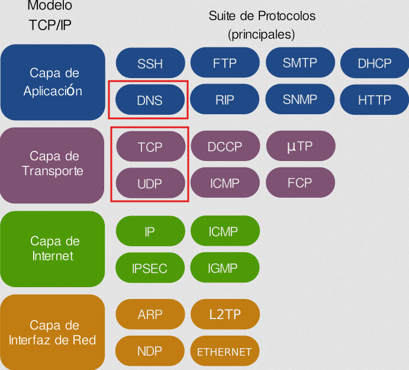{.marco .seiszero}

- **El servicio de nombres de dominio utiliza el protocolo DNS para realizar las consultas y las respuestas**.
- Se trata de un protocolo de **capa de aplicación** que puede utilizar tanto UDP como TCP en la capa de transporte.  
- Habitualmente, tanto las consultas del cliente como las respuestas del servidor caben en un datagrama (512 bytes) y se utiliza UDP (de hecho, generalmente se dice que el DNS usa UDP). 
- Si la información a transmitir es amplia (por ejemplo, una respuesta con una lista con mucha información), la comunicación pasa a TCP automáticamente.
- Otro caso en el que la comunicación es por TCP es cuando se realiza la transferencia de información de una zona entre servidores primarios y secundarios. **El servidor DNS utiliza el puerto privilegiado 53**.

!!! tip "Resumen de los que hemos visto"
    - El protocolo DNS es habitualmente UDP, pero puede ser TCP y UDP.
    - Se trata de un protocolo de capa de aplicación y utiliza el puerto 53.
    - Los datagramas DNS se componen de varios apartados, tal como se puede ver en la siguiente consulta con host:

        !!! example "Ejemplo de consulta DNS"
            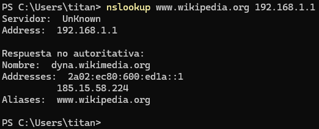{.sietecinco}
    
## 3 - Mecanismos de comunicación DNS

- La comunicación DNS es un mecanismo de consulta/respuesta entre el cliente y el servidor. Los datagramas, por tanto, serán de query (consulta) o de answer (respuesta).

- Los apartados que componen un mensaje DNS son:

    - **HEADER**. Cabecera del mensaje que indica si se trata de una consulta o de una respuesta. Contiene el id (identificador) del mensaje, flags y un resumen de qué secciones del mensaje llevan información y cuánta.
    - **QUESTION**. Esta sección contiene la consulta que se ha efectuado, es decir, qué dato se ha pedido al servidor. Puede ser la resolución de un nombre de dominio a una dirección IP, pedir la lista de servidores de impresión, etc.
    - **ANSWER**. Sección que contiene la respuesta obtenida del servidor. Esta respuesta será autoritativa o no en función de si el servidor que responde es autoritativo para esa zona: cuando la respuesta procede de un servidor caché/resolver (no autoritativo), algunas utilidades de consulta la muestran como non-authoritative answer.
    - **AUTHORITY**. Esta sección contiene las respuestas que son autoritativas para la consulta efectuada. Evidentemente, puede estar vacía.
    - **ADDITIONAL**. Contiene información adicional para completar la respuesta. En el ejemplo se observa que completa la resolución de los nombres de máquina que aparecen en la sección ANSWER, indicando su dirección IP correspondiente.

        !!! example "Ejemplo de comunicación DNS"
            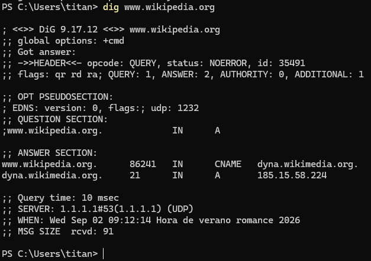{.ochocinco}

## 4 - Consultas al DNS

En una búsqueda de DNS habitual se producen **tres tipos de consultas**.

Al usar una combinación de estas consultas, un proceso optimizado para la resolución de DNS puede conllevar una reducción de la distancia recorrida.  
En una situación ideal, los datos de registro almacenados en la memoria caché estarán disponibles, lo cual permitirá que un servidor de nombres DNS devuelva una consulta no recursiva.

1. **Consulta recursiva:** en una consulta recursiva, un cliente DNS requiere que un servidor DNS (generalmente un resolver DNS recursivo) responda al cliente con el registro del recurso solicitado o un mensaje de error si el resolver no puede encontrar el registro.
1. **Consulta iterativa:** en esta situación, el cliente DNS permitirá que un servidor DNS devuelva la mejor respuesta posible. Si el servidor DNS consultado no cuenta con un nombre que corresponda con el de la consulta, devolverá una referencia a un servidor DNS autoritativo para un nivel inferior del espacio de nombres de dominio. El cliente DNS hará a continuación una consulta a la dirección de referencia. Este proceso continúa con servidores DNS adicionales que siguen en la cadena de consulta hasta que se produzca un error o se supere el tiempo de espera.
1. **Consulta no recursiva:** generalmente se produce cuando un cliente resolver DNS consulta a un servidor DNS por un registro al que tiene acceso porque o bien es autoritativo para el registro o el registro existe dentro de su caché. Generalmente, el servidor DNS almacenará en caché registros DNS para prevenir el consumo de ancho de banda adicional y la carga en los servidores que preceden en la cadena.

## 5 - Funcionamiento del DNS

El funcionamiento del DNS se basa en un sistema **jerárquico y distribuido** conocido como **resolución de nombres de dominio**. Su función principal es obtener información asociada a un nombre de dominio, como su dirección IP.

Cuando escribimos la dirección web `www.aules.edu.gva.es` en el navegador, el dispositivo necesita obtener la dirección IP asociada a ese nombre antes de poder establecer la comunicación con el servicio.

La resolución de un nombre puede implicar diferentes servidores DNS. De forma simplificada, el proceso es el siguiente:

---

### 5.1 Inicio de la consulta y comprobación de la caché

El dispositivo realiza una consulta a un **servidor DNS recursivo**, también denominado **DNS resolver**. Habitualmente, este servidor es proporcionado por el proveedor de acceso a Internet, aunque también puede pertenecer a una organización, una empresa o ser **configurado manualmente**.
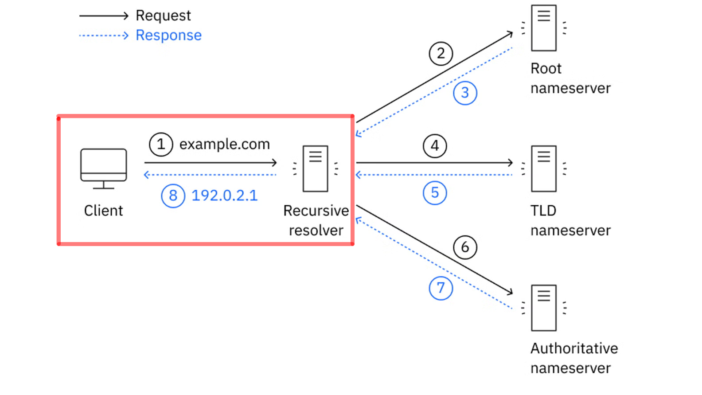{.marco .margintop10}

Antes de realizar nuevas consultas, pueden comprobarse diferentes **cachés DNS**. Por ejemplo, pueden existir cachés en:

- El navegador.
- El sistema operativo.
- El servidor DNS recursivo.

Si alguno de estos componentes dispone de una respuesta válida almacenada en caché, no será necesario repetir todo el proceso de resolución.

La información almacenada en caché tiene un tiempo de validez denominado **TTL (*Time To Live*)**.

---

### 5.2 Consulta al servidor raíz (*Root Server*)

Si el resolver recursivo no dispone de la respuesta en su caché, comienza la búsqueda consultando la jerarquía DNS.

El primer nivel corresponde a los **servidores raíz**.
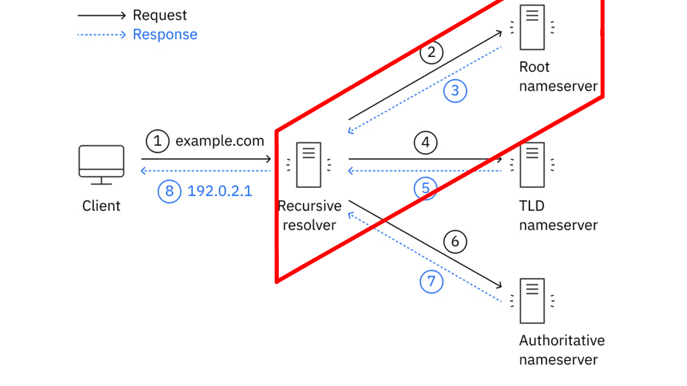{.marco .margintop10}

Existen **13 servidores raíz lógicos**, identificados mediante las letras de la **A a la M**. Cada uno de ellos está replicado mediante numerosas instancias distribuidas geográficamente por diferentes lugares del mundo.

Los servidores raíz **no conocen directamente la dirección IP** del dominio que estamos buscando. Su función es indicar qué servidores son responsables del **dominio de nivel superior (TLD)** correspondiente.

Por ejemplo, si estamos buscando:

```text
www.aules.edu.gva.es
```

el servidor raíz puede indicar qué servidores se encargan del TLD `.es`.

---

### 5.3 Consulta al servidor de nivel superior (TLD)

El resolver recursivo consulta entonces a un **servidor TLD** (*Top-Level Domain*).
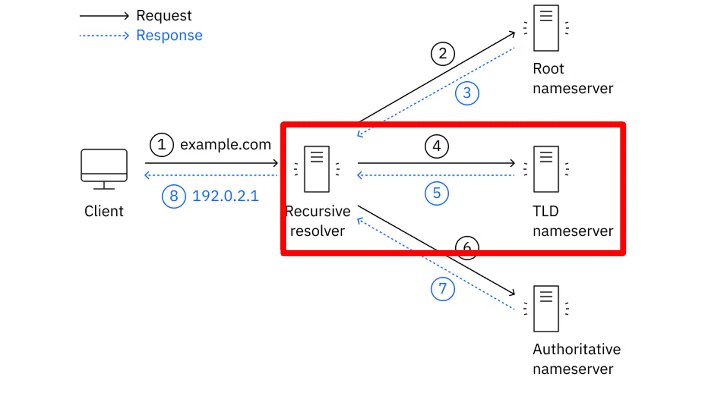{.marco .margintop10}

Un TLD es la parte final de un nombre de dominio, como:

```text
.com
.es
.org
.net
```

El servidor TLD no proporciona necesariamente la dirección IP del equipo que buscamos. Su función es indicar cuáles son los **servidores DNS autoritativos** encargados del dominio correspondiente.

Por ejemplo, los servidores responsables del TLD `.es` pueden indicar qué servidores DNS son autoritativos para:

```text
aules.edu.gva.es
```

---

### 5.4 Consulta al servidor de nombres autoritativo

El resolver recursivo consulta finalmente a uno de los **servidores DNS autoritativos** responsables de la zona correspondiente.
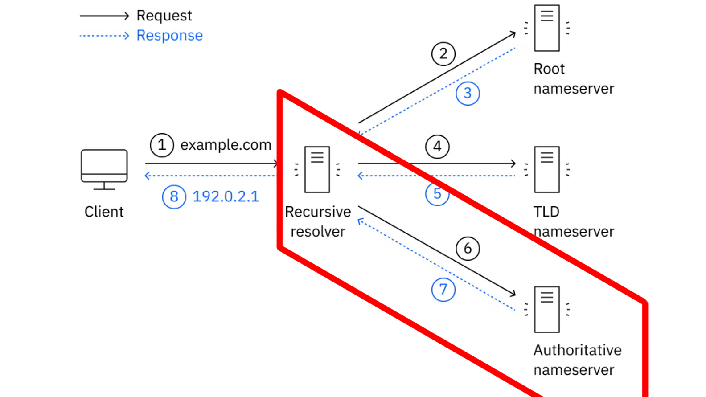{.marco .margintop10}

Un servidor autoritativo dispone de la **información oficial de la zona DNS que administra**. Esta información contiene diferentes registros DNS que permiten conocer los servicios asociados a los nombres del dominio.

Por ejemplo, un registro **A** puede asociar un nombre con una dirección IPv4:

```text
www.aules.edu.gva.es  →  195.77.20.168
```

Para IPv6 se utiliza normalmente un registro **AAAA**.

Un dominio puede disponer de **varios servidores autoritativos**, proporcionando redundancia y disponibilidad.

---

### 5.5 Resolución final y almacenamiento en caché

El resolver recursivo recibe la respuesta del servidor autoritativo y se la proporciona al dispositivo que realizó la consulta.
{.marco .margintop10}

El navegador ya puede utilizar la dirección IP obtenida para establecer una conexión con el servicio correspondiente.

Además, el resolver puede almacenar la respuesta en su **caché DNS** durante el tiempo indicado por el **TTL** del registro.

De esta forma, si otro dispositivo realiza posteriormente la misma consulta, el resolver puede responder utilizando la información almacenada en caché sin tener que volver a consultar a los servidores raíz, TLD y autoritativos.

---

### 5.6 Resumen del proceso

De forma simplificada, podemos representar la resolución de un nombre de dominio de la siguiente manera:

<!-- ```text
              Cliente
                 │
                 │ Consulta DNS
                 ▼
        ┌─────────────────┐
        │ DNS recursivo   │
        │    Resolver     │
        └────────┬────────┘
                 │
                 │ 1. Consulta
                 ▼
        ┌─────────────────┐
        │ Servidor raíz   │
        └────────┬────────┘
                 │
                 │ Indica el TLD
                 ▼
        ┌─────────────────┐
        │ Servidor TLD    │
        │     (.es)       │
        └────────┬────────┘
                 │
                 │ Indica los servidores
                 │ autoritativos
                 ▼
        ┌─────────────────────┐
        │ Servidor autoritativo│
        └──────────┬──────────┘
                   │
                   │ Registro A / AAAA
                   ▼
              Dirección IP
                   │
                   ▼
              DNS Resolver
                   │
                   ▼
                Cliente
``` -->

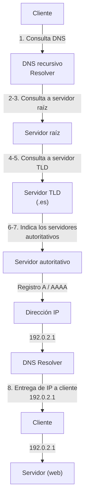

!!! tip "Resumen de los que hemos visto"

    1. El **cliente no suele consultar directamente a los servidores raíz, TLD y autoritativos**. 
    1. Normalmente realiza una consulta a un **resolver DNS recursivo**, que se encarga de realizar las consultas necesarias y devolver finalmente la respuesta al cliente.
    1. Por tanto, debemos distinguir entre:

          | Servidor DNS                 | Función principal                                                 |
          | ---------------------------- | ----------------------------------------------------------------- |
          | **DNS recursivo (Resolver)** | Realiza la búsqueda en nombre del cliente y devuelve la respuesta |
          | **Servidor raíz (Root)**     | Indica qué servidores gestionan el TLD solicitado                 |
          | **Servidor TLD**             | Indica qué servidores son autoritativos para el dominio           |
          | **Servidor autoritativo**    | Proporciona la información oficial de la zona DNS                 |

    4. Esta jerarquía permite que el DNS sea un sistema **distribuido, escalable y resistente**, capaz de gestionar una enorme cantidad de  nombres de dominio sin depender de un único servidor central.

---

## 6 - Jerarquía de nombres DNS

El sistema DNS está organizado mediante una **estructura jerárquica**, similar a un árbol invertido. En la parte superior se encuentra la **raíz (`.`)** y, a medida que descendemos por la jerarquía, encontramos los diferentes dominios y subdominios.

Si tenemos el siguiente nombre:
{.margintop10}

<!-- ```text
www.edu.gva.es
``` -->

Su estructura jerárquica sería:
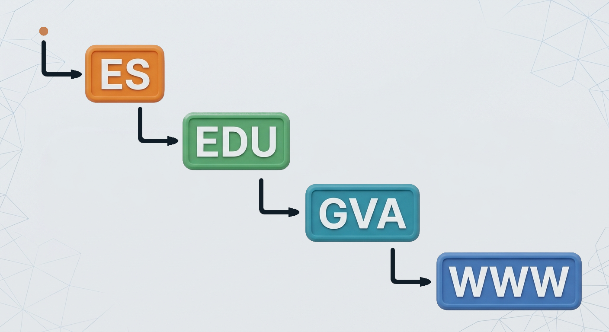{.margintop10}

<!-- ```text
.
└── es
    └── gva
        └── edu
            └── www
``` -->

Cada nivel representa una parte diferente de la jerarquía DNS.

### 6.1 La raíz DNS

En la parte superior de la jerarquía se encuentra la **raíz DNS**, representada mediante un punto:

```text
.
```

La raíz es el nivel superior de todo el sistema DNS.

Un nombre de dominio completamente cualificado (*FQDN, Fully Qualified Domain Name*) podría escribirse de la siguiente manera:

{.margintop10}

Normalmente este punto final no se escribe cuando utilizamos un nombre de dominio en un navegador pero forma parte de la estructura completa del nombre.
{.margintop10}

---

### 6.2 Dominios de nivel superior (TLD)

Por debajo de la raíz se encuentran los **dominios de nivel superior**, conocidos como **TLD (*Top-Level Domain*)**.

Algunos ejemplos son:

```text
.com
.org
.net
.es
.edu
```

Existen diferentes tipos de TLD. Por ejemplo:

- **gTLD (*generic Top-Level Domain*)**: `.com`, `.org`, `.net`, etc.
- **ccTLD (*country code Top-Level Domain*)**: `.es`, `.fr`, `.it`, `.de`, etc.

En el caso de:

```text
www.edu.gva.es
```

el TLD es:

```text
.es
```

---

### 6.3 Dominio

A la izquierda del TLD encontramos otros niveles de la jerarquía.

En el caso de:

```text
www.edu.gva.es
```

Un dominio dentro del TLD `.es` sería.

```text
gva.es
```

<!-- 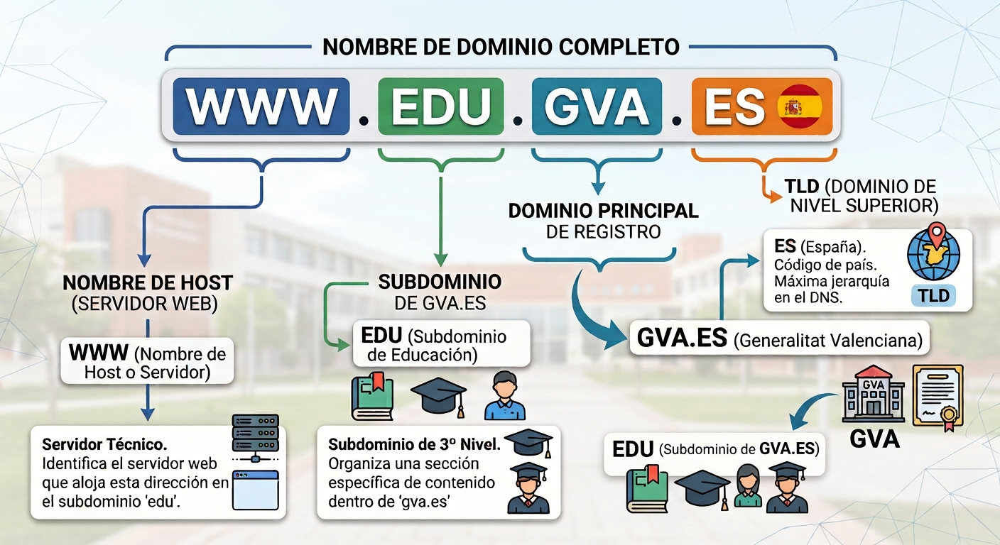{.marco .margintop10} -->

<!-- ```text
www . edu . gva . es
 │     │     │    │
 │     │     │    └── TLD
 │     │     └─────── Dominio
 │     └───────────── Subdominio
 └─────────────────── Nombre de host
``` -->

<!-- Es importante tener en cuenta que los términos **dominio** y **subdominio** dependen del nivel que estemos analizando.

Por ejemplo:

```text
gva.es
```

es un dominio dentro de `.es`.

A su vez:

```text
edu.gva.es
```

es un subdominio de `gva.es`.

Y:

```text
www.edu.gva.es
```

es un nombre situado dentro de `edu.gva.es`. -->

---

### 6.4 Subdominios

Un **subdominio** es un dominio que se encuentra por debajo de otro dominio dentro de la jerarquía DNS.

En el caso de:

```text
gva.es
```

podría tener diferentes subdominios:

```text
edu.gva.es
san.gva.es
just.gva.es
```

Y, a su vez, `edu.gva.es` podría tener otros niveles:

```text
www.edu.gva.es
moodle.edu.gva.es
correo.edu.gva.es
```

Los subdominios permiten organizar diferentes servicios, departamentos o recursos dentro de una misma estructura de nombres.

---

### 6.5 FQDN

Un **FQDN (*Fully Qualified Domain Name*)**, o **nombre de dominio completamente cualificado**, identifica de forma completa una posición dentro de la jerarquía DNS.

En el caso de tendríamos:

```text
www.edu.gva.es.
```


<!-- ```text
.          → raíz
es         → TLD
gva        → dominio
edu        → subdominio
www        → nombre situado dentro de edu.gva.es
``` -->

<!-- El FQDN permite identificar un nombre de manera inequívoca dentro de la jerarquía DNS. -->

!!! tip "Importante"
    Los nombres DNS se interpretan **de derecha a izquierda**.

### 6.6 Nombre de host

En una red, un **host** es un dispositivo o sistema que puede comunicarse mediante una red.

En DNS, un nombre como `www.edu.gva.es` puede utilizarse para identificar un servicio o un host.

Por ejemplo, podríamos tener:

```text
www.edu.gva.es
correo.edu.gva.es
ftp.edu.gva.es
```

Cada nombre podría estar asociado mediante DNS a una dirección IP diferente:

```text
www.edu.gva.es       → 192.168.1.10
correo.edu.gva.es    → 192.168.1.20
ftp.edu.gva.es       → 192.168.1.30
```

!!! warning "Importante"

    - Cada nombre DNS **no representa necesariamente un único equipo físico**.  
    - Un mismo servicio puede estar distribuido entre varios servidores y una misma dirección IP puede utilizarse para diferentes nombres.

---

### 4.7 Zona DNS

Una **zona DNS** es una parte de la jerarquía DNS que está administrada por una organización o servidor DNS determinado.

La zona contiene los **registros DNS** que proporcionan información sobre los nombres y servicios que administra.

Por ejemplo, una organización podría administrar la zona:

```text
edu.gva.es
```

y dentro de ella tener:

```text
www.edu.gva.es
correo.edu.gva.es
ftp.edu.gva.es
```

La zona podría contener registros como:

```text
www.edu.gva.es      → 192.168.10.10
correo.edu.gva.es   → 192.168.10.20
ftp.edu.gva.es      → 192.168.10.30
```

!!! warning "Dominio y zona no son exactamente lo mismo"

    1. Aunque en muchos ejemplos sencillos un dominio y una zona pueden parecer equivalentes, **dominio y zona son conceptos diferentes**.
    1. Un dominio representa una parte de la **jerarquía de nombres DNS**, mientras que una zona representa una parte de esa jerarquía que está **administrativamente gestionada mediante servidores DNS autoritativos**.
    1. Un dominio puede contener diferentes subdominios y estos pueden estar delegados en otras zonas.  
    En nuestro ejemplo:
    ```mermaid
    flowchart TD
        A[edu.gva.es] --> X((　))
        X --> B[Zona A]
        X --> C[Zona B]
        B --> D[www.edu.gva.es </br>+</br>correo.edu.gva.es]
        C --> E[ftp.edu.gva.es]
    style X fill:none,stroke:none
    ```
    La organización puede administrar directamente `edu.gva.es`, mientras que `www.edu.gva.es`, `correo.edu.gva.es` y `rrhh.empresa.es` pueden estar delegados en otros servidores DNS.

<!-- ```text
                empresa.es
                    │
          ┌─────────┴─────────┐
          │                   │
      ventas.empresa.es   rrhh.empresa.es
          │                   │
       Zona A                Zona B
``` -->

---

### 4.8 Resumen de la jerarquía DNS

Podemos resumir los diferentes conceptos mediante la siguiente imagen:

{.marco .margintop10}

De esta forma, el DNS organiza los nombres mediante una estructura jerárquica en la que cada nivel puede ser administrado de forma independiente.

| Concepto | Significado | Ejemplo |
||||
| **Raíz** | Nivel superior de la jerarquía DNS | `.` |
| **TLD** | Dominio de nivel superior | `.es` |
| **Dominio** | Nombre registrado dentro de un TLD | `gva.es` |
| **Subdominio** | Dominio situado dentro de otro dominio | `edu.gva.es` |
| **FQDN** | Nombre DNS completamente cualificado (incluye el punto raíz final) | `www.edu.gva.es.` |
| **Host** | Equipo o servicio identificado mediante un nombre | `www.edu.gva.es` |
| **Zona** | Parte de la jerarquía administrada por unos servidores autoritativos concretos | `edu.gva.es` (zona delegada, con sus propios servidores autoritativos dentro del dominio `gva.es`) |

## 7 - Servidores DNS públicos y privados

No todos los servidores DNS tienen la misma función ni están disponibles para los mismos usuarios. 

Dependiendo de quién pueda utilizarlos y de dónde se encuentren, podemos distinguir entre **servidores DNS públicos** y **servidores DNS privados**.

---

### 7.1 Servidores DNS públicos

Un **servidor DNS público** es un servidor DNS que ofrece su servicio de resolución de nombres a usuarios y dispositivos de Internet de forma pública.

Estos servidores suelen estar gestionados por empresas, organizaciones o proveedores de servicios de Internet y pueden ser utilizados por cualquier usuario que tenga acceso a Internet.

Algunos ejemplos conocidos son:

| Servicio DNS          | Dirección IPv4 |
| --------------------- | -------------- |
| **Google Public DNS** | `8.8.8.8`      |
| **Google Public DNS** | `8.8.4.4`      |
| **Cloudflare DNS**    | `1.1.1.1`      |
| **Cloudflare DNS**    | `1.0.0.1`      |
| **Quad9**             | `9.9.9.9`      |

Por ejemplo, podemos configurar un ordenador para que utilice:

```text
Servidor DNS preferido: 1.1.1.1
Servidor DNS alternativo: 1.0.0.1
```

A partir de ese momento, las consultas DNS realizadas por el dispositivo podrán enviarse a los servidores de Cloudflare.

!!! tip "Importante"
    - Un servidor DNS público **no significa que sea un servidor raíz ni un servidor autoritativo**.
    - Por ejemplo, `1.1.1.1` es un **resolver DNS recursivo público**. Recibe consultas de los clientes y, cuando es necesario, realiza las consultas correspondientes a otros servidores DNS de la jerarquía.

---

### 7.2 ¿Por qué utilizar un DNS público?

Existen diferentes motivos para utilizar un servidor DNS público en lugar del servidor DNS proporcionado automáticamente por nuestro proveedor de Internet.

#### 7.2.1 Rendimiento

Algunos proveedores de DNS público disponen de una infraestructura distribuida por diferentes partes del mundo. Esto permite que las consultas puedan ser atendidas desde servidores cercanos al usuario.

El tiempo necesario para obtener una respuesta DNS se denomina habitualmente **latencia DNS**.

Una menor latencia puede hacer que la resolución de nombres sea más rápida.

---

#### 7.2.2 Disponibilidad y redundancia

Los grandes proveedores de DNS público utilizan infraestructuras distribuidas y redundantes.

Si uno de sus servidores o centros de datos deja de funcionar, otros servidores pueden continuar atendiendo las consultas.

Esto proporciona una elevada **disponibilidad** del servicio.

---

#### 7.2.3 Seguridad

Algunos servicios DNS públicos incorporan mecanismos de seguridad adicionales, como el bloqueo de determinados dominios asociados a:

- Malware.
- Phishing.
- Botnets.
- Otros tipos de amenazas.

Por ejemplo, algunos resolvers públicos están diseñados específicamente para proporcionar una capa adicional de protección frente a determinados dominios maliciosos.

!!! warning "DNS y seguridad"
    - El uso de un DNS público **no garantiza por sí mismo que una conexión sea segura**.
    - DNS se encarga principalmente de resolver nombres. La seguridad de la comunicación dependerá también de otros mecanismos, como **HTTPS/TLS**, firewalls, sistemas de detección de intrusiones y otros controles de seguridad.

---

### 7.3 Servidores DNS privados

Un **servidor DNS privado** es un servidor DNS que está destinado a una organización, red o conjunto limitado de usuarios.

A diferencia de un servidor DNS público, no está pensado para que cualquier usuario de Internet pueda realizar consultas libremente.

Los servidores DNS privados son muy habituales en:

- Empresas.
- Centros educativos.
- Organismos públicos.
- Redes domésticas.
- Centros de datos.
- Redes virtuales en la nube.

!!! example "Ejemplo de red empresarial"
    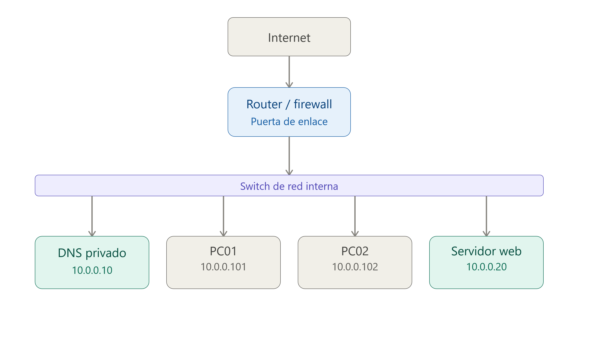{.marco .margintop10 .marginbottom10}
    **Dónde:**  

    - `10.0.0.0/24` es la red de la empresa.
    - `10.0.0.10` es el servidor DNS interno.
    - `10.0.0.20` es el servidor Web de la empresa.
    - `10.0.0.101` es un dispositivo conectado a la red (p.e.: impresora) con el nombre DNS **impresora.empresa.local**
    - `10.0.0.102` otro dispositivo conectado a la red (p.e.: nas) con el nombre DNS **nas.empresa.local** 
    
    !!! Warning "Estos nombres pueden (suelen) no existir en el DNS público de Internet"

---

### 7.4 DNS privado y acceso a Internet

Un servidor DNS privado no tiene por qué limitarse a resolver nombres internos.

También puede actuar como **resolver recursivo** para los dispositivos de la organización.

Si miramos el siguiente esquema veremos que el servidor DNS puede resolver tanto `servidor.empresa.local` utilizando sus **zonas internas** como `www.google.com`, `www.wikipedia.org` y `www.aules.edu.gva.es` realizando consultas recursivas hacia otros servidores DNS.

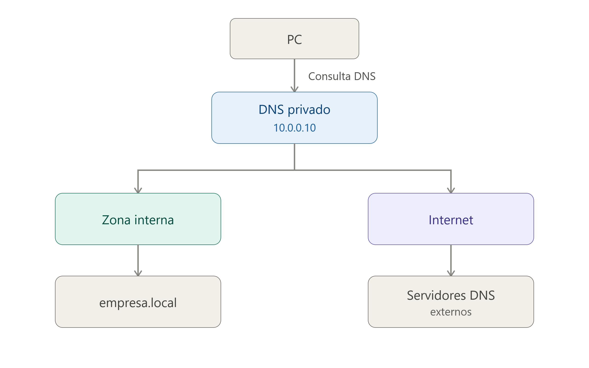{.marco .margintop10 .marginbottom10}

### 7.5 Servidor DNS privado en una red local

En una red local, los equipos suelen obtener automáticamente la dirección del servidor DNS mediante el protocolo **DHCP**.

!!! example "Configurción dee red devuelta por el servidor DHCP"
    ```text
    Configuración recibida mediante DHCP

    Dirección IP:       192.168.10.101
    Máscara:            255.255.255.0
    Puerta de enlace:   192.168.10.1
    Servidor DNS:       192.168.10.10
    ```

    **Dónde:**

    - El ordenador cliente recibe la IP `192.168.10.101`.
    - El ordenador cliente utilizará `192.168.10.10` para realizar consultas DNS.
    - El ordenador cliente utilizará `192.168.10.1` como puerta de enlace es decir para acceder a internet.
    - El servidor DNS privado podría resolver tanto nombres internos como nombres de Internet.

!!! example "Ejemplo de consulta DNS interna"
    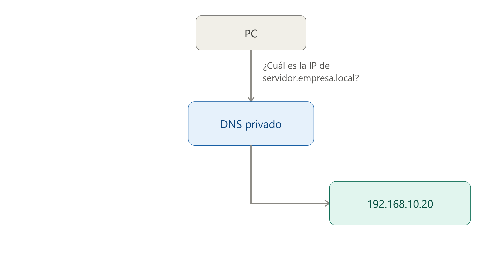{ .margintop10 .marginbottom10}

!!! example "Ejemplo de consulta DNS externa"
    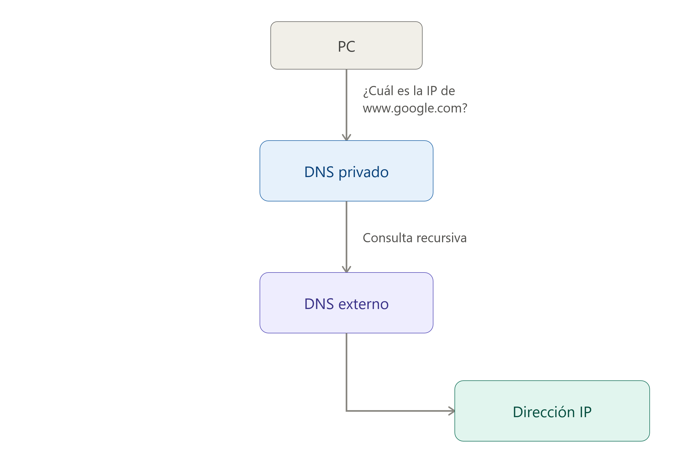{ .margintop10 .marginbottom10}

---

### 7.6 Comparativa DNS público vs. DNS privado

Podemos comparar ambos tipos de servidores:

| Característica           | DNS público                  | DNS privado                          |
| ------------------------ | ---------------------------- | ------------------------------------ |
| Acceso                   | Público                      | Restringido                          |
| Usuarios                 | Cualquier usuario            | Usuarios de una organización o red   |
| Uso habitual             | Resolver nombres de Internet | Resolver nombres internos y externos |
| Ejemplo                  | `1.1.1.1`                    | `192.168.10.10`                      |
| Administración           | Proveedor externo            | Organización                         |
| Nombres internos         | Normalmente no               | Sí                                   |
| Uso en empresas          | Posible                      | Muy habitual                         |
| Accesible desde Internet | Generalmente sí              | Normalmente no                       |

---

## 8 - Evolución del protocolo DNS y seguridad

El protocolo DNS ha evolucionado para adaptarse a las necesidades cada vez mayores de las redes y, especialmente, para solucionar algunos de sus problemas de seguridad.

Dos de las principales tecnologías relacionadas con esta evolución son **DDNS (Dynamic DNS)** y **DNSSEC (DNS Security Extensions)**.

### 8.1 DDNS

**El DDNS (Dynamic DNS o DNS dinámico)** permite actualizar automáticamente los registros de un servidor DNS cuando cambia la dirección IP asociada a un nombre de dominio.

Su principal utilidad es permitir que un dispositivo o servidor cuya dirección IP es **dinámica** pueda seguir siendo accesible mediante un nombre de dominio, aunque su dirección IP cambie.

!!! example "ejemplo"
    Imaginemos un servidor al que queremos acceder utilizando el nombre:

    ```text
    servidor.midominio.com
    ```

    Si el servidor tiene una dirección IP dinámica, esta podría cambiar periódicamente:

    ```text
    servidor.midominio.com → 80.25.10.100
    ```

    y posteriormente:

    ```text
    servidor.midominio.com → 80.25.15.200
    ```

    El servicio DDNS se encarga de actualizar el registro DNS para que el nombre continúe apuntando a la dirección IP actual.

    Un mecanismo habitual consiste en que un dispositivo o servicio con conocimiento del cambio de IP comunique la nueva dirección al servidor DNS para actualizar el registro correspondiente.

    En determinadas redes, el **servidor DHCP** puede participar en este proceso. Cuando asigna o modifica una dirección IP, puede actualizar también los registros DNS asociados. De esta forma, **DHCP y DNS pueden trabajar conjuntamente** para mantener actualizada la información de nombres y direcciones.

    !!! warning "Importante:"
        DDNS no es un protocolo DNS diferente. Es un mecanismo o servicio que permite realizar **actualizaciones dinámicas de los registros DNS**.

### 8.2 DNSSEC

**DNSSEC (Domain Name System Security Extensions o extensiones de seguridad para el DNS)** es un conjunto de extensiones que permite añadir **autenticidad e integridad** a la información proporcionada por DNS.

El funcionamiento tradicional de DNS presenta un problema: un atacante podría intentar proporcionar al cliente una respuesta DNS falsa. 

!!! example "Ejemplo"
    Ante una consulta como:

    ```text
    www.banco.com → ¿cuál es su dirección IP?
    ```

    un atacante podría intentar conseguir que el cliente recibiera una dirección IP incorrecta:

    ```text
    www.banco.com → 203.0.113.50
    ```

    DNSSEC utiliza **firmas digitales** para que el resolver DNS pueda comprobar que los datos recibidos son auténticos y que no han sido modificados.

    Por tanto, DNSSEC permite proteger principalmente:

    - **La autenticidad:** comprobar que los datos DNS proceden de la zona DNS que tiene autoridad sobre ellos.
    - **La integridad:** comprobar que los datos no han sido modificados durante su transmisión.

    !!! warning "Importante"
        
        - DNSSEC **no cifra** las consultas ni las respuestas DNS. Por tanto, no proporciona confidencialidad.
        - Tampoco garantiza por sí mismo que el usuario esté conectado directamente con su servidor DNS real. Su objetivo es permitir que el resolver pueda **validar criptográficamente la autenticidad de los datos DNS recibidos**.

    !!! warning "Importante"
        
        - DNSSEC protege la información DNS, pero **no protege la disponibilidad del servicio**. Por tanto, no evita los ataques de denegación de servicio (DoS o DDoS).  
        - Además, las respuestas DNSSEC suelen ser de mayor tamaño debido a la información criptográfica que contienen. Esto puede contribuir a que determinadas configuraciones de DNS sean utilizadas en **ataques de amplificación DNS**, aunque DNSSEC no sea la causa de estos ataques.

    !!! note "En resumen"
        DNSSEC proporciona **autenticidad e integridad**, pero no **confidencialidad ni disponibilidad**.

### 8.3 Envenenamiento de la caché DNS

Uno de los principales problemas de seguridad del DNS tradicional es que, si un atacante consigue introducir información DNS falsa en la caché de un servidor DNS, puede conseguir que las consultas de los usuarios sean redirigidas a direcciones IP incorrectas.

Este ataque se conoce como **DNS cache poisoning o envenenamiento de la caché DNS**.

!!! example "Ejemplo"
    Un usuario quiere acceder a la web de su banco:

    ```text
    www.banco.com
    ```
    Normalmente, el servidor DNS debería proporcionar la dirección IP legítima:
    ```text
    www.banco.com → 198.51.100.20
    ```
    Sin embargo, si un atacante consigue introducir un registro falso en la caché DNS:
    ```text
    www.banco.com → 203.0.113.50
    ```

    Los usuarios que reciban esa respuesta podrían ser enviados a un servidor controlado por el atacante.

    El objetivo podría ser mostrar una página web falsa que imite a la original para intentar obtener **credenciales de acceso, datos personales u otra información confidencial**.

    Este tipo de ataque puede utilizarse, por ejemplo, como parte de una campaña de **phishing**.

    !!! success "Prevención contra el dead cache poisoning" 
        DNSSEC ayuda a prevenir el problema del ataque por "dead cache poisoning" porque permite al resolver DNS comprobar mediante firmas digitales que los registros DNS recibidos son auténticos y no han sido modificados.

    !!! warning "Importante"
        - No debemos confundir el **envenenamiento de la caché DNS** con el hecho de que un servidor DNS haya sido comprometido. 
        - En el primer caso, el atacante intenta introducir información DNS falsa en la caché de un resolver; en el segundo, el propio servidor DNS puede haber sido tomado bajo control por el atacante.

### 8.4 Ataques Man-in-the-Middle

Un ataque **Man-in-the-Middle (MITM)**, o **hombre en el medio**, se produce cuando un atacante consigue situarse entre dos dispositivos que se están comunicando.

!!! example "Ejemplo"
    Imaginemos que un usuario cree estar comunicándose directamente con el servidor de su banco:
    ```text
    Cliente --→ Banco
    ```

    En un ataque MITM, el atacante intenta situarse entre ambos:
    ```text
    Cliente --→ Atacante --→ Banco
    Cliente ←-- Atacante ←-- Banco
    ```

    El atacante puede recibir el tráfico, analizarlo y, dependiendo de las circunstancias y de las protecciones utilizadas, intentar modificarlo antes de reenviarlo.

    !!! warning "Importante"
        - Un ataque MITM no es específico de DNS. **Puede producirse en diferentes tipos de comunicaciones de red**. 
        - Además, utilizar DNSSEC no sustituye a mecanismos como **HTTPS/TLS**, que son los encargados de proteger la comunicación entre el navegador y el servidor web.

## 9 - Registros DNS

### 9.1 Introducción

- Los **registros DNS** son datos que contienen información sobre los nombres de dominio y los servicios asociados a ellos. 

    !!! example "Ejemplo"
        Un registro de tipo **A** permite asociar un nombre de dominio con **una dirección IPv4**:

        ```text
        www.ejemplo.com → 192.0.2.10
        ```

- En los **servidores DNS autoritativos**, estos registros pueden almacenarse en **archivos de zona**. Un archivo de zona es un archivo de texto que contiene los registros DNS y determinadas directivas que describen una zona DNS.

    !!! example "Ejemplo"
        Un archivo de zona puede contener registros como:

        ```text
        ejemplo.com.      IN    A       192.0.2.10
        www               IN    A       192.0.2.10
        mail              IN    A       192.0.2.20
        ```

- La **sintaxis de los archivos de zona** establece cómo deben escribirse estos registros y directivas para que el servidor DNS pueda interpretarlos correctamente.

    !!! example "Ejemplo"
        Cuando un usuario introduce en su navegador una dirección como:

        ```text
        https://www.ejemplo.com/index.html
        ```

        el navegador necesita conocer la dirección IP asociada al nombre de host **[www.ejemplo.com](http://www.ejemplo.com)**. Para obtenerla, se inicia una **consulta DNS**.

        El equipo del usuario normalmente realiza la consulta a un **servidor DNS recursivo** o *resolver*. Este servidor puede disponer de la respuesta en su **caché**. Si no la tiene, puede realizar consultas a otros servidores DNS hasta encontrar la información necesaria.

- En una resolución DNS pueden intervenir diferentes tipos de servidores, entre ellos:

    - **Servidores DNS recursivos:** reciben las consultas de los clientes y se encargan de obtener la respuesta.
    - **Servidores DNS raíz:** indican qué servidores son responsables de los diferentes dominios de nivel superior (*Top-Level Domains* o  TLD), como `.com`, `.org` o `.es`.
    - **Servidores DNS de TLD:** indican cuáles son los servidores autoritativos responsables de un dominio concreto.
    - **Servidores DNS autoritativos:** contienen la información oficial de una zona DNS y proporcionan los registros correspondientes.

### 9.2 TTL (Time To Live)

- Los registros DNS incluyen un valor denominado **TTL (Time To Live)**.
- El TTL indica **durante cuánto tiempo puede mantenerse un registro DNS en la caché de un servidor DNS recursivo antes de que deba volver a consultarse**.

    !!! example "Ejemplo"
        Si un registro tiene:

        ```text
        www.ejemplo.com.    3600    IN    A    192.0.2.10
        ```

        el valor `3600` representa un TTL de **3600 segundos**, es decir, **1 hora**.

        Durante ese periodo, un servidor DNS recursivo puede utilizar la información almacenada en su caché sin tener que volver a consultar al servidor autoritativo.

        !!! warning "Importante" 
            el TTL **no indica cada cuánto tiempo se actualiza el registro en el servidor DNS autoritativo**. Indica cuánto tiempo otros servidores pueden conservar ese registro en su caché.

### 9.3 Tipos de Registros DNS

#### 9.3.1 Registro A (Address)

- Los registros de direcciones, o registros A, son los registros DNS más utilizados. Crean una conexión directa entre **una dirección IPv4** y un nombre de dominio.
- Permiten que un navegador web cargue un sitio utilizando un nombre de dominio legible, evitando que el usuario tenga que recordar complejas direcciones IP numéricas.
- Redundancia: Es posible configurar múltiples registros A para un mismo dominio, lo que proporciona respaldo y redundancia en caso de fallos.
- Seguridad: Se utiliza también en listas negras basadas en DNS (DNSBL) para bloquear correos provenientes de fuentes de spam conocidas.

!!! tip "Sintaxis típica"
    midominio.com. IN A 192.0.2.15.

#### 9.3.2 Registro AAAA (Quad A)

Funciona de manera similar al registro A, pero conecta nombres de dominio **con direcciones IPv6**.
Aunque menos común que IPv4, su adopción global va en aumento para resolver el problema del agotamiento de las direcciones IPv4 tradicionales.

!!! tip "Sintaxis típica"
    midominio.net. IN AAAA 2001:0db8:85a3:0000:0000:8a2e:0370:1234

#### 9.3.3 Registro CNAME (Canonical Name)

Los registros de nombres canónicos, o registros CNAME, dirigen un dominio de alias a un dominio canónico. 
Los registros CNAME se usan a menudo para asignar un nombre de dominio con un alias al dominio principal que lleva el registro A o AAAA.

!!! example "Ejemplo"

    - En lugar de crear dos registros A para `www.example.com` y `product.example.com`, puede vincular `product.example.com` a un **registro CNAME** que luego se **vincula a un registro A** para `example.com`.
    - El valor es que si la dirección IP cambia para el dominio raíz, solo se tendrá que actualizar el registro A y el CNAME se actualizará en consecuencia.
    - Restricciones de configuración:
        - No se puede ubicar un registro CNAME en el dominio de raíz.
        - Los registros de servidores de correo (MX) y servidores de nombres (NS) nunca deben estar dirigidos a un CNAME.
        - Aunque técnicamente es posible apuntar un CNAME a otro CNAME, esta práctica no se recomienda porque resulta ineficaz y ralentiza la velocidad de carga.

#### 9.3.4 Registro DNAME

Los registros de nombres de delegación, o registros DNAME, se utilizan para redirigir varios subdominios con un registro y apuntarlos a otro dominio.

!!! example "Ejemplo"

    - Un registro DNAME que vincule `domain.com` a `example.com` vinculará `product.domain.com`, `trial.domain.com`, y `blog.domain.com` a `example.com`. 
    - Estos registros son útiles para administrar dominios a gran escala y para administrar cambios de nombres de dominio al garantizar que los subdominios estén vinculados correctamente.

#### 9.3.5 Registros CAA

Los registros de autorización de autoridad de certificación, o registros CAA, permiten a los propietarios de dominios especificar qué **autoridades de certificación (CA)** pueden emitir certificados para su dominio.

Una CA es una organización que valida la identidad de los sitios web y los conecta a claves criptográficas mediante la emisión de certificados digitales.

#### 9.3.5 Registro NS (Nameserver)

- Especifica qué servidor de nombres o servidor DNS en particular actúa como la autoridad autoritativa para un dominio o subdominio.

!!! warning "Importante"
    - El registro NS indica qué servidor **alberga físicamente los archivos de zona del dominio**. 
    - Sin un registro NS debidamente configurado, es imposible cargar o acceder a un sitio web.

#### 9.3.5 Registro MX (Mail Exchange)

Los registros MX son indispensables para la recepción de correos electrónicos bajo el nombre de dominio.

Indica cuáles son los servidores de correo autorizados para recibir los mensajes mediante el protocolo SMTP.

!!! example "Sintaxis típica"
    midominio.com. IN MX 10 mail.midominio.com..

#### 9.3.6 Registro TXT

Permite que un administrador pueda almacenar notas de texto en el registro. Estos registros se suelen utilizar para la seguridad del correo electrónico.

#### 9.3.7 Registros CERT

Los certificados, o registros CERT, almacenan certificados que verifican la autenticidad de todas las partes involucradas.  

Este tipo de registro es particularmente valioso cuando se protege y encripta información confidencial.

#### 9.3.8 Registros SOA

Los registros de inicio de autoridad, o registros SOA, almacenan información administrativa importante sobre un dominio. Esta información puede incluir la dirección de correo electrónico del administrador del dominio, información sobre las actualizaciones del dominio y cuándo un servidor debe actualizar su información.

#### 9.3.9 Registros PTR

Los registros de puntero, o registros PTR, funcionan en la dirección opuesta a los registros A. Se utilizan para **conectar una dirección IP con un nombre de dominio, en lugar de un nombre de dominio con una dirección IP**.

Cuando una búsqueda de DNS comienza con una dirección IP, encuentra el nombre de host correspondiente. Estos registros se utilizan para detectar spam comprobando si las direcciones IP y las direcciones de correo electrónico asociadas son utilizadas por servidores de correo electrónico legítimos. El host del servidor debe configurar los registros PTR.

# hasta aqui

5. Herramientas de Diagnóstico Técnico de Registros DNS
Para verificar y solucionar problemas con las zonas DNS, los administradores de sistemas y profesionales de redes emplean herramientas de terminal populares:

    nslookup: Permite consultar de forma rápida la dirección IP asociada a un dominio y ver registros básicos como A, MX o NS.
    dig (Domain Information Groper): Ofrece información mucho más profunda y detallada sobre las consultas DNS, incluyendo los tiempos de respuesta del servidor y la jerarquía de autoridad.

https://www.cloudflare.com/es-es/learning/dns/dns-records/
https://www.ibm.com/es-es/think/topics/dns-records
https://www.site24x7.com/es/learn/dns-record-types.html
https://blog.infranetworking.com/registros-dns-que-son-y-cuales-tipos-hay/
https://www.digicert.com/es/faq/dns/what-are-dns-records
https://www.webempresa.com/blog/que-es-un-registro-dns-y-que-tipos-hay.html
https://easydmarc.com/blog/es/8-tipos-comunes-de-registros-dns/


# hasta aqui

<!-- https://notebook.google.com/notebook/3ba0b1e5-23cc-414c-a66b-1591bdf88c4a -->

<!-- PAJA -->
<!-- https://sri.codeandcoke.com/doku.php?id=sri:t2
https://ioc.xtec.cat/materials/FP/Recursos/fp_smx_m07_/web/fp_smx_m07_htmlindex/WebContent/u1/a2/continguts.html
https://serviciosgm.readthedocs.io/es/latest/windows/dns/index.html
http://127.0.0.1:5500/docs/SMX/SMX_2/SX/sxe/UD02/2._Servei_DNS/1_introducci.html
https://www.youtube.com/watch?v=TwMAS7Iha30
https://asir.readthedocs.io/es/latest/Tema_3_DNS/Index.html -->
<!-- file:///C:/Users/titan/Documents/GitHub/githubpages/Apuntes/docs/SMX/SMX_2/SX/admin/recursos/tema3dns.pdf -->
<!-- https://www.youtube.com/watch?v=EfSbT3gJUFY&t=47s -->

<!-- para nat -->
<!-- tipo de elementos de red -->
<!-- https://itadmins.es/networking-ii-dispositivos-de-red-y-tipos-de-trafico/ -->

<!-- # NAT -->
<!-- https://www.manageengine.com/latam/oputils/direcciones-ip-fundamentos.html
https://www.redeszone.net/tutoriales/redes-cable/calcular-subnetting-ip-red-mascara-subred-ipv4/
https://www.1nce.com/es-es/recursos/iot-knowledge-base/que-es-el-mecanismo-nat
https://openwebinars.net/blog/nat-que-es-y-para-que-sirve/
-->

<!-- https://www.webempresa.com/blog/servidor-dns-como-solucionar-problemas-habituales.html -->
<!-- https://www.dreamhost.com/blog/es/nameservers-vs-dns-guia/ -->

 busqueda directa
 busqueda inversa

 zona directa: resuleve dominios a IPs
 zona inversa: resuleve Ips a dominios

 ping -a 192.168.100.12 (hace ping y devuelve el nombre)

aging y scavenging
