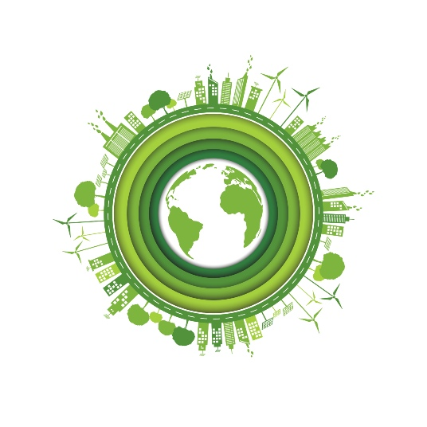
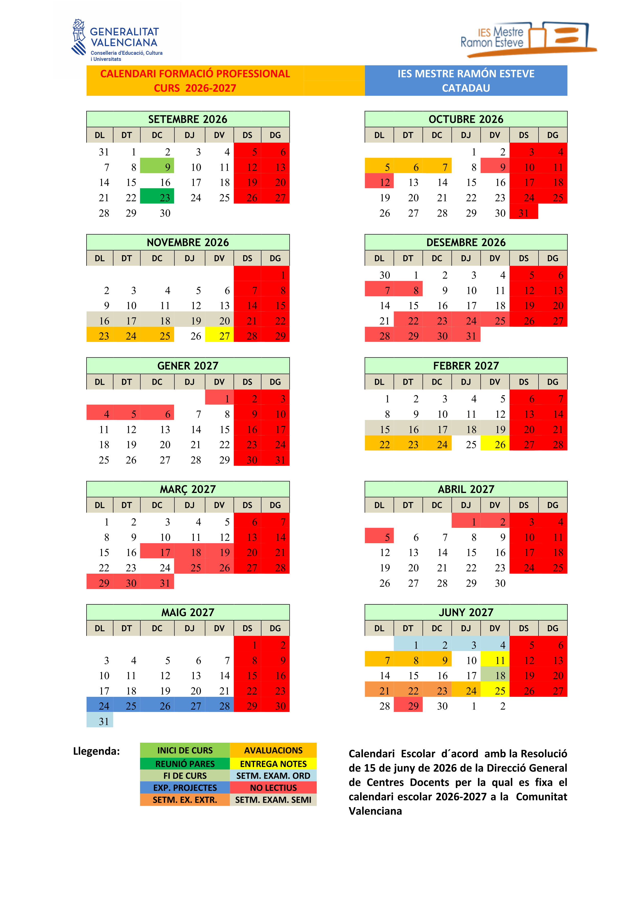
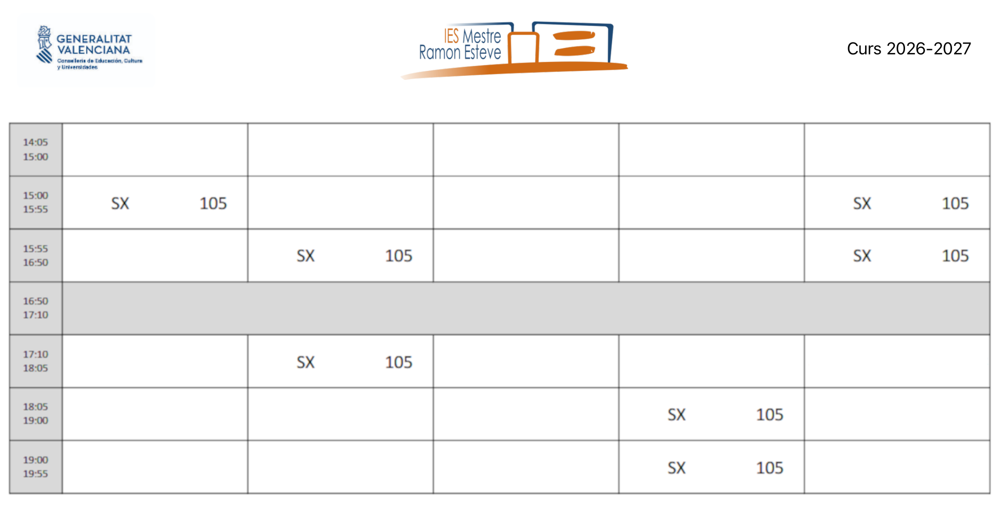

{ .img1 }

## 1 - Calendario escolar

{.marco}

## 2 - Horario de sesiones

{.marco}

## 3 - Contenidos del módulo

Contenidos disponibles [aquí](https://ceice.gva.es/documents/388109149/390333672/Sostenibilidad.pdf).

!!! info "Análisis de la situación actual: problemas, impactos y medida de impactos"
    1. Identificación de los principales retos ambientales y sociales:
        - Cambio climático.
        - Contaminación del aire, agua y suelo.
        - Pérdida de biodiversidad.
        - Agotamiento de recursos naturales.
        - Desigualdad social y económica.
        - Pobreza.
        - Desplazamiento forzado y migración.
        - Discriminación y exclusión social.
    1. Relación entre los retos ambientales y sociales y el desarrollo de la actividad económica:
        - Impacto de la actividad industrial, agrícola, energética, etc., en los retos ambientales y sociales.
        - Influencia de las políticas económicas y comerciales en la exacerbación o mitigación de los retos.
    1. La medida de los impactos sobre el medio ambiente:
        - Evaluación del impacto ambiental.
        - La huella de carbono.
    1. Análisis del efecto de los impactos ambientales y sociales sobre las personas y los sectores
        - Impacto en la salud humana.
        - Riesgos para la seguridad alimentaria.
        - Interrupción de cadenas de suministro y producción.
        - Aumento de costos y pérdida de productividad.
    1. Identificación de medidas y acciones para minimizar los impactos ambientales:
        - Fomento de la economía circular y el consumo sostenible.
        - Medidas de descarbonización de la economía:
            - Implementación de tecnologías limpias y prácticas sostenibles.
            - Promoción de la eficiencia energética y el uso de energías renovables.
            - Electrificación de la demanda.
            - Cambios en procesos industriales y agrícolas.
        - Medidas de adaptación al cambio climático.
        - Medidas de compensación de emisiones de GEI.
    1. Importancia de establecer alianzas y trabajar de manera transversal y coordinada:
        - Colaboración entre empresas, gobierno, ONGs y la sociedad civil.
        - Necesidad de compartir recursos, conocimientos y buenas prácticas.
        - Importancia de la cooperación internacional para abordar problemas globales.

!!! info "Iniciativas internacionales, europeas y nacionales para afrontar esos problemas"
    1. Introducción a la sostenibilidad y desarrollo sostenible:
        - Definición del concepto de sostenibilidad.
        - Explicación del desarrollo sostenible y su importancia.
    1. Acciones encaminadas a lograr un desarrollo sostenible:
        - Marco internacional de referencia: Agenda 2030, los Objetivos de Desarrollo Sostenible (ODS), Acuerdo de París, el marco de Sendai y la agenda de Addis Abeba.
    1. La lucha contra el cambio climático:
        - Acciones a nivel internacional.
        - Acciones a nivel europeo.
        - Acciones a nivel nacional.
    1. La protección de la biodiversidad:
        - Acciones a nivel internacional.
        - Acciones a nivel europeo.
        - Acciones a nivel nacional.

!!! info "Productos y actividades sostenibles"
    1. Aplicación de criterios de sostenibilidad en el desempeño profesional y personal:
        - Descripción de la actividad profesional y su impacto en la sociedad, la economía y el medio ambiente.
        - Análisis de cómo los ODS se relacionan con esa actividad profesional.
        - Identificación de los riesgos y las oportunidades, ambientales y sociales, asociados con el incumplimiento o la contribución a los ODS (Sinergias y Trade-offs o compensaciones).
        - Integración de los ODS en la estrategia profesional y/o en la planificación de la intervención:
            - Definición de objetivos y acciones específicas para contribuir al logro de esos ODS en el área de trabajo, una vez identificados los ODS pertinentes.
            - Identificación de acciones necesarias para abordar retos ambientales y sociales desde la actividad profesional y personal:
                - Desarrollo de estrategias para integrar los ODS en la práctica profesional y en la vida cotidiana.
                - Identificación de acciones concretas que pueden implementarse para contribuir a los ODS.
                - Exploración de cómo estas acciones pueden tener un impacto positivo tanto a nivel individual como en la comunidad y el entorno laboral.
            - Evaluación continua para ajustar las acciones según sea necesario y maximizar el impacto de la empresa en el desarrollo sostenible.
    1. Caracterización del modelo de producción y consumo actual:
        - Modelo macroeconómico actual.
        - Descripción de los principales aspectos del modelo lineal de producción y consumo.
        - Identificación de sus impactos ambientales y sociales.
    1. Identificación de los principios de la economía verde y circular:
        - Explicación de los principios fundamentales de la economía verde.
        - Explicación de los principios fundamentales de la economía circular (la minimización de residuos, la reutilización, el reciclaje y la renovabilidad de recursos).
        - Tipos de reciclaje.
        - Los distintos metabolismos de la economía circular.
    1. Contraste de los beneficios de la economía verde y circular frente al modelo clásico de producción:
        - Análisis y comparación de los beneficios ambientales, sociales y económicos de la economía verde y circular.
        - Exploración de casos de estudio que demuestren los efectos positivos de la transición hacia la economía circular.
        - Concepto de desacoplamiento entre crecimiento económico y consumo de recursos.
        - Estrategias europeas y españolas de economía circular: planes y proyectos.
    1. Aplicación de los principios de ecodiseño y diseño sostenible:
        - Concepto de ecodiseño y diseño sostenible. Aplicación en el desarrollo de productos y servicios.
        - Identificación de estrategias de diseño que minimicen el impacto ambiental a lo largo del ciclo de vida del producto.
    1. Análisis del ciclo de vida del producto y su proceso de producción:
        - Concepto de ciclo de vida del producto.
        - Impactos ambientales, sociales y económicos asociados con todas las etapas del ciclo de vida del producto (diseño, extracción de materias primas, fabricación, acondicionamiento, embalaje, distribución, consumo final y desecho).
        - Perspectiva de sostenibilidad a lo largo del ciclo de vida del producto.
    1. Certificación y etiquetado de productos:
        - Certificaciones públicas.
        - Certificaciones privadas.

!!! info "Sostenibilidad Empresarial"
    1. Conceptos empresariales básicos previos:
        - Definición de cadena de valor de una empresa.
        - Definición de grupos de interés, internos y externos, y sus expectativas.
        - Definición de impactos de nivel 1, 2 y 3 aplicados a toda la cadena de suministro.
    1. Concepto de ASG o ESG:
        - Definición e importancia de ASG o ESG.
        - Análisis de los riesgos y oportunidades que presentan para las empresas.
        - Los aspectos sociales. Acciones relacionadas con:
            - Condiciones laborales y derechos humanos.
            - Diversidad, igualdad e inclusión.
            - Participación en la comunidad, en su bienestar y su desarrollo.
            - Seguridad del producto y protección de los consumidores.
            - Compromisos con los proveedores.
        - Los aspectos ambientales. Acciones relacionadas con:
            - Protección de la biodiversidad.
            - Emisiones de gases de efecto invernadero y cambio climático. Medición de alcance 1, 2 y 3.
            - Gestión del agua.
            - Control de la contaminación.
            - Energías renovables y eficiencia energética.
            - Gestión de residuos y programas de reciclaje.
        - Los aspectos de gobernanza. Medidas relacionadas con:
            - Gobierno corporativo.
            - Transparencia y comunicación responsable. Greenwashing, lavado verde o ecolavado. Social washing o lavado social.
            - Políticas de anticorrupción y antisoborno.
            - Respeto a la normativa y contribución a los impuestos.
            - Evitar la participación en grupos de presión (lobbies).
    1. Medida de las estrategias ASG:
        - Indicadores ASG. Necesidad y ejemplos más relevantes.
        - Informes de sostenibilidad:
            - Normativa europea sobre informes de sostenibilidad.
            - Normativa española sobre informes de sostenibilidad.
    1. Certificación ASG.
    1. El papel de los inversores en la sostenibilidad:
        - Concepto de Inversión y capital socialmente responsable.
            - Fondos ISR (Inversión Socialmente Responsable).
            - Índices bursátiles relacionados con el AGS y otros indicadores de sostenibilidad.
    1. Los planes de sostenibilidad:
        - Concepto de plan de sostenibilidad.
        - Fases para su elaboración:
            - Compromiso de la alta dirección.
            - Diagnóstico.
            - Recopilación de datos. Digitalización.
            - Análisis de doble materialidad.
            - Plan director.
            - Plan de comunicación.
        - Estrategias de seguimiento y mejora continua.
        - Indicadores de desempeño.
        - Análisis de planes de sostenibilidad, especialmente de empresas del sector profesional

## 4 - Metodología de aprendizaje

1. Exposición de los **aspectos teóricos** para que después **sean aplicados mediante prácticas y ejercicios**.  
1. La metodología de trabajo será el **Aprendizaje Basado en Problemas (ABP/PBL)**. Se propondrá un problema real y los alumnos tendrán que buscar una solución, justificándola y comprobando que funciona. Además, si procede, incluirán un pequeño estudio de necesidades y costes para valorar su viabilidad.  
1. Las prácticas podrán ser **individuales o colectivas**.
1. Realización de **actividades voluntarias** de investigación y ampliación para **profundizar en los conocimientos adquiridos**.  
1. **Proyección de vídeos**.

## 5 - Evaluación

1. La evaluación se hará **por resultados de aprendizaje RA**. [R.D. 659/2023](https://www.boe.es/boe/dias/2023/07/22/pdfs/BOE-A-2023-16889.pdf).
1. Los resultados de aprendizaje y criterios de evaluación asociados al módulo **Servicios en red** constituyen los logros que los alumnos/as tienen que alcanzar para **superar el módulo**.
1. Cada resultado de aprendizaje **RA** se evalúa a través de los criterios de evaluación **CE**. Los **CE** actúan como “desglose” del **RA**, facilitando medir de forma objetiva si el aprendizaje se ha alcanzado.

### 5.1 - Relación entre Criterios de Evaluación y Resultados de Aprendizaje

**Los criterios de evaluación** asociados a los **resultados de aprendizaje** del módulo **Servicios en red** son los siguientes:

=== "RA 1"
    |RA1. Identifica los aspectos ambientales, sociales y de gobernanza (ASG) relativos a la sostenibilidad teniendo en cuenta el concepto de desarrollo sostenible y los marcos internacionales que contribuyen a su consecución.|Peso|
    |-|-|
    |**a)** Se ha descrito el concepto de sostenibilidad, estableciendo los marcos internacionales asociados al desarrollo sostenible. |15%|
    |**b)** Se han identificado los asuntos ambientales, sociales y de gobernanza que influyen en el desarrollo sostenible de las organizaciones empresariales. |15%|
    |**c)** Se han relacionado los Objetivos de Desarrollo Sostenible (ODS) con su importancia para la consecución de la Agenda 2030.|15%|
    |**d)** Se ha analizado la importancia de identificar los aspectos ASG más relevantes para los grupos de interés de las organizaciones relacionándolos con los riesgos y oportunidades que suponen para la propia organización.|15%|
    |**e)** Se han identificado los principales estándares de métricas para la evaluación del desempeño en sostenibilidad y su papel en la rendición de cuentas que marca la legislación vigente y las futuras regulaciones en desarrollo. |20%|
    |**f)** Se ha descrito la inversión socialmente responsable y el papel de los analistas, inversores, agencias e índices de sostenibilidad en elfomento de la sostenibilidad. |20%|

=== "RA 2"
    |RA2. Caracteriza los retos ambientales y sociales a los que se enfrenta la sociedad, describiendo los impactos sobre las personas y los sectores productivos y proponiendo acciones para minimizarlos.|Peso|
    |-|-|
    |**a)** Se han identificado los principales retos ambientales y sociales.|20%|
    |**b)** Se han relacionado los retos ambientales y sociales con el desarrollo de la actividad económica.|20%|
    |**c)** Se ha analizado el efecto de los impactos ambientales y sociales sobre las personas y los sectores productivos.|20%|
    |**d)** Se han identificado las medidas y acciones encaminadas a minimizar los impactos ambientales y sociales.|20%|
    |**e)** `Se ha analizado la importancia de establecer alianzas y trabajar de manera transversal y coordinada para abordar con éxito los retos ambientales y sociales.`|20%|

=== "RA 3"
    |RA3. Establece la aplicación de criterios de sostenibilidad en el desempeño profesional y personal, identificando los elementos necesarios.|Peso|
    |-|-|
    |**a)** Se han identificado los ODS más relevantes para la actividad profesional que realiza.|40%|
    |**b)** Se han analizado los riesgos y oportunidades que representan los ODS.|30%|
    |**c)** `Se han identificado las acciones necesarias para atender algunos de los retos ambientales y sociales desde la actividad profesional y elentorno personal.`|30%|

=== "RA 4"
    |RA4. Propón productos y servicios responsables teniendo en cuenta los principios de la economía circular.|Peso|
    |-|-|
    |**a)** Se ha caracterizado el modelo de producción y consumo actual.|20%|
    |**b)** Se han identificado los principios de la economía verde y circular.|20%|
    |**c)** Se han contrastado los beneficios de la economía verde y circular frente al modelo clásico de producción.|15%|
    |**d)** Se han aplicado principios de ecodiseño.|15%|
    |**e)** Se ha analizado el ciclo de vida del producto.|15%|
    |**f)** Se han identificado los procesos de producción y los criterios de sostenibilidad aplicados.|15%|

=== "RA 5"
    |RA5. Realiza actividades sostenibles minimizando el impacto de las mismas en el medio ambiente.|Peso|
    |-|-|
    |**a)** Se ha caracterizado el modelo de producción y consumo actual.|10%|
    |**b)** Se han identificado los principios de la economía verde y circular.|10%|
    |**c)** Se han contrastado los beneficios de la economía verde y circular frente al modelo clásico de producción.|10%|
    |**d)** Se ha evaluado el impacto de las actividades personales y profesionales.|10%|
    |**e)** Se han aplicado principios de ecodiseño.|10%|
    |**f)** `Se han aplicado estrategias sostenibles.`|10%|
    |**g)** Se ha analizado el ciclo de vida del producto.|10%|
    |**h)** Se han identificado los procesos de producción y los criterios de sostenibilidad aplicados.|15%|
    |**i)** Se ha aplicado la normativa ambiental.|15%|

=== "RA 6"
    |RA6. Analiza un plan de sostenibilidad de una empresa del sector, identificando sus grupos de interés, los aspectos ASG materiales y justificando acciones para su gestión y medición.|Peso|
    |-|-|
    |**a)** Se han identificado los principales grupos de interés de la empresa.|20%|
    |**b)** Se han analizado los aspectos ASG materiales, las expectativas de los grupos de interés y la importancia de los aspectos ASG en relación con los objetivos empresariales.|20%|
    |**c)** Se han definido acciones encaminadas a minimizar los impactos negativos y aprovechar las oportunidades que plantean los principales aspectos ASG identificados.|20%|
    |**d)** Se han determinado las métricas de evaluación del desempeño de la empresa de acuerdo con los estándares de sostenibilidad más ampliamente utilizados.|20%|
    |**e)** Se ha elaborado un informe de sostenibilidad con el plan y los indicadores propuestos.|20%|

### 5.2 - Metodología de evaluación

- La evaluación será **contínua**.
- Se basará en la comprobación de la superación de los **resultados de aprendizaje (RA)**.
- La evaluación se hará sobre **todos los RA y todos los CE** del currículo.

### 5.3 - Instrumentos de evaluación

1. Exámenes.
    - Preguntas tipo test.
    - Examen escrito (ejercicios).
1. Entrega de tareas.  
1. Exposiciones orales.  
1. **Prácticas en empresa**.

### **5.4 - Responsable evaluación de los RA's y/o CE's**

1. Evaluación por profesor:  
**Todos los que no serán evaluados en empresa**.

1. Evaluación por tutor empresa (dualización de los RA y CE):  

=== "RA 2"
    |Criterios de evaluación.|
    |-|
    |**e)** Se ha analizado la importancia de establecer alianzas y trabajar de manera transversal y coordinada para abordar con éxito los retos ambientales y sociales.|20%|

=== "RA 3"
    |Criterios de evaluación.|
    |-|
    |**c)** Se han identificado las acciones necesarias para atender algunos de los retos ambientales y sociales desde la actividad profesional y elentorno personal.

=== "RA 5"
    |Criterios de evaluación.|
    |-|
    |**f)** Se han aplicado estrategias sostenibles.|

## 6 - Criterio de superación del módulo

### 6.1 - Nota final

La nota final será la suma ponderada de **los resultados de aprendizaje** obtenidos en cada evaluación.  

La superación del módulo requerirá obtener una media mínima de **5 sobre 10 en cada resultado de aprendizaje**.

En caso de no superar el módulo, el alumna/o dispondrá de un proceso de recuperación orientado a reforzar específicamente los resultados de aprendizaje no alcanzados.

|Resultado de aprendizaje|Porcentage|
|-|-|
|**RA1.** Identifica los aspectos ambientales, sociales y de gobernanza (ASG) relativos a la sostenibilidad teniendo en cuenta el concepto de desarrollo sostenible y los marcos internacionales que contribuyen a su consecución.|18%|
|**RA2.** Caracteriza los retos ambientales y sociales a los que se enfrenta la sociedad, describiendo los impactos sobre las personas y los sectores productivos y proponiendo acciones para minimizarlos.|17%|
|**RA3.** Establece la aplicación de criterios de sostenibilidad en el desempeño profesional y personal, identificando los elementos necesarios.|15%|
|**RA4.** Propón productos y servicios responsables teniendo en cuenta los principios de la economía circular.|17%|
|**RA5.** Realiza actividades sostenibles minimizando el impacto de las mismas en el medio ambiente.|17%|
|**RA6.** Analiza un plan de sostenibilidad de una empresa del sector, identificando sus grupos de interés, los aspectos ASG materiales y justificando acciones para su gestión y medición.|16%|

### 6.2 - Instrumentos de recuperación

- Se propondrá a los alumnos una serie de **recuperaciones** que le permitirán recuperar los **criterios de evaluación** no superados. Esas recuperaciones podrán ser ejercicios o exámenes.
- Si el alumno **no entrega los trabajos obligatorios o presenta tasas de absentismo elevadas**, perderá **la evaluación contínua** y para aprobar el módulo, deberá presentarse a la evaluación **ordinaria** y/o **extraordinaria**.

### 6.3 - Calendario de evaluaciones

1. Evaluación inicial (primer mes).
1. **Una evaluación parcial por cada trimestre**.
    - Se daran las notas de los **RA** completados y también la nota **parcial** de los **RA** incompletos.
    - Para tener el aprobado será necesario haber alcanzado una puntuación superior o igual a 5 en los **Resultados de Aprendizaje RA** completados.
1. **Evaluación ordinaria** y **extraordinaria**: Permitirán recuperar los **RA no superados**.

## 7 - Secuenciación y duración de cada Unidad de Trabajo

```mermaid
flowchart TB 
  A["`**UT 1 / RA1**
  Identifica los aspectos ambientales, sociales y de gobernanza (ASG) relativos a la sostenibilidad teniendo en cuenta el concepto de desarrollo sostenible y los marcos internacionales que contribuyen a su consecución.`"]
  C["`**UT 2 / RA2**
  Caracteriza los retos ambientales y sociales a los que se enfrenta la sociedad, describiendo los impactos sobre las personas y los sectores productivos y proponiendo acciones para minimizarlos.`"]
  G["`**RA3**
  Establece la aplicación de criterios de sostenibilidad en el desempeño profesional y personal, identificando los elementos necesarios.`"]
  H["`**RA4**
  Propón productos y servicios responsables teniendo en cuenta los principios de la economía circular.`"]
  E["`**RA5**
  Realiza actividades sostenibles minimizando el impacto de las mismas en el medio ambiente.`"]
  D["`**RA6**
  Analiza un plan de sostenibilidad de una empresa del sector, identificando sus grupos de interés, los aspectos ASG materiales y justificando acciones para su gestión y medición.`"]
 

  classDef texto font-size:1.1em;
  classDef principal font-size:1.4em;

  class A,B,C,D,E,F,G,H,I,J,K texto;

  subgraph "`**Orden y duración de las UT**`"

    AAA["6h."]
    CCC["5h."]
    GGG["4h."]
    HHH["5h."]
    EEE["5h."]
    DDD["4h."]
    
    subgraph "`**UT8**`"
      direction LR
      E --> EEE 
    end

    subgraph "`**UT7**`"  
      direction LR
      H --> HHH 
    end

    subgraph "`**UT6**`" 
      direction LR
      G --> GGG 
    end

    subgraph "`**UT5**`" 
      direction LR
      J --> JJJ 
    end

    subgraph "`**UT4**`" 
      direction LR
      I --> III 
    end 
  
    subgraph "`**UT3**`" 
      direction LR
      C --> CCC 
    end
    
    subgraph "`**UT2**`" 
      direction LR
      A --> AAA 
    end

    subgraph "`**UT1**`"
      direction LR
      D --> DDD 
    end
  

    class AA,BB,CC,DD,EE,FF,GG,HH,II,JJ,KK texto;
    class AAA,BBB,CCC,DDD,EEE,FFF,GGG,HHH,III,JJJ,KKK texto;
    
  
  end
```

---

| **Licencia Creative Commons:** | |
| - | - |
|  { .by-nc-nd-eu_ } | **Reconocimiento-NoComercial-CompartirIgual CC BY-NC-SA:**  No se permite un uso comercial de la obra original ni de las posibles obras derivadas, la distribución de la cuales se debe hace con una licencia igual a la que regula la obra original. |
