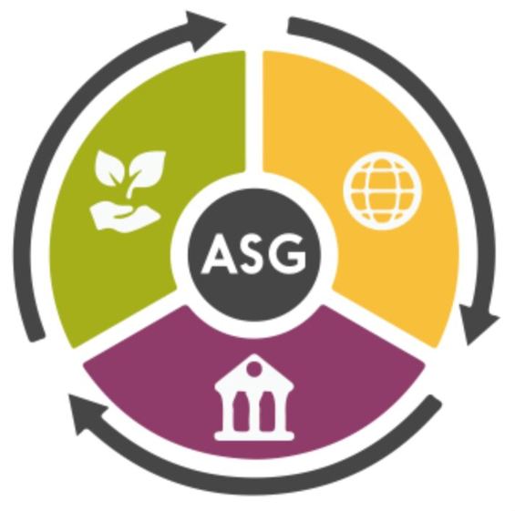

{ .img1 }

## 1 - Introducción

- Los criterios ASG han pasado de ser una tendencia a convertirse en un elemento clave en la estrategia de las empresas.
- Cada vez más inversores, administraciones públicas, clientes, empleados y grupos de interés exigen a las organizaciones un mayor compromiso con la sostenibilidad, la responsabilidad social y la transparencia.
- Tenerlas en cuenta puede impulsar la competitividad, reforzar la reputación corporativa y contribuir a una mejor gestión.

!!! question "¿Qué son los criterios ASG?"

- Los criterios ASG son un conjunto de estándares que miden el impacto ético, social y medioambiental de una organización.
- Permiten valorar a las compañías más allá de su rentabilidad y evaluar su contribución a la sociedad y el entorno.-
- Las siglas ASG hacen referencia a **Ambiental, Social y de Gobernanza**. Su equivalente en inglés es ESG, que corresponde a Environmental, Social and Governance.

- Estos criterios se han convertido en un referente para empresas, inversores y organismos reguladores, ya que ayudan a medir el compromiso de una organización con la sostenibilidad y la responsabilidad corporativa.-
- Además de facilitar la toma de decisiones, promueven prácticas más transparentes, responsables y alineadas con las expectativas de clientes, empleados y otros stakeholders.

!!! tip "A de ambiental"

    - En primer lugar, los factores ASG ponen el foco en el impacto que la actividad de una organización provoca en el medio ambiente.
    - Así, la A de ambiental puede atender a cuestiones como la huella de carbono, la gestión de residuos y las políticas de reciclaje de una organización, o el uso que hace de los recursos naturales. Asimismo, contempla las medidas puestas en marcha con el fin de reducir el consumo energético.

!!! tip "S de social"

    - Otra área central de los criterios ASG es la social. Consiste en analizar cómo es la interacción entre una empresa y las personas que tiene a su alrededor, ya sean empleados, comunidades de vecinos, proveedores o clientes.
    - De este modo, presta atención a las políticas de diversidad e inclusión, las condiciones laborales, las medidas de salud y seguridad y otros asuntos relacionados con la responsabilidad social corporativa.

!!! tip "G de gobernanza"

    - La gobernanza evalúa la forma en que una compañía se organiza, gestiona y toma decisiones.
    - Este criterio analiza aspectos como la transparencia, la ética empresarial, la composición y el funcionamiento de los órganos de dirección, el cumplimiento normativo o las políticas para prevenir la corrupción.
    - También tiene en cuenta la rendición de cuentas y la adopción de buenas prácticas.

## 2 - ASG dentro del sector de las TIC

# hasta aqui

<!-- https://www.mecalux.es/blog/criterios-asg -->

En el sector de las Tecnologías de la Información y la Comunicación (TIC), la aplicación de la sostenibilidad ecosocial y los criterios ASG resulta de vital importancia. A menudo existe el "espejismo" de que la digitalización es intrínsecamente "verde" o inmaterial por basarse en la "nube". Sin embargo, la realidad biofísica nos muestra que el sector TIC descansa sobre una infraestructura física masiva con profundos impactos ambientales, sociales y de gobernanza.

1. Dimensión Ambiental (A) en el Sector TIC
El impacto ambiental de las TIC es físico, creciente y sumamente centralizado:

    La huella de carbono digital: Aunque no se vea, internet ya genera aproximadamente el 3,7% de las emisiones globales de CO2, con un incremento del 4% anual en su intensidad energética. Los centros de datos consumen el 45% de esta energía y las redes de comunicación el 24%. El auge de la Inteligencia Artificial (IA), el internet de las cosas y el minado de criptomonedas multiplican exponencialmente esta demanda.
    La mochila ecológica: Los dispositivos que utilizamos diariamente son verdaderos icebergs de materiales. Un teléfono móvil de solo 150 gramos arrastra una mochila ecológica de 80 kg (es decir, el 99,8% de los materiales movilizados para su extracción, fabricación y transporte se desechan antes de que llegue a tus manos). Un ordenador promedio carga una mochila invisible de 1.500 kg.
    Extractivismo de minerales críticos: La alta tecnología de las TIC requiere la extracción de más de 50 metales diferentes por dispositivo (como coltán, litio, cobalto, cobre y níquel). Estos minerales son finitos y muchos ya están cerca de sus picos de extracción. Su minería, a menudo a cielo abierto, destruye ecosistemas locales.
    Residuos electrónicos (E-waste): Estrategias de marketing y la obsolescencia tecnológica programada provocan el descarte de más de 5.300 millones de teléfonos inteligentes al año en todo el mundo. Muchos de estos residuos, altamente contaminantes y de difícil degradación, acaban siendo exportados ilegalmente a vertederos del Sur Global, como el basurero de Agbogbloshie en Ghana.

2. Dimensión Social (S) en el Sector TIC
La cara social de la digitalización globalizada revela asimetrías de poder y precarización laboral:

    Conflictos de neocolonialidad: La obtención de los componentes baratos de hardware perpetúa dinámicas coloniales en los países de origen. Un ejemplo paradigmático es la enorme violencia y el uso de trabajo infantil en las minas de coltán de la República Democrática del Congo para abastecer la producción de móviles y ordenadores occidentales.
    Precarización y "plataformas colaborativas": En el ámbito del empleo, las TIC facilitan la aparición de plataformas de servicios que acceden a una fuerza de trabajo sindicalmente débil y fácil de explotar. Además, la conectividad constante dilata la jornada de trabajo hacia el espacio privado de las personas.
    Colonización del tiempo y la atención: El diseño de las aplicaciones de internet está orientado a la captación de datos y la dependencia de las pantallas, colonizando espacios de la vida íntima que previamente no estaban mercantilizados (relaciones, ocio, descanso).

3. Dimensión de Gobernanza (G) en el Sector TIC
La gobernanza en el sector se enfrenta al surgimiento de monopolios y la pérdida de soberanía tecnológica:

    Monopolios radicales: El uso de móviles y pantallas se ha convertido en una obligación social de la que es casi imposible escapar sin arriesgarse a la dessocialización. Al mismo tiempo, el tráfico global de internet está monopolizado por un puñado de corporaciones (como Google, Meta, Apple, Amazon, Microsoft y Netflix), que controlan el 57% del tráfico mundial.
    Control de la infraestructura física: Estas grandes corporaciones ya no solo controlan el software, sino que son propietarias directas de las autopistas físicas de la información, como los cables submarinos de larga distancia por los que discurre el 95% del tráfico intercontinental. Esto les otorga la capacidad de decidir qué datos viajan, hacia dónde y a qué velocidad.
    Extracción de datos y vigilancia: El modelo de negocio se basa en la extracción masiva de datos individuales y financieros, lo que devalúa el derecho a la privacidad y facilita sistemas de control tanto corporativos como estatales.

Falsas Soluciones frente a la Alternativa Ecosocial
Falsas soluciones comunes en TIC:

    Eficiencia y "Paradoja de Jevons": Creer que hacer chips más eficientes solucionará el problema. La paradoja demuestra que cuanto más eficiente y barato es un chip, más aumenta la producción total de dispositivos, incrementando el consumo global de recursos.
    Centros de datos "0 emisiones": Es una ficción publicitaria de lavado verde (greenwashing) si no se calcula el ciclo de vida completo (ACV), que incluye las emisiones de la construcción de los servidores, los materiales de red y el tendido de cables.
    El mito del teletrabajo ecológico: Aunque reduce desplazamientos, el tráfico de datos intensivo en la nube y el uso constante de videollamadas masivas consumen ingentes cantidades de electricidad que reducen el beneficio ambiental inicial.

Líneas de acción para unas TIC sostenibles (Nueva Cultura de la Tierra):

    Ecodiseño de hardware modular: Implementar de manera obligatoria la modularidad y estandarización de las marcas para facilitar la reparación, eliminando la obsolescencia técnica.
    Desdigitalización paulatina y local: Salir del modelo de "todo en la nube" mediante el uso de servidores locales, almacenamiento descentralizado e intercambio de información más comunitario.
    Software libre y ligero: Utilizar programas ligeros sostenidos por comunidades abiertas, lo que evita que los equipos queden obsoletos y requieran ser reemplazados continuamente.
    Internet Low-Tech: Apostar por redes autónomas que dependan únicamente de energías renovables locales. Aunque presentan cierta intermitencia y menor velocidad, son viables y resilientes para cubrir las necesidades informativas de administraciones y servicios comunitarios de proximidad.
    Soberanía tecnológica: Participar en cooperativas y proyectos de telecomunicaciones sin ánimo de lucro y de control ciudadano (como Guifi.es o Som Conexió), que reorientan el servicio TIC hacia el bien común.

| **Licencia Creative Commons:** | |
| - | - |
|  { .by-nc-nd-eu_ } | **Reconocimiento-NoComercial-CompartirIgual CC BY-NC-SA:**  No se permite un uso comercial de la obra original ni de las posibles obras derivadas, la distribución de la cuales se debe hace con una licencia igual a la que regula la obra original. |
