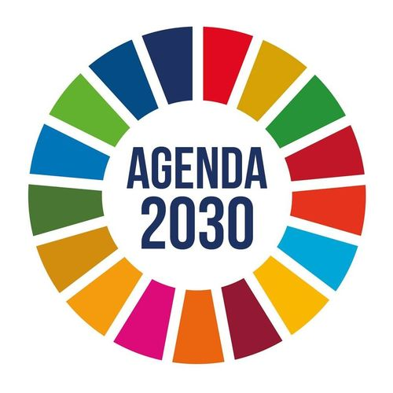

{  }
  
**Resultados de aprendizaje y criterios de evaluacion que se evaluarán en esta unidad.**  

| **Resultados de aprendizaje de la unidad didáctica:**|
||
| **RA. 1:** Identifica los aspectos ambientales, sociales y de gobernanza (ASG) relativos a la sostenibilidad teniendo en cuenta el concepto de desarrollo sostenible y los marcos internacionales que contribuyen a su consecución.|

|**Criterios de evaluación de la unidad didáctica:**|
||
|**c)** Se han relacionado los Objetivos de Desarrollo Sostenible (ODS) con su importancia para la consecución de la Agenda 2030.|
|**d)** Se ha analizado la importancia de identificar los aspectos ASG más relevantes para los grupos de interés de las organizaciones relacionándolos con los riesgos y oportunidades que suponen para la propia organización.|

## 1 - Agenda 2030

- La **Agenda 2030 para el Desarrollo Sostenible** es un acuerdo global aprobado por consenso por los 193 Estados miembros de las Naciones Unidas el 25 de septiembre de 2015, mediante la resolución A/RES/70/1 titulada *Transformar nuestro mundo: la Agenda 2030 para el Desarrollo Sostenible*.
- Entró en vigor formalmente el 1 de enero de 2016 como un marco internacional para orientar las políticas de desarrollo económico, social y ambiental.

## 2 - Estructura y Principios Fundamentales

- **Objetivos y metas**: Se articula alrededor de **17 Objetivos de Desarrollo Sostenible (ODS) y 169 metas específicas**, cuyo seguimiento se realiza mediante un marco mundial que cuenta con más de 230 indicadores únicos.

- **Evolución respecto a los ODM**: Surge como continuación de los Objetivos de Desarrollo del Milenio (ODM, 2000-2015). 

- A diferencia de los ODM (centrados principalmente en problemas sociales de países en desarrollo), la Agenda 2030 tiene **carácter universal** (se aplica a todos los países) e integra de forma indivisible la dimensión económica, la social y la ambiental.

- **Principios rectores**:
  - **Universalidad**: Aplica a todos los Estados según sus circunstancias, sin dividirlos de forma rígida entre donantes y receptores.
  - **Integración e indivisibilidad**: Los objetivos no pueden abordarse de forma aislada, ya que existen sinergias y conflictos (*trade-offs*) entre ellos.
  - **No dejar a nadie atrás (leave no one behind)**: Prioriza la atención a los grupos en mayor situación de vulnerabilidad y la reducción de desigualdades.
  - **Las cinco P**: Agrupa sus áreas de acción en **Personas** (pobreza y dignidad), **Planeta** (protección ambiental), **Prosperidad** (progreso económico y tecnológico), **Paz** (sociedades inclusivas) y **Alianzas** (*Partnerships*).

## 3 - Implementación y Financiación

* **Gobernanza y localización**: La Agenda no establece un mecanismo único; cada país la adapta a sus estructuras institucionales mediante estrategias nacionales y planes locales (como la *Estrategia de Desarrollo Sostenible 2030* o la Red de Entidades Locales en España)[16]. El seguimiento se evalúa en el Foro Político de Alto Nivel (HLPF) mediante Exámenes Nacionales Voluntarios[19][20].
* **Brecha de financiación**: La ONU señala un déficit de financiación anual de **entre 2,5 y 4 billones de dólares** para alcanzar los ODS[21][22]. Para cerrar esta brecha se apela al sector privado mediante herramientas como la **Inversión Socialmente Responsable (criterios ASG/ESG)** y la **Inversión de Impacto**[21][23].

---

### 3\. Balance de Progreso Global (Hacia 2026)

Las evaluaciones globales muestran que el plan está en riesgo y avanza a dos velocidades[24]:

* **Estado de las metas**: Según los datos oficiales, **solo el 36% de las metas va por buen camino o registra un progreso moderado** (15% encaminadas y 21% moderado)[26][27]. Casi la mitad (**49%**) muestra avances insuficientes y un **15% ha retrocedido** a niveles peores que los de 2015[26].
* **Hitos positivos**: Se registraron avances notables en el acceso a agua potable (casi 1.000 millones de personas adicionales desde 2015), electrificación global (92%), conectividad digital (74%) y extensión de la protección social[28].
* **Graves barreras**: La **crisis climática** (con récords de temperatura global)[29], el aumento de **conflictos armados**[29], la caída de la ayuda oficial al desarrollo[30] y la persistencia de la pobreza extrema y la inseguridad alimentaria están provocando retrocesos estructurales[30].

---

### 4\. Críticas y Debates Ecosociales

* **Voluntariedad (** **Soft Law** **)**: Al no ser un acuerdo jurídicamente vinculante ni establecer sanciones por incumplimiento, depende de la voluntad política de los gobiernos de turno, lo que facilita el *greenwashing* o cumplimiento cosmético[31].
* **Contradicción biofísica**: Análisis ecosociales critican que el ODS 8 promueva un "crecimiento económico sostenido", lo que resulta incompatible con los límites planetarios y la escasez de energía y materiales[34]. Además, se señala que muchas metas tienen un enfoque de "final de tubería" (atienden los síntomas en lugar de las causas estructurales)[35].
* **Oposición y desinformación**: Ha encontrado contestación política en sectores negacionistas y de extrema derecha[36][37], además de ser blanco de teorías conspirativas que le atribuyen de forma falsa mandatos obligatorios[38].

### 5.8 Foro de discusión

!!! question "Sobre el concepto mismo de sostenibilidad"
    1. ¿Es la sostenibilidad un concepto universal o depende del contexto cultural, económico y geográfico de cada región?
    1. ¿Existe una tensión irresoluble entre crecimiento económico y sostenibilidad ambiental, o son compatibles?
    1. El famoso "Informe Brundtland" (1987) define desarrollo sostenible como aquel que satisface las necesidades presentes sin comprometer las de futuras generaciones. ¿Sigue siendo esta definición suficiente casi 40 años después?

<!-- 
1. Sobre el concepto mismo de sostenibilidad
¿Es la sostenibilidad un concepto universal o depende del contexto?
Hay dos posturas principales:

A favor de la universalidad: existen límites planetarios objetivos (cambio climático, pérdida de biodiversidad) que afectan a toda la humanidad por igual, por lo que se necesitan principios comunes.
A favor del relativismo contextual: lo que es sostenible en un país nórdico rico difiere radicalmente de lo que es viable en una comunidad rural africana o andina. Imponer un modelo único puede ser una forma de "colonialismo verde".
Una respuesta intermedia sería: los principios (equidad intergeneracional, límites ecológicos) pueden ser universales, pero las estrategias deben adaptarse localmente. -->

<!-- 
1. Sobre el concepto mismo de sostenibilidad

¿Es la sostenibilidad un concepto universal o depende del contexto?
Hay dos posturas principales:

A favor de la universalidad: existen límites planetarios objetivos (cambio climático, pérdida de biodiversidad) que afectan a toda la humanidad por igual, por lo que se necesitan principios comunes.
A favor del relativismo contextual: lo que es sostenible en un país nórdico rico difiere radicalmente de lo que es viable en una comunidad rural africana o andina. Imponer un modelo único puede ser una forma de "colonialismo verde".
Una respuesta intermedia sería: los principios (equidad intergeneracional, límites ecológicos) pueden ser universales, pero las estrategias deben adaptarse localmente.

2. ¿Tensión entre crecimiento económico y sostenibilidad?

Postura de la "economía verde": es posible el desacoplamiento (crecer sin aumentar el uso de recursos) mediante innovación tecnológica y eficiencia.
Postura del "decrecimiento": el desacoplamiento absoluto nunca se ha demostrado a escala global; el crecimiento económico infinito es incompatible con un planeta finito.
Postura pragmática/institucional (la de la mayoría de organismos como la ONU): se puede lograr un "crecimiento verde" mediante cambios en la matriz energética y regulación, aunque con matices y plazos inciertos.

3. ¿Sigue vigente la definición de Brundtland?
Argumentos a favor: sigue siendo útil porque introduce la equidad intergeneracional, un principio ético central.
Argumentos en contra: es ambigua (no define qué "necesidades" ni cómo medir el "compromiso" con el futuro), y ha sido criticada por no cuestionar el modelo de crecimiento capitalista. Muchos autores proponen complementarla con enfoques como los "límites planetarios" (Rockström) o el "donut" de Kate Raworth.
-->

!!! question "Marcos internacionales (ODS, Agenda 2030, Acuerdo de París, etc.)"
    - ¿Los Objetivos de Desarrollo Sostenible (ODS) son metas realistas o más bien aspiraciones simbólicas sin mecanismos de cumplimiento efectivos?
    - ¿Qué responsabilidad diferenciada deben asumir los países desarrollados frente a los países en desarrollo en el cumplimiento de estos marcos?
    - ¿Hasta qué punto los acuerdos internacionales (como el Acuerdo de París) logran traducirse en políticas nacionales concretas y vinculantes?

<!-- 
1. Sobre los marcos internacionales (ODS, Agenda 2030, Acuerdo de París)

¿Los ODS son metas realistas o simbólicas?

Postura crítica: son 17 objetivos y 169 metas sin mecanismos de sanción; los países que incumplen no enfrentan consecuencias reales, y los informes de progreso muestran que la mayoría de metas no se cumplirán para 2030.
Postura defensora: aunque no sean vinculantes, funcionan como marco orientador común que permite comparar, medir y presionar políticamente (mediante la opinión pública, inversión ESG, cooperación internacional).
Un punto de encuentro: los ODS son más útiles como lenguaje común y herramienta de rendición de cuentas blanda que como instrumento jurídico.

2. ¿Responsabilidad diferenciada entre países desarrollados y en desarrollo?
Este es un tema de fuerte disputa geopolítica:

Los países en desarrollo argumentan que los países industrializados generaron la mayor parte de las emisiones históricas y deben asumir mayor carga financiera y tecnológica ("deuda climática").
Los países desarrollados suelen aceptar el principio pero discuten su alcance práctico, y algunos señalan que potencias emergentes (China, India) ya son grandes emisores actuales.
El principio de "responsabilidades comunes pero diferenciadas" (CBDR, reconocido en la CMNUCC) intenta equilibrar ambas posturas, aunque su aplicación concreta sigue siendo objeto de negociación en cada COP.

3. ¿Se traducen los acuerdos en políticas nacionales concretas?
En la práctica, el cumplimiento es desigual: algunos países (ej. varios de la UE) han integrado metas climáticas en su legislación; otros presentan compromisos (NDC) poco ambiciosos o no vinculantes. La falta de mecanismos de cumplimiento obligatorio en el Acuerdo de París (a diferencia del Protocolo de Kioto) es señalada tanto como debilidad (falta de fuerza) como fortaleza (permitió mayor adhesión de países).
-->

!!! question "Las tres dimensiones de la sostenibilidad (ambiental, social, económica)"
    - ¿Se le da igual peso a las tres dimensiones en la práctica, o predomina la dimensión económica sobre la ambiental y social?
    - ¿Cómo se mide el "progreso" en sostenibilidad más allá del PIB? ¿Son útiles indicadores alternativos como el Índice de Progreso Social o la Huella Ecológica?

<!-- 
Sobre las tres dimensiones de la sostenibilidad

1. ¿Se le da igual peso a las tres dimensiones?
La mayoría de análisis académicos coinciden en que, en la práctica, la dimensión económica suele predominar, porque los indicadores de éxito político y empresarial siguen centrados en el PIB y la rentabilidad. Las dimensiones social y ambiental muchas veces se tratan como "externalidades" a mitigar, no como ejes centrales de la toma de decisiones.

¿Son útiles indicadores alternativos al PIB?

2. A favor: indicadores como el Índice de Progreso Social, la Huella Ecológica o el Índice de Desarrollo Humano capturan dimensiones de bienestar que el PIB ignora (desigualdad, salud, medio ambiente).
Objeción: son más complejos de calcular, menos comparables entre países, y no siempre reemplazan al PIB en la toma de decisiones porque los mercados financieros siguen priorizando indicadores económicos tradicionales.
Respuesta de síntesis: probablemente lo más realista sea usar paneles de indicadores complementarios en vez de buscar un único sustituto del PIB.
-->

!!! question "Actores y responsabilidades"
    - ¿Quién debe liderar la transición hacia la sostenibilidad: los gobiernos, las empresas, la sociedad civil o los organismos internacionales?
    - ¿El fenómeno del "greenwashing" debilita la credibilidad de los marcos y certificaciones de sostenibilidad?
    - ¿Qué papel deben jugar las corporaciones multinacionales frente a marcos que, en principio, son de adhesión voluntaria?

<!-- 
Sobre actores y responsabilidades

1. ¿Quién debe liderar la transición?

Argumento a favor del liderazgo estatal: los gobiernos tienen la capacidad regulatoria y fiscal para imponer reglas vinculantes.
Argumento a favor del sector privado: las empresas tienen los recursos, tecnología y capacidad de escala para implementar cambios rápidos.
Argumento a favor de la sociedad civil: los movimientos sociales han sido históricamente el motor que presiona a gobiernos y empresas a actuar (ej. movimientos climáticos juveniles).
La postura más extendida en la literatura es que se requiere una gobernanza "multinivel" o "multisectorial", donde ningún actor puede lograrlo solo.

2. ¿El "greenwashing" debilita la credibilidad de los marcos?
Sí, es un consenso bastante amplio: numerosos estudios y casos mediáticos muestran empresas que usan certificaciones de sostenibilidad como estrategia de marketing sin cambios sustanciales. Esto genera escepticismo del consumidor y presiona a que surjan regulaciones más estrictas sobre reporte de sostenibilidad (como la normativa CSRD de la UE).

3. ¿Qué papel deben jugar las multinacionales frente a marcos voluntarios?

Postura optimista: la presión de inversores (criterios ESG), consumidores y reputación empresarial puede generar cambios reales incluso sin obligación legal.
Postura escéptica: sin regulación vinculante, las empresas tienden a priorizar el cumplimiento mínimo o solo declarativo, especialmente cuando implica costos de corto plazo. 
-->

!!! question "Sobre desafíos y críticas a los marcos actuales"
    - ¿Los marcos internacionales de sostenibilidad reproducen relaciones de poder desiguales entre el Norte y el Sur global?
    - ¿Es posible alcanzar los ODS para 2030, dado el contexto actual de crisis climática, conflictos geopolíticos y desigualdad creciente?
    - ¿Qué alternativas o complementos existen a los marcos dominantes (por ejemplo, el "Buen Vivir" en América Latina, o el decrecimiento)?

<!-- 
Sobre desafíos y críticas a los marcos actuales

1. ¿Reproducen los marcos desigualdades Norte-Sur?
Este es un debate genuinamente abierto en la literatura de estudios del desarrollo:

Quienes lo afirman señalan que los marcos fueron diseñados principalmente por y para intereses de países desarrollados, y que imponen estándares (ej. certificaciones ambientales) que pueden limitar el desarrollo industrial de países pobres.
Quienes lo niegan o matizan argumentan que los ODS fueron negociados con participación amplia de países del Sur Global y que ofrecen financiamiento y transferencia tecnológica (aunque insuficiente) para compensar asimetrías.

2. ¿Es posible cumplir los ODS para 2030?
La evidencia de seguimiento de la ONU (informes anuales) indica que la mayoría de las metas están retrasadas o estancadas, agravado por la pandemia, conflictos y crisis económicas. La postura predominante entre analistas es que el cumplimiento total para 2030 es poco probable, aunque el marco puede extenderse o servir de base para una "Agenda post-2030".

3. ¿Qué alternativas existen a los marcos dominantes?

El "Buen Vivir" (Sumak Kawsay) en países andinos propone una relación armónica con la naturaleza distinta del paradigma desarrollista occidental.
El decrecimiento (degrowth) cuestiona la idea misma de "desarrollo sostenible" y propone reducir deliberadamente la producción y el consumo en economías ricas.
Estos enfoques son valorados por ofrecer visiones alternativas, pero criticados por su difícil aplicación a gran escala o su tensión con la reducción de la pobreza en países en desarrollo.
-->

!!! questin "Aplicación local"
    - ¿Cómo se traducen estos marcos globales a la realidad de una comunidad, empresa o país específico?
    - ¿Qué barreras (financieras, políticas, culturales) impiden que estos marcos se implementen efectivamente a nivel local?

<!-- 
Sobre aplicación local

1. ¿Cómo se traducen los marcos globales a la realidad local?
Usualmente mediante planes nacionales de desarrollo que "aterrizan" los ODS en metas específicas, indicadores locales y presupuestos públicos. Sin embargo, la traducción es desigual: depende de la voluntad política, la capacidad institucional y la disponibilidad de datos para monitorear el progreso.

1. ¿Qué barreras impiden la implementación efectiva?

Financieras: falta de presupuesto público y dificultad de acceso a financiamiento climático internacional.
Políticas: cambios de gobierno que alteran prioridades, corrupción, falta de continuidad de políticas de largo plazo.
Culturales: resistencia al cambio de hábitos de consumo o producción, desconocimiento del marco por parte de la ciudadanía.
Técnicas: falta de datos confiables para medir indicadores de sostenibilidad en muchos países.  
-->

---

| **Licencia Creative Commons:** | |
| - | - |
|  { .by-nc-nd-eu_ } | **Reconocimiento-NoComercial-CompartirIgual CC BY-NC-SA:**  No se permite un uso comercial de la obra original ni de las posibles obras derivadas, la distribución de la cuales se debe hace con una licencia igual a la que regula la obra original. |

<!-- Ra1 c https://www.youtube.com/watch?v=0hlIl9mhCXE&list=PLy_p4f0UmJpYVdYTPDn7sRnoLI3fGJpe2&index=6 -->
<!-- ra1 b https://www.youtube.com/watch?v=-GozBVKAioI&list=PLy_p4f0UmJpYVdYTPDn7sRnoLI3fGJpe2&index=7 -->
<!-- ra1 a https://www.youtube.com/watch?v=nmIhqAbBkqk&list=PLy_p4f0UmJpYVdYTPDn7sRnoLI3fGJpe2&index=8  -->
<!-- https://www.un.org/sustainabledevelopment/es/2023/08/fast-facts/ -->
<!-- https://www.sostenibilidad.com/desarrollo-sostenible/5-curiosos-inventos-sostenibles -->