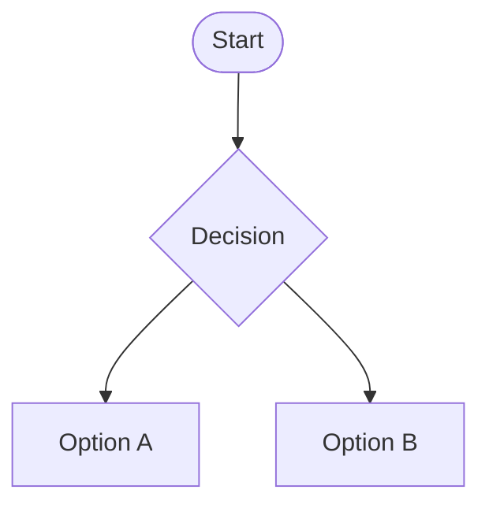

# Welcome to MkDocs

For full documentation visit [mkdocs.org](https://www.mkdocs.org).

## Commands

* `mkdocs new [dir-name]` - Create a new project.
* `mkdocs serve` - Start the live-reloading docs server.
* `mkdocs build` - Build the documentation site.
* `mkdocs -h` - Print help message and exit.

## Project layout

    mkdocs.yml    # The configuration file.
    docs/
        index.md  # The documentation homepage.
        ...       # Other markdown pages, images and other files.

## Content tabs.

=== "Tabla 1"
    Este es su contendi

=== "Tabla 2"
    Otra contenido

=== "Tabla 3"
    Contenido final 

## Admonition tabs

!!! note "Title of the callout"
    Aquí va el texto, no se si se puede cambiar el icono

??? info "Title of the content"
    Aquí va el texto, no se si se puede cambiar el icono    

Tipos (iconos disponibles).  
- abstract  
- info  
- tip  
- success  
- octicons  
- question  
- warning  
- failure  
- danger  
- bug  
- example  
- quote     

## Enlace a documentacion sobre mkdocs
<a href=https://squidfunk.github.io/mkdocs-material>Clic aqui</a>

## Diagramas (superfences)

<a href=https://mermaid.js.org>Editor de diagramas</a>