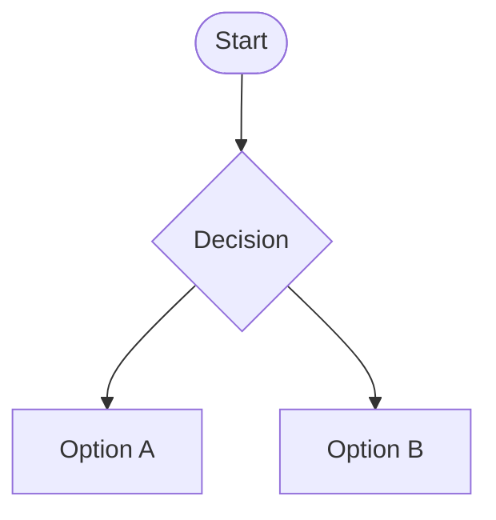

# Welcome to MkDocs

For full documentation visit [mkdocs.org](https://www.mkdocs.org).

## Commands

* `mkdocs new [dir-name]` - Create a new project.
* `mkdocs serve` - Start the live-reloading docs server.
* `mkdocs build` - Build the documentation site.
* `mkdocs -h` - Print help message and exit.

## Content tabs

=== "Tabla 1"
    Este es su contenido

=== "Tabla 2"
    Otra contenido

=== "Tabla 3"
    Contenido final

## Admonition tabs

!!! note "Title of the callout"
    Aquí va el texto

??? quote "Title of the content"
    Aquí va el texto

Tipos (iconos disponibles).  
!!! note "note"
!!! abstract "abstract"
!!! info "info"
!!! tip "tip"
!!! success "success"
!!! question "question"
!!! warning "warning"
!!! failure "failure"
!!! danger "danger"
!!! bug "bug"
!!! failure "failure"
!!! example "example"
!!! quote "quote"

!!! info inline end "info inline end"

    Lorem ipsum dolor sit amet, consectetur
    adipiscing elit. Nulla et euismod nulla.
    Curabitur feugiat, tortor non consequat
    finibus, justo purus auctor massa, nec
    semper lorem quam in massa.  
Lorem ipsum dolor sit amet, consectetur adipiscing elit. Nulla et euismod nulla. Curabitur feugiat, tortor non consequat finibus, justo purus auctor massa, nec semper lorem quam in massa. texto. Lorem ipsum dolor sit amet, consectetur adipiscing elit. Nulla et euismod nulla. Curabitur feugiat, tortor non consequat finibus, justo purus auctor massa, nec semper lorem quam in massa. texto. Lorem ipsum dolor sit amet, consectetur adipiscing elit. Nulla et euismod nulla. Curabitur feugiat, tortor non consequat finibus, justo purus auctor massa, nec semper lorem quam in massa. texto. 
  
!!! info inline "info inline"

    Lorem ipsum dolor sit amet, consectetur
    adipiscing elit. Nulla et euismod nulla.
    Curabitur feugiat, tortor non consequat
    finibus, justo purus auctor massa, nec
    semper lorem quam in massa.    
Lorem ipsum dolor sit amet, consectetur adipiscing elit. Nulla et euismod nulla. Curabitur feugiat, tortor non consequat finibus, justo purus auctor massa, nec semper lorem quam in massa. texto. Lorem ipsum dolor sit amet, consectetur adipiscing elit. Nulla et euismod nulla. Curabitur feugiat, tortor non consequat finibus, justo purus auctor massa, nec semper lorem quam in massa. texto. Lorem ipsum dolor sit amet, consectetur adipiscing elit. Nulla et euismod nulla. Curabitur feugiat, tortor non consequat finibus, justo purus auctor massa, nec semper lorem quam in massa. texto.

## Diagramas (superfences)

```mermaid
flowchart TD
  A(["Start"])
  A --> B{"Decision"}
  B --> C["Option A"]
  B --> D["Option B"]
```

[mermaid](https://mermaid.js.org)